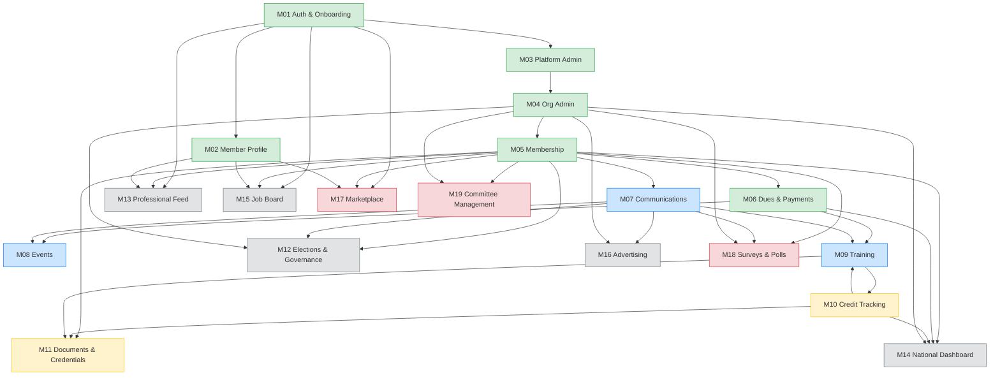

# Module Dependency Map

Compliance documentation artifact mapping Memberry's 19 business modules to their dependencies and corresponding handler implementations.

**Canonical source:** [`docs/ver-3/business/modules/README.md`](ver-3/business/modules/README.md) contains the full module table, monetization tiers, phase rollout plan, and enable/disable behavior.

## Dependency Diagram

**Legend:** Green = Phase 1 Wave 1, Blue = Phase 1 Wave 2, Yellow = Phase 1 Wave 3, Gray = Phase 2, Red = Phase 3

**Note:** M09 (Training) and M10 (Credit Tracking) have a circular dependency -- training generates AUTO credit entries, credit tracking consumes them. Both are developed in the same wave.

## Handler Cross-Reference

| Module | Spec File | Handler Directory | Handlers | TypeSpec |
|--------|-----------|-------------------|----------|---------|
| M01 Auth & Onboarding | `m01-auth-onboarding.md` | `person/` | 25 | Yes |
| M02 Member Profile | `m02-member-profile.md` | `person/` (shared) | -- | -- |
| M03 Platform Admin | `m03-platform-admin.md` | `platformadmin/` | 21 | Yes |
| M04 Org Admin | `m04-org-admin.md` | `association:member/` | 157 | Yes |
| M05 Membership | `m05-membership.md` | `membership/` + `association:member/` | 12 + shared | Mixed |
| M06 Dues & Payments | `m06-dues-payments.md` | `dues/` + `billing/` | 15 + 16 | Mixed |
| M07 Communications | `m07-communications.md` | `communication/` + `comms/` + `email/` + `notifs/` | 28 + 11 + 9 + 5 | Mixed |
| M08 Events | `m08-events.md` | `events/` + `booking/` | 11 + 19 | Yes |
| M09 Training | `m09-training.md` | `training/` | 10 | No |
| M10 Credit Tracking | `m10-credit-tracking.md` | `training/` (shared) | -- | -- |
| M11 Documents & Credentials | `m11-documents-credentials.md` | `documents/` + `certificates/` + `storage/` | 15 + 3 + 6 | Yes |
| M12 Elections & Governance | `m12-elections-governance.md` | `elections/` | 6 | Yes |
| M13 Professional Feed | `m13-professional-feed.md` | -- (Future) | -- | -- |
| M14 National Dashboard | `m14-national-dashboard.md` | `association:operations/` | 54 | Yes |
| M15 Job Board | `m15-job-board.md` | -- (Future) | -- | -- |
| M16 Advertising | `m16-advertising.md` | -- (Future) | -- | -- |
| M17 Marketplace | `m17-marketplace.md` | -- (Future) | -- | -- |
| M18 Surveys & Polls | `m18-surveys-polls.md` | -- (Future) | -- | -- |
| M19 Committee Management | `m19-committee-management.md` | -- (Future) | -- | -- |

### Handler directories without a direct module mapping

| Handler Directory | Purpose | Related Modules |
|-------------------|---------|-----------------|
| `audit/` | Compliance logging | Cross-cutting (all modules) |
| `invite/` | Org invitations | M04, M05 |
| `reviews/` | NPS review system | M08, M09 |

## Dependency Matrix (compact)

| Module | Depends On |
|--------|-----------|
| M01 | -- |
| M02 | M01 |
| M03 | M01 |
| M04 | M01, M03 |
| M05 | M01, M04 |
| M06 | M01, M04, M05 |
| M07 | M01, M04, M05 |
| M08 | M05, M06, M07 |
| M09 | M05, M06, M07, M10 |
| M10 | M05, M09 |
| M11 | M05, M09, M10 |
| M12 | M04, M05, M07 |
| M13 | M01, M02, M05 |
| M14 | M04, M05, M06, M10 |
| M15 | M01, M02, M05 |
| M16 | M03, M07 |
| M17 | M01, M02, M05 |
| M18 | M04, M05, M07 |
| M19 | M04, M05 |

---

*Generated 2026-05-13. Source of truth: `docs/ver-3/business/modules/README.md`.*
