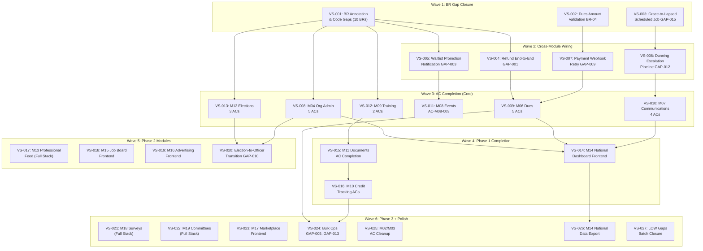

# Vertical Slice Plan

Generated: 2026-05-20 (v2 -- cross-module dependency-ordered)
Based on: TRACE_MATRIX.md, WORKFLOW_MAP.md, MODULE_MAP.md, DOMAIN_MODEL.md, codebase audit

## Summary

| Metric | Count |
|--------|-------|
| **Total slices** | 31 |
| **Waves** | 6 |
| **Estimated phases** | 12-15 |

### What's DONE (not in this plan)

28/40 BRs COMPLETE. Modules M01-M12 have handler code + tests. Frontend exists for: auth, profile, membership, dues, events, training, credits, elections, communications, certificates, officer dashboard. Admin app has: associations, orgs, feature flags, impersonation, audit, members, operators.

### What REMAINS (this plan covers)

- 12 PARTIAL BRs needing production code (test-only coverage)
- 1 ORPHAN BR (BR-04) with zero implementation
- 46 orphan ACs across M01-M19
- M13-M19 modules (Phase 2/3 -- some have backend stubs)
- M14 National Dashboard (54 handlers, 0 frontend)
- 20 cross-module workflow gaps (GAP-001 through GAP-020)

---

## Dependency Graph

---

## Wave 1: BR Gap Closure (Foundation)

No new features. Close gaps between "test exists" and "production code implements BR".

---

### VS-001: BR Annotation & Production Code Gaps

**Story:** 10 PARTIAL BRs have tests but zero production code referencing the BR. Add BR annotations and verify the behavior is actually implemented (not just tested).

| Aspect | Detail |
|--------|--------|
| **Modules** | M03, M05, M08, M09, M10, M11, M01 |
| **DB** | None |
| **API** | Add `// BR-XX` annotations: BR-10 (impersonation guards) in `platformadmin/startImpersonation.ts`, BR-14 (cross-org credit aggregation) in `association:member/`, BR-15 (training vs event distinction) in `events/createEvent.ts` + `training/createTraining.ts`, BR-18 (QR auth check) in `events/checkIn.ts`, BR-24 (invite expiry) in `invite/` handlers, BR-26 (session mgmt) in `person/` auth, BR-31 (SVG sanitization) in `storage/uploadFile.ts`, BR-36 (dashboard scoping) in `association:operations/`. For any BR where test passes but no production logic exists: implement the guard. |
| **Frontend** | None |
| **Tests** | Verify existing tests pass. Add `// BR-XX` comments for traceability. |
| **Depends on** | None |

---

### VS-002: Dues Amount Validation (BR-04 -- ORPHAN)

**Story:** As an officer, when recording a payment, the system validates the amount matches org dues config.

| Aspect | Detail |
|--------|--------|
| **Modules** | M06 |
| **DB** | None (schema exists: `dues_org_config`, `dues_category_override`) |
| **API** | `dues/recordDuesPayment.ts` -- add validation: `payment.amount == duesOrgConfig.baseAmount OR duesCategoryOverride.amount`. Reject with `INVALID_AMOUNT` if mismatch. |
| **Frontend** | None (dues config UI at `officer/settings/dues.tsx` already sets amounts) |
| **Tests** | New `br-04.dues-amount-validation.test.ts` -- payment rejected when amount != config, accepted when matching, category override takes precedence |
| **Depends on** | None |

---

### VS-003: Grace-to-Lapsed Scheduled Job (GAP-015 -- HIGH)

**Story:** Members in Grace status automatically transition to Lapsed when grace period expires.

| Aspect | Detail |
|--------|--------|
| **Modules** | M05 |
| **DB** | None (status computed from `dues_expiry_date` + `gracePeriodDays`) |
| **API** | `association:member/jobs/grace-to-lapsed.ts` -- daily cron: scan members where `duesExpiryDate + gracePeriodDays < now()` AND status not already lapsed/suspended/removed. Write `membership_status_history` entry. Fire dunning escalation trigger. |
| **Frontend** | None (status reflected in existing UI via computed status) |
| **Tests** | `grace-to-lapsed.test.ts` -- transition fires, idempotent re-run, skips suspended members, uses per-org grace period |
| **Depends on** | None |

---

## Wave 2: Cross-Module Wiring (Workflow Gaps)

Close HIGH and MEDIUM gaps from WORKFLOW_MAP.md Section 8.

---

### VS-004: Refund End-to-End (GAP-001 -- HIGH)

**Story:** As a treasurer, I process a refund that reverses membership expiry extension and fund allocations.

| Aspect | Detail |
|--------|--------|
| **Modules** | M06, M05 |
| **DB** | None (`dues_payment_status` already has `refunded` value) |
| **API** | Verify `dues/refundPayment.ts` + `refund-validation.ts` implement BR-08 (30-day window, allocation reversal, expiry rollback). Add integration test for full flow: refund -> expiry shortened -> status history entry -> fund allocations reversed. Add refund reason field. |
| **Frontend** | Add refund button + confirmation dialog to `officer/payments/$paymentId.tsx` |
| **Tests** | `refund-e2e.test.ts` -- full refund reverses expiry, partial refund adjusts proportionally, expired 30-day window rejected |
| **Depends on** | VS-001 (BR annotations baseline) |

---

### VS-005: Waitlist Auto-Promotion Notification (GAP-003 -- MEDIUM)

**Story:** When a registered member cancels, the next waitlisted member is promoted and notified.

| Aspect | Detail |
|--------|--------|
| **Modules** | M08, Notifications |
| **DB** | None |
| **API** | `association:operations/promoteWaitlistEntry.ts` -- wire `notifyWaitlistPromotion()` from `notifs/notification-triggers.ts` (trigger function already exists). Verify `waitlist.promoted` notification type in enum. |
| **Frontend** | None (notification appears in existing notification list) |
| **Tests** | `waitlist-promotion-notification.test.ts` -- cancellation triggers FIFO promotion + notification |
| **Depends on** | VS-001 |

---

### VS-006: Dunning Escalation Pipeline (GAP-012 -- MEDIUM)

**Story:** Overdue members receive escalating reminders (friendly -> urgent -> final) based on configurable templates.

| Aspect | Detail |
|--------|--------|
| **Modules** | M06, M07 (Notifications) |
| **DB** | Uses existing `dunning_template`, `dunning_event` tables |
| **API** | `association:member/jobs/dunning-processor.ts` -- scheduled job: 1) query members with expired dues, 2) check `dunning_template` for next escalation stage, 3) create `dunning_event` record, 4) fire `notifyDunningEscalation()` from notification-triggers.ts |
| **Frontend** | None (templates managed via seed/admin config) |
| **Tests** | Extend `dunning-escalation.test.ts` -- stage progression, template selection, skip deceased/suppressed |
| **Depends on** | VS-003 (grace-to-lapsed provides the member pool for dunning) |

---

### VS-007: Payment Webhook Retry (GAP-009 -- HIGH)

**Story:** Failed payment webhooks retry with exponential backoff before marking as permanently failed.

| Aspect | Detail |
|--------|--------|
| **Modules** | M06 |
| **DB** | Add `retryCount`, `lastRetryAt`, `nextRetryAt` to `dues_payment` or new `webhook_attempt` table |
| **API** | `dues/jobs/webhook-retry.ts` -- find payments in `pending` > 1hr, re-query gateway (PayMongo/Stripe) status, max 3 retries (1m, 5m, 30m backoff), after exhaustion mark `expired` and notify member |
| **Frontend** | None |
| **Tests** | `webhook-retry.test.ts` -- pending retried, eventually expired, idempotent re-query |
| **Depends on** | VS-002 (amount validation wired before retrying) |

---

## Wave 3: AC Completion (Core Modules)

Close the 46 orphan ACs for modules M04-M12. Each slice verifies spec compliance and adds AC-traceable tests.

---

### VS-008: M04 Org Admin -- 5 Orphan ACs

**Story:** Org admin features (settings, officer transition, discipline, dashboard, public page) satisfy spec acceptance criteria.

| Aspect | Detail |
|--------|--------|
| **Modules** | M04 |
| **DB** | None |
| **API** | Verify handlers match: AC-M04-001 (org settings CRUD), AC-M04-002 (officer transition with handoff checklist), AC-M04-003 (disciplinary action with mandatory reason), AC-M04-004 (org dashboard metrics), AC-M04-005 (public page slug). Add AC annotations. |
| **Frontend** | Verify existing pages exercise AC behaviors: `officer/settings/org.tsx`, `officer/officers.tsx`, `officer/dashboard.tsx` |
| **Tests** | `ac-m04-compliance.test.ts` covering all 5 ACs |
| **Depends on** | VS-001 |

---

### VS-009: M06 Dues -- 5 Orphan ACs

**Story:** Dues payment flows, fund allocation, refunds, config, and financial reporting satisfy spec acceptance criteria.

| Aspect | Detail |
|--------|--------|
| **Modules** | M06 |
| **DB** | None |
| **API** | Map AC-M06-001 through AC-M06-005 to existing handlers. Verify behaviors match spec. Fill implementation gaps. |
| **Frontend** | Verify: `officer/settings/dues.tsx`, `officer/payments/`, `officer/reports/financial.tsx` |
| **Tests** | `ac-m06-compliance.test.ts` |
| **Depends on** | VS-004 (refund), VS-007 (webhook retry) |

---

### VS-010: M07 Communications -- 4 Orphan ACs

**Story:** Announcement sending, template management, delivery stats, and email opt-out satisfy spec acceptance criteria.

| Aspect | Detail |
|--------|--------|
| **Modules** | M07 |
| **DB** | None |
| **API** | Verify: AC-M07-001 (announcement CRUD + audience targeting), AC-M07-002 (template variable substitution), AC-M07-003 (delivery stats per announcement), AC-M07-004 (email opt-out enforcement) |
| **Frontend** | Verify `officer/communications/` pages exercise these behaviors |
| **Tests** | `ac-m07-compliance.test.ts` |
| **Depends on** | VS-006 (dunning exercises notification path) |

---

### VS-011: M08 Events -- AC-M08-003

**Story:** Event check-in and attendance tracking satisfy AC-M08-003 spec.

| Aspect | Detail |
|--------|--------|
| **Modules** | M08 |
| **DB** | None |
| **API** | Verify QR check-in handler matches AC-M08-003 (authenticated scanner + valid event + duplicate prevention) |
| **Frontend** | Verify `officer/events/$eventId/attendance.tsx` |
| **Tests** | Extend `events.test.ts` with AC-M08-003 |
| **Depends on** | VS-005 (waitlist notification wired) |

---

### VS-012: M09 Training -- 2 Orphan ACs

**Story:** Training enrollment and paid training satisfy spec acceptance criteria.

| Aspect | Detail |
|--------|--------|
| **Modules** | M09, M06 |
| **DB** | None |
| **API** | AC-M09-002 (enrollment capacity management), AC-M09-003 (paid training fee collection cross-module with M06) |
| **Frontend** | Verify training pages |
| **Tests** | `ac-m09-compliance.test.ts` |
| **Depends on** | VS-001 |

---

### VS-013: M12 Elections -- 3 Orphan ACs

**Story:** Election lifecycle, secret ballot, and bylaw ratification satisfy spec acceptance criteria.

| Aspect | Detail |
|--------|--------|
| **Modules** | M12 |
| **DB** | None |
| **API** | AC-M12-001 (full election lifecycle draft->published), AC-M12-002 (secret ballot, one-vote-per-position, active-members-only), AC-M12-003 (bylaw ratification flow) |
| **Frontend** | Verify `elections/` and `officer/elections/` pages |
| **Tests** | `ac-m12-compliance.test.ts` |
| **Depends on** | VS-001 |

---

## Wave 4: Phase 1 Completion

---

### VS-014: M14 National Dashboard Frontend

**Story:** National officers view cross-chapter KPIs, drill into chapter details, and compare performance.

| Aspect | Detail |
|--------|--------|
| **Modules** | M14 |
| **DB** | None (54 backend handlers already exist) |
| **API** | Verify existing `association:operations/` endpoints return aggregated data |
| **Frontend** | Create route group `org/$orgId/officer/national/`: `index.tsx` (KPI cards: membership counts, collection rates, credit compliance), `chapters.tsx` (chapter drill-down with comparison table). Wire to existing API. |
| **Tests** | `m14-national-dashboard.test.ts` (API), E2E for dashboard rendering |
| **Depends on** | VS-008, VS-009, VS-010 |

---

### VS-015: M11 Documents & Credentials -- AC Completion

**Story:** Document management, certificate download, and QR verification satisfy spec acceptance criteria.

| Aspect | Detail |
|--------|--------|
| **Modules** | M11 |
| **DB** | None |
| **API** | AC-M11-001 (document upload/publish/archive + access logging), AC-M11-002 (certificate download after training completion), AC-M11-003 (QR HMAC verification), AC-M11-004 (auto-regeneration on profile change) |
| **Frontend** | Build `org/$orgId/officer/documents/` CRUD pages. Verify `my/certificates/` end-to-end. |
| **Tests** | Extend `slice-023-documents-credentials.test.ts` |
| **Depends on** | VS-012 (training ACs -- certificates depend on training completion) |

---

### VS-016: M10 Credit Tracking -- AC Completion

**Story:** Credit summary, manual entry, officer compliance view, and transcript export satisfy spec acceptance criteria.

| Aspect | Detail |
|--------|--------|
| **Modules** | M10 |
| **DB** | None |
| **API** | AC-M10-001 (cross-cycle summary with breakdown), AC-M10-003 (officer compliance reporting by org), AC-M10-004 (credit transcript export PDF/CSV) |
| **Frontend** | Verify `my/credits/` and `officer/reports/credits.tsx` |
| **Tests** | Extend `credits.test.ts` |
| **Depends on** | VS-015 |

---

## Wave 5: Phase 2 Modules

New feature modules. Some have backend stubs, some are greenfield.

---

### VS-017: M13 Professional Feed (Full Stack)

**Story:** Members browse an org-scoped feed, create posts, react, mute authors. Officers moderate.

| Aspect | Detail |
|--------|--------|
| **Modules** | M13 |
| **DB** | Create tables: `feed_post` (id, orgId, authorId, content, mediaUrls jsonb, status draft/published/hidden/removed, likesCount), `feed_reaction` (postId, personId, type), `feed_mute` (muterId, mutedPersonId) |
| **API** | Create `handlers/feed/`: `listPosts.ts` (paginated, org-scoped, mute-filtered), `createPost.ts`, `reactToPost.ts`, `muteAuthor.ts`, `moderatePost.ts` (officer: hide/remove). Add BR-35 production code. |
| **Frontend** | `org/$orgId/feed/index.tsx` (infinite scroll), compose post UI, `org/$orgId/officer/feed/index.tsx` (moderation panel) |
| **Tests** | Replace stub `m13.professional-feed.test.ts` with real handler + E2E tests |
| **Depends on** | None (M01, M02, M05 all complete) |

---

### VS-018: M15 Job Board Frontend

**Story:** Members browse/save jobs, set alerts. Officers/employers post jobs with 30-day auto-expiry.

| Aspect | Detail |
|--------|--------|
| **Modules** | M15 |
| **DB** | Verify `jobs/` handler schema. May need `saved_job`, `job_alert` tables. |
| **API** | 7 handlers exist in `jobs/`. Verify CRUD, search, expiry. Add BR-37 annotation. |
| **Frontend** | `org/$orgId/jobs/index.tsx` (browse/search/filter), `org/$orgId/jobs/$jobId.tsx` (detail), `my/saved-jobs.tsx`, `org/$orgId/officer/jobs/` (manage postings) |
| **Tests** | API expiry logic tests, E2E for browsing |
| **Depends on** | None (M01, M02, M05 complete) |

---

### VS-019: M16 Advertising Frontend

**Story:** Platform admins manage ad campaigns and creative approval. Members see/report ads.

| Aspect | Detail |
|--------|--------|
| **Modules** | M16 |
| **DB** | None (7 handlers + schema exist in `advertising/`) |
| **API** | 7 handlers exist. Verify campaign lifecycle, creative approval, ad serving. |
| **Frontend** | Admin app: `admin/src/routes/advertising/` (campaign mgmt, creative approval). Memberry: ad placement component, report-ad action. |
| **Tests** | E2E for admin campaign flow |
| **Depends on** | None (M03, M07 complete) |

---

### VS-020: Election-to-Officer Transition (GAP-010 -- MEDIUM)

**Story:** Publishing election results auto-assigns winning candidates to officer roles.

| Aspect | Detail |
|--------|--------|
| **Modules** | M12, M04 |
| **DB** | None |
| **API** | `elections/certifyElection.ts` -- after publishing results, auto-create `officer_term` records for winners. End-date existing terms. Handle edge cases: tied elections, declined positions. |
| **Frontend** | None (automatic) |
| **Tests** | `election-to-officer.test.ts` -- certified election creates officer terms, old terms end-dated |
| **Depends on** | VS-013 (election ACs), VS-008 (org admin ACs) |

---

## Wave 6: Phase 3 + Polish

---

### VS-021: M18 Surveys & Polls (Full Stack)

**Story:** Officers create surveys/polls, members respond (anonymously when configured), officers view aggregated results.

| Aspect | Detail |
|--------|--------|
| **Modules** | M18 |
| **DB** | Create: `survey` (orgId, title, deadline, status, isAnonymous), `survey_question` (surveyId, text, type, options jsonb, order), `survey_response` (surveyId, respondentId nullable), `survey_answer` (responseId, questionId, value jsonb) |
| **API** | `handlers/surveys/`: `createSurvey.ts`, `publishSurvey.ts`, `closeSurvey.ts`, `submitResponse.ts` (BR-40: respondentId null when anonymous), `getSurveyResults.ts` (aggregated per question) |
| **Frontend** | `org/$orgId/surveys/index.tsx`, `org/$orgId/surveys/$surveyId.tsx` (respond), `org/$orgId/officer/surveys/` (create/manage/results) |
| **Tests** | Replace stub with real tests. BR-40 anonymity guarantee. |
| **Depends on** | None (M04, M05, M07 complete) |

---

### VS-022: M19 Committee Management (Full Stack)

**Story:** Officers manage committees with members, tasks, meetings, and dissolution cascade.

| Aspect | Detail |
|--------|--------|
| **Modules** | M19 |
| **DB** | Tables exist (committee, committee_member, committee_task). Add `committee_meeting` (committeeId, scheduledAt, location, minutes, attendees jsonb). |
| **API** | `handlers/committees/`: `createCommittee.ts`, `dissolveCommittee.ts` (BR-39 cascade: remove member assignments, archive tasks), `addMember.ts`, `removeMember.ts`, `createTask.ts`, `updateTask.ts`, `createMeeting.ts`. Wire `notifyTaskOverdue()` (GAP-017). |
| **Frontend** | `org/$orgId/officer/committees/index.tsx`, `$committeeId.tsx` (members, tasks, meetings), `new.tsx` |
| **Tests** | Replace stubs. BR-39 dissolution cascade. GAP-017 overdue notification. |
| **Depends on** | None (M04, M05 complete) |

---

### VS-023: M17 Marketplace Frontend

**Story:** Members browse marketplace listings. Admins manage vendor verification.

| Aspect | Detail |
|--------|--------|
| **Modules** | M17 |
| **DB** | None (9 handlers + schema exist in `marketplace/`) |
| **API** | 9 handlers exist. Verify CRUD, vendor verification. Add BR-38 annotation (referral disclosure). |
| **Frontend** | `org/$orgId/marketplace/index.tsx` (browse/search), `$listingId.tsx` (detail). Admin: `admin/routes/marketplace/` (vendor mgmt). |
| **Tests** | Extend existing 3 tests. E2E for browsing. |
| **Depends on** | None |

---

### VS-024: Bulk Operations (GAP-005, GAP-013)

**Story:** Treasurers record bulk payments. Officers adjust credits in bulk.

| Aspect | Detail |
|--------|--------|
| **Modules** | M06, M10 |
| **DB** | None |
| **API** | `dues/bulkRecordPayment.ts` (CSV or multi-select, per-row validation, partial failure handling), `person/bulkAdjustCredits.ts` |
| **Frontend** | Bulk action buttons on `officer/payments/index.tsx` and `officer/reports/credits.tsx` |
| **Tests** | Bulk op tests with edge cases (partial failures, duplicate detection) |
| **Depends on** | VS-009, VS-016 |

---

### VS-025: M02/M03 AC Cleanup

**Story:** Profile management and platform admin satisfy all remaining spec ACs.

| Aspect | Detail |
|--------|--------|
| **Modules** | M02, M03 |
| **DB** | None |
| **API** | M02: AC-M02-001..005 (profile CRUD, photo, privacy, deletion, export). M03: AC-M03-001 (association onboarding), AC-M03-003 (support ticket resolution). |
| **Frontend** | Verify existing pages |
| **Tests** | `ac-m02-compliance.test.ts`, `ac-m03-compliance.test.ts` |
| **Depends on** | None (parallel with other Wave 6 slices) |

---

### VS-026: M14 National Data Export

**Story:** National officers export cross-chapter aggregated data as CSV/PDF.

| Aspect | Detail |
|--------|--------|
| **Modules** | M14 |
| **DB** | None |
| **API** | `association:operations/exportNationalData.ts` (CSV), `exportNationalReport.ts` (PDF) |
| **Frontend** | Export buttons on national dashboard (from VS-014) |
| **Tests** | Export format validation |
| **Depends on** | VS-014 |

---

### VS-027: LOW-Priority Gap Batch Closure

**Story:** Close remaining LOW-impact gaps in one batch.

| Aspect | Detail |
|--------|--------|
| **Modules** | Cross-cutting |
| **DB** | Minor schema additions as needed |
| **API** | GAP-002 (import conflict resolution UI), GAP-004 (election archive), GAP-007 (configurable cancellation deadline), GAP-008 (global admin member search), GAP-011 (committee archival), GAP-016 (survey edit conflicts), GAP-018 (credit transcript format), GAP-019 (job listing extension limit), GAP-020 (ad creative resubmission) |
| **Frontend** | Various small additions |
| **Tests** | Per-gap unit tests |
| **Depends on** | All prior waves |

---

## Parallel Execution Groups

Slices within the same wave that share NO `files_modified` overlap can run in parallel.

| Wave | Parallel Group A | Parallel Group B | Parallel Group C |
|------|-----------------|-----------------|-----------------|
| 1 | VS-001 (annotations) | VS-002 (BR-04) | VS-003 (cron job) |
| 2 | VS-004 (refund) + VS-007 (webhook) | VS-005 (waitlist) | VS-006 (dunning) |
| 3 | VS-008 (M04) + VS-012 (M09) + VS-013 (M12) | VS-009 (M06) | VS-010 (M07) + VS-011 (M08) |
| 4 | VS-014 (M14 frontend) | VS-015 (M11) + VS-016 (M10) | -- |
| 5 | VS-017 (M13) + VS-018 (M15) + VS-019 (M16) | VS-020 (election transition) | -- |
| 6 | VS-021 (M18) + VS-022 (M19) + VS-023 (M17) | VS-024 (bulk) + VS-025 (AC cleanup) | VS-026 (export) + VS-027 (LOW gaps) |

## Priority Matrix

| Priority | Slices | Rationale |
|----------|--------|-----------|
| **P0** | VS-001..VS-003 | BR gaps + HIGH scheduled job -- ship blockers |
| **P1** | VS-004..VS-007 | HIGH/MEDIUM workflow gaps -- core product reliability |
| **P2** | VS-008..VS-013 | AC compliance for shipped modules -- spec fidelity |
| **P3** | VS-014..VS-016 | Phase 1 completion -- national dashboard, documents, credits |
| **P4** | VS-017..VS-020 | Phase 2 modules -- growth features |
| **P5** | VS-021..VS-027 | Phase 3 modules + polish |

## HIGH Gap Resolution Map

| Gap ID | Description | Slice | Resolution |
|--------|-------------|-------|------------|
| GAP-001 | No refund handler | VS-004 | Verify e2e: refund -> expiry reversal -> fund reversal |
| GAP-009 | No webhook retry | VS-007 | Exponential backoff, max 3 retries, dead letter |
| GAP-015 | No Grace->Lapsed cron | VS-003 | Daily cron, batch processing, idempotent |

## MEDIUM Gap Resolution Map

| Gap ID | Description | Slice |
|--------|-------------|-------|
| GAP-003 | Waitlist notification | VS-005 |
| GAP-005 | No bulk payment | VS-024 |
| GAP-006 | Late cancel notification | VS-005 (same notification wiring) |
| GAP-010 | Election-to-officer | VS-020 |
| GAP-012 | Dunning escalation | VS-006 |
| GAP-013 | No bulk credit adjust | VS-024 |
| GAP-017 | Committee task overdue | VS-022 |

## Ambiguities Requiring Decision

| Issue | Slice | Default if no decision |
|-------|-------|----------------------|
| Refund approval threshold for large amounts | VS-004 | No threshold -- treasurer can refund any amount |
| Partial refund allocation reversal: proportional vs LIFO | VS-004 | Proportional across all funds |
| Webhook retry max attempts | VS-007 | 3 retries with 1m/5m/30m backoff |
| Grace-to-Lapsed cron schedule | VS-003 | Daily at 00:00 UTC+8 |
| Election tie-breaking | VS-020 | President decides (manual) |
| Credit transcript PDF format | VS-016 | Cycle-grouped table with types, hours, running total |

---

*Generated 2026-05-20 by /oli-vertical-slice-plan*
*Sources: TRACE_MATRIX.md, WORKFLOW_MAP.md, MODULE_MAP.md, DOMAIN_MODEL.md, codebase handler audit*
