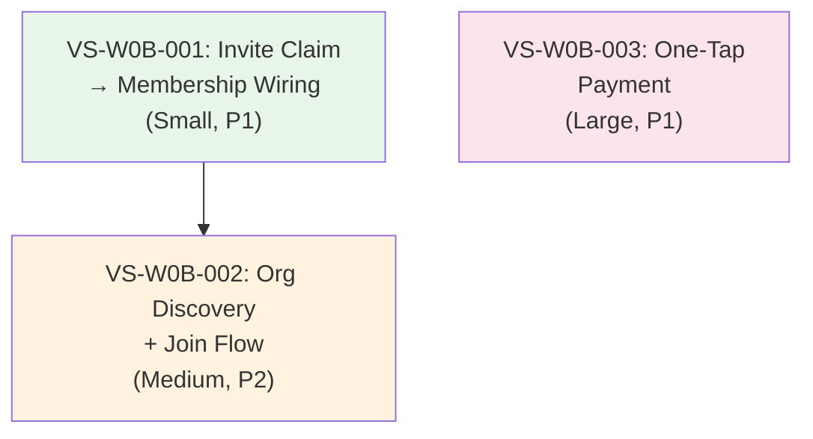

<!-- oli:vertical-slice-plan v1.0 | generated 2026-05-23 | source: Wave 0b eng plan, codebase exploration -->
# Wave 0b — Vertical Slice Plan

> Wave 0b features: membership join flow, invite→membership wiring, one-tap payment.
> Prerequisite: Wave 0a infrastructure (slug migration, OrgProvider, org switcher, Account merge) — COMPLETE.

---

## Codebase State Assessment

**Key discovery:** Frontend routes for all 3 features already exist and are functional UI shells. The gaps are backend wiring and missing API endpoints.

| Feature | Frontend | Backend Handler | TypeSpec | Tests |
|---------|----------|-----------------|----------|-------|
| Invite claim | ✅ `/invite/$token.tsx` (128 LOC) | ⚠️ Handler exists, addMember DEFERRED | ✅ `invite.tsp` | ⚠️ Unit only |
| Org profile + apply | ✅ `/org/$slug.tsx` (299 LOC) | ✅ Public org lookup + applications exist | ✅ Partial | ⚠️ No E2E |
| Org discovery (/join) | ❌ Route missing | ❌ No list/search endpoint | ❌ Not defined | ❌ None |
| One-tap payment | ✅ `/pay/$token.tsx` (138 LOC) | ❌ `/pay/:token/validate` + `/checkout` missing | ❌ Not defined | ❌ None |

---

## Vertical Slices

### VS-W0B-001: Invite Claim → Membership Wiring

**User story:** Member clicks invite link → validates → claims → becomes org member → redirected to org dashboard.

| Property | Value |
|----------|-------|
| Risk | P1 (cross-module integration) |
| Type | Stabilize (handler exists, wiring missing) |
| Complexity | Small |
| Pattern | Pattern-establishing (invite→membership integration) |

**Scope:**

| Layer | Files | Action |
|-------|-------|--------|
| Backend handler | `services/api-ts/src/handlers/invite/claimInvite.ts` | Wire `MembershipRepository.addMember()` after marking claimed |
| Backend handler | `services/api-ts/src/handlers/invite/claimInvite.ts` | Handle edge cases: already member (409), org requires approval (create application instead), specific role from invite metadata |
| TypeSpec | `specs/api/src/modules/invite.tsp` | Add `membership` object to `ClaimInviteResponse` (memberId, status, role) |
| Generated | `services/api-ts/src/generated/openapi/*` | Regenerate after TypeSpec change |
| Frontend | `apps/memberry/src/routes/invite/$token.tsx` | Update post-claim redirect to use org slug (currently `/my/organizations`) |
| Frontend lib | `apps/memberry/src/features/invite/lib/token-validation.ts` | Update ClaimInviteResponse type to include membership |
| Tests | `services/api-ts/src/handlers/invite/claimInvite.test.ts` | TDD: already-member 409, approval-required 202, auto-join 200, metadata-role |
| Tests | `apps/memberry/src/features/invite/lib/token-validation.test.ts` | Update for new response shape |

**Edge cases:**
- Person already member of org → return 409 with existing membership info
- Org has `requiresApproval: true` → create application instead of auto-join, return `{ claimed: true, status: "pendingApproval" }`
- Invite metadata has `membershipTierId` → use that tier; no tier → use org default
- Invite metadata has `membershipCategoryId` → assign category

**Acceptance criteria:**
- AC-1: Claiming invite creates membership record with correct org + tier
- AC-2: Already-member returns 409 without duplicate
- AC-3: Approval-required orgs create application, not auto-join
- AC-4: Frontend redirects to `/org/{slug}/home` after successful claim
- AC-5: Audit log captures membership creation

**Dependencies:** None (first slice)
**Blocks:** VS-W0B-002 (join flow references invite claim)

---

### VS-W0B-002: Org Discovery + Join Flow

**User story:** Unauthenticated user visits `/join` → searches/browses orgs → clicks org → sees public profile → applies to join → gets confirmation.

| Property | Value |
|----------|-------|
| Risk | P2 (new endpoint + new route) |
| Type | New |
| Complexity | Medium |
| Pattern | Pattern-following (uses existing membership application flow) |

**Scope:**

| Layer | Files | Action |
|-------|-------|--------|
| TypeSpec | `specs/api/src/modules/platform-admin.tsp` or new `public.tsp` | Define `GET /public/orgs` with search, featured, pagination |
| Generated | Regenerate routes/validators | |
| Backend handler | `services/api-ts/src/handlers/platformadmin/listPublicOrgs.ts` | New handler: query orgs with `isPublic: true`, search by name/slug, paginate |
| Backend schema | `services/api-ts/src/handlers/platformadmin/repos/platform-admin.schema.ts` | May need `isPublic` / `isFeatured` boolean columns (check if exists) |
| Frontend | `apps/memberry/src/routes/join.tsx` | New route: org search bar, featured orgs grid, results list |
| Frontend | `apps/memberry/src/routes/org/$slug.tsx` | Already exists — verify "Apply to Join" works end-to-end |
| Tests | `services/api-ts/src/handlers/platformadmin/listPublicOrgs.test.ts` | TDD: search, pagination, empty results, non-public orgs excluded |
| Tests E2E | `apps/memberry/e2e/join-flow.spec.ts` | Browse → select org → apply → confirmation toast |

**Existing infrastructure to reuse:**
- `GET /public/org/:slug` handler already exists (single org lookup)
- `POST /association/member/applications` already works (org/$slug.tsx calls it)
- Org schema has `slug` column (Wave 0a backfilled)

**Acceptance criteria:**
- AC-1: `/join` page lists public orgs with search
- AC-2: Search filters by org name (case-insensitive substring)
- AC-3: Non-public orgs excluded from results
- AC-4: Clicking org navigates to `/org/{slug}` public profile
- AC-5: Full flow: `/join` → search → click → apply → toast confirmation

**Dependencies:** VS-W0B-001 (invite claim pattern establishes membership wiring)
**Blocks:** None

---

### VS-W0B-003: One-Tap Payment

**User story:** Officer sends payment link → member receives email with `/pay/{token}` URL → clicks → sees invoice details → pays via Stripe → success confirmation.

| Property | Value |
|----------|-------|
| Risk | P1 (financial, security-sensitive) |
| Type | New |
| Complexity | Large |
| Pattern | Pattern-following (reuses invite HMAC token pattern) |

**Scope:**

| Layer | Files | Action |
|-------|-------|--------|
| Backend schema | `services/api-ts/src/handlers/dues/repos/payment-token.schema.ts` | New table: `payment_tokens` (tokenHash, personId, orgId, invoiceId, amount, expiresAt, usedAt, createdBy) |
| Backend utils | `services/api-ts/src/handlers/dues/utils/payment-token.ts` | HMAC token gen/validate (reuse pattern from `invite/utils/token.ts`) |
| TypeSpec | `specs/api/src/modules/dues-custom.tsp` or new section | Define 3 endpoints: `POST /org/:orgId/payments/send-link`, `GET /pay/:token/validate`, `POST /pay/:token/checkout` |
| Generated | Regenerate routes/validators | |
| Backend handler | `services/api-ts/src/handlers/dues/sendPaymentLink.ts` | Officer creates HMAC token, stores hash, returns raw token + URL |
| Backend handler | `services/api-ts/src/handlers/dues/validatePaymentToken.ts` | Public: validate token, return invoice details (amount, org, member name) |
| Backend handler | `services/api-ts/src/handlers/dues/checkoutPaymentToken.ts` | Public: create Stripe checkout session, mark token used |
| Frontend | `apps/memberry/src/routes/pay/$token.tsx` | Already exists — update API paths to match new endpoints |
| Tests | `services/api-ts/src/handlers/dues/sendPaymentLink.test.ts` | TDD: token generation, auth check, rate limit |
| Tests | `services/api-ts/src/handlers/dues/validatePaymentToken.test.ts` | TDD: valid token, expired, already-used, invalid HMAC |
| Tests | `services/api-ts/src/handlers/dues/checkoutPaymentToken.test.ts` | TDD: Stripe session creation, double-pay prevention, token consumption |

**Security requirements:**
- Token: HMAC-SHA256 with server secret (reuse `INVITE_TOKEN_SECRET` pattern)
- Expiry: 72 hours
- Single-use: mark `usedAt` on checkout initiation
- Rate limit: 5 validate attempts per token per hour (prevent enumeration)
- Stripe: use existing gateway config from `POST /org/:orgId/config/gateway`

**Acceptance criteria:**
- AC-1: Officer can generate payment link for a specific member
- AC-2: Payment page shows correct amount, org name, member name
- AC-3: Expired token (>72h) shows clear error
- AC-4: Already-paid token shows "Already Paid" state
- AC-5: Successful payment redirects to Stripe checkout
- AC-6: Token cannot be reused after checkout initiated
- AC-7: Invalid/tampered token rejected

**Dependencies:** None (independent of invite/join slices)
**Blocks:** None

---

## Dependency Graph

## Execution Groups

| Group | Slices | Parallelizable | Notes |
|-------|--------|----------------|-------|
| **Group A** | VS-W0B-001, VS-W0B-003 | ✅ Yes (independent) | Start both in parallel. VS-001 is small, VS-003 is large. |
| **Group B** | VS-W0B-002 | After VS-W0B-001 | Join flow references invite claim behavior |

**Recommended execution order:**
1. **Sprint 1:** VS-W0B-001 (invite wiring, ~30min) + VS-W0B-003 (payment, ~1h) — parallel
2. **Sprint 2:** VS-W0B-002 (join flow, ~45min) — after VS-W0B-001

---

## Checklist Validation

| Check | VS-001 | VS-002 | VS-003 |
|-------|--------|--------|--------|
| Single user behavior? | ✅ Claim invite | ✅ Discover + join org | ✅ Pay via link |
| Backend + frontend? | ✅ Handler + redirect | ✅ New endpoint + route | ✅ 3 handlers + existing UI |
| Tests included? | ✅ Unit + update E2E | ✅ Unit + E2E | ✅ Unit (3 handlers) |
| Data/schema changes? | ❌ None | ⚠️ Maybe isPublic column | ✅ payment_tokens table |
| Auth/permissions? | ✅ Existing (authenticated) | ✅ Public + authenticated | ✅ Officer (send) + public (pay) |
| Pattern reference? | First cross-module wire | Follows existing public org | Follows invite token pattern |

---

## PRD Gaps / Ambiguities

1. **Org `isPublic` flag** — Does this column exist? If not, which orgs appear on `/join`? Decision: default all orgs to public unless explicitly hidden.
2. **Approval-required orgs** — How does claimInvite know if org requires approval? Decision: check org settings or always auto-join for invited members (invite = pre-approved).
3. **Payment link generation UI** — Where does officer trigger "send payment link"? Decision: defer officer UI to Wave 1 Finances; for now, API-only (officer can use admin tools or we add a button to dues dashboard).
4. **Stripe vs PayMongo** — Frontend `/pay/$token.tsx` says "GCash, Maya, or card" but eng plan says "Stripe only". Decision: Stripe only per D14.

---

## What's Next

After Wave 0b slices complete:
1. Run `/gsd-verify-work` on each slice
2. **Pre-Wave 1 gate:** Domain Event Spike (2-day, EventEmitter + typed registry)
3. Wave 1: Financial module UX upgrade
