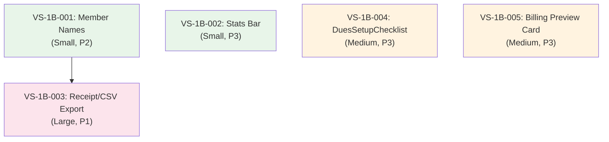

<!-- oli:vertical-slice-plan v1.0 | generated 2026-05-23 | source: Phase 1b task analysis, codebase exploration -->
# Wave 1 Phase 1b — Vertical Slice Plan

> Phase 1b: Stats + Names + Export (backend-dependent tasks)
> Prerequisite: Phase 0 (infrastructure) + Phase 1a (UX polish) — COMPLETE

---

## Codebase State

| Task | Backend | Frontend | Tests | Complexity |
|------|---------|----------|-------|------------|
| T1B-1: Member names | Missing JOIN | Table exists, no name column | None | Small |
| T1B-2: Stats bar | ✅ getDuesDashboard done | Dashboard exists, not wired | None | Small |
| T1B-3: Receipt/CSV export | No handler, no PDF lib | No buttons | None | Large |
| T1B-4: DuesSetupChecklist | ✅ Config endpoints exist | No component | None | Medium |
| T1B-5: Billing preview card | ✅ Config form has logic | No standalone card | None | Medium |

---

## Vertical Slices

### VS-1B-001: Member Names in Payment Tables

**User story:** Officer views payment history and sees member names, not just IDs.

| Property | Value |
|----------|-------|
| Risk | P2 |
| Type | Stabilize |
| Complexity | Small |
| Pattern | Pattern-establishing (person JOIN pattern reused by T1B-3) |

**Scope:**

| Layer | Files | Action |
|-------|-------|--------|
| Backend repo | `services/api-ts/src/handlers/association:member/repos/dues-payments.repo.ts` | Add LEFT JOIN on persons table in `listPayments()` to include firstName, lastName, email |
| Frontend | `apps/memberry/src/features/dues/components/payment-history-table.tsx` | Add "Member" column showing person name |
| Frontend | `apps/memberry/src/features/dues/components/pending-proofs-list.tsx` | Add member name display |
| Tests | Backend: verify JOIN returns person data. Frontend: vitest component test |

**Dependencies:** None
**Blocks:** VS-1B-003 (receipt export needs person names)

---

### VS-1B-002: Stats Bar on Financial Dashboard

**User story:** Treasurer sees collection rate, collected amount, outstanding amount at a glance.

| Property | Value |
|----------|-------|
| Risk | P3 |
| Type | New (frontend component) |
| Complexity | Small |
| Pattern | Pattern-following (uses existing getDuesDashboard endpoint) |

**Scope:**

| Layer | Files | Action |
|-------|-------|--------|
| Frontend | `apps/memberry/src/features/dues/components/financial-dashboard.tsx` | Wire getDuesDashboard data into 3-metric stats bar: Collection Rate %, Collected ₱, Outstanding ₱ |
| Frontend | New: `apps/memberry/src/features/dues/components/stats-bar.tsx` | Reusable stats bar component |
| Tests | Vitest: renders metrics, formats currency, handles zero data |

**Dependencies:** None (backend already done in T0D)
**Blocks:** None

---

### VS-1B-003: Receipt PDF + CSV Export

**User story:** Treasurer downloads payment receipt as PDF. Exports payment list as CSV for board reports.

| Property | Value |
|----------|-------|
| Risk | P1 (new dependency, new content type) |
| Type | New |
| Complexity | Large |
| Pattern | Pattern-establishing (first PDF/CSV generation in codebase) |

**Scope:**

| Layer | Files | Action |
|-------|-------|--------|
| Backend handler | `services/api-ts/src/handlers/dues/generateDuesReceipt.ts` (new) | Generate PDF receipt for a payment. Content-Type: application/pdf |
| Backend handler | `services/api-ts/src/handlers/dues/exportPaymentsCsv.ts` (new) | Export filtered payments as CSV. Content-Type: text/csv |
| Backend route | `services/api-ts/src/app.ts` | Register 2 new routes |
| Frontend | `apps/memberry/src/features/dues/components/payment-history-table.tsx` | Add "Export CSV" button + per-row "Receipt" download button |
| Tests | Backend: PDF generation, CSV format, auth guard. Frontend: button renders |

**Decision needed:** PDF library choice. Options:
- `pdfkit` (Node.js native, server-side, lightweight)
- `@react-pdf/renderer` (React-based, heavier)
- Plain text receipt (MVP — skip PDF library, return formatted text/HTML)

**Recommendation:** Start with HTML receipt (server-rendered HTML string, browser prints to PDF via `window.print()`). No new dependency. Upgrade to proper PDF later if needed.

**Dependencies:** VS-1B-001 (person JOIN needed for member name in receipt)
**Blocks:** None

---

### VS-1B-004: DuesSetupChecklist

**User story:** First-time treasurer sees guided 4-step checklist on officer dashboard.

| Property | Value |
|----------|-------|
| Risk | P3 |
| Type | New (frontend component) |
| Complexity | Medium |
| Pattern | Pattern-following (queries existing config endpoints) |

**Scope:**

| Layer | Files | Action |
|-------|-------|--------|
| Frontend | New: `apps/memberry/src/features/dues/components/dues-setup-checklist.tsx` | 4-step checklist: (1) Set dues amount, (2) Configure billing schedule, (3) Connect gateway, (4) Allocate funds |
| Frontend | `apps/memberry/src/features/admin/components/officer-dashboard.tsx` | Render checklist at top when setup incomplete |
| Tests | Vitest: renders steps, marks complete, hides when all done |

**Setup complete conditions:**
1. Dues config has `annualAmount > 0`
2. Dues config has `billingFrequency` set
3. `gatewayConfigured === true` from dashboard endpoint
4. At least 1 fund exists

**Dependencies:** None
**Blocks:** None

---

### VS-1B-005: Billing Schedule Preview Card

**User story:** Treasurer sees visual card showing upcoming billing dates based on their config.

| Property | Value |
|----------|-------|
| Risk | P3 |
| Type | New (frontend component) |
| Complexity | Medium |
| Pattern | Reuses `getBillingDates()` logic from config form |

**Scope:**

| Layer | Files | Action |
|-------|-------|--------|
| Frontend | New: `apps/memberry/src/features/dues/components/billing-schedule-preview.tsx` | Card showing next 4-8 billing dates in a timeline/list. Takes config props (frequency, startMonth, dueDay, gracePeriod, amount) |
| Frontend | `apps/memberry/src/features/dues/components/dues-config-form.tsx` | Replace inline date text with preview card component |
| Tests | Vitest: annual shows 1 date/year, quarterly shows 4, semi-annual 2. Edge cases |

**Dependencies:** None
**Blocks:** None

---

## Dependency Graph

## Execution Groups

| Group | Slices | Parallelizable |
|-------|--------|----------------|
| **Group A** | VS-001, VS-002, VS-004, VS-005 | ✅ All independent |
| **Group B** | VS-003 | After VS-001 (needs person JOIN) |

**Execution order:**
1. **Sprint 1:** VS-001 + VS-002 + VS-004 + VS-005 — all parallel
2. **Sprint 2:** VS-003 — after VS-001 merges

---

## Checklist Validation

| Check | VS-001 | VS-002 | VS-003 | VS-004 | VS-005 |
|-------|--------|--------|--------|--------|--------|
| Single user behavior? | ✅ | ✅ | ✅ | ✅ | ✅ |
| Backend + frontend? | ✅ | Frontend only | ✅ | Frontend only | Frontend only |
| Tests included? | ✅ | ✅ | ✅ | ✅ | ✅ |
| Data/schema changes? | JOIN only | ❌ | New routes | ❌ | ❌ |
| Auth/permissions? | Existing | Existing | Officer auth | Existing | Existing |

---

## PRD Gaps

1. **Receipt format** — No spec for what a dues receipt looks like. Decision: HTML receipt with org name, member name, amount, date, receipt number, payment method. Browser print to PDF.
2. **CSV columns** — No spec for export format. Decision: receiptNumber, memberName, amount, currency, paymentMethod, status, paidAt, recordedBy.
3. **Checklist persistence** — Should "dismissed" state persist? Decision: localStorage dismiss, re-appears if config changes.
