# Domain Model
Generated from 37 Drizzle ORM schema files + spec review additions. Source of truth for data architecture.

## Summary Statistics

| Metric | Count |
|--------|-------|
| **Tables** | 104 |
| **Enums (pgEnum)** | 93 |
| **Foreign Keys** | 49 |
| **Unique Constraints** | 24 |
| **Check Constraints** | 10 |
| **Schema Files** | 37 |
| **Bounded Contexts** | 13 |

All tables inherit 6 base entity fields from `core/database.schema.ts`:
`id` (uuid PK), `createdAt`, `updatedAt`, `version` (optimistic locking), `createdBy`, `updatedBy`.

> **Footnote — count scope (C-3):** The 104/93 figures above are the documented Drizzle-managed business-domain surface (`services/api-ts/src/handlers/**/repos/*.schema.ts`). Better-Auth managed tables (`user`, `account`, `session`, `organization`, `member`, `invitation`, etc. — authored at `services/api-ts/src/generated/better-auth/schema.ts`) and internal junction/audit tables are excluded by design; they are governed by the Better-Auth library spec, NOT this domain-model document.

---

## 1. Identity & Auth

### Tables

| Table | Description | Columns (excl. base) | Schema File |
|-------|-------------|---------------------|-------------|
| `person` | Core identity record for every user | 11 | `person/repos/person.schema.ts` |
| `notification_preference` | Per-person, per-category push/email toggles | 5 | `person/repos/notification-preferences.schema.ts` |
| `person_privacy_setting` | Directory visibility controls per person per org | 9 | `person/repos/privacy-settings.schema.ts` |
| `data_export` | GDPR-style personal data export request tracking | 6 | `person/repos/data-export.schema.ts` |

### Enums

| Enum | Values |
|------|--------|
| `gender` | `male`, `female`, `non-binary`, `other`, `prefer-not-to-say` |

### Table Details

**`person`**
- `firstName` varchar(50) NOT NULL
- `lastName` varchar(50)
- `middleName` varchar(50)
- `dateOfBirth` date
- `gender` gender enum
- `primaryAddress` jsonb (Address)
- `contactInfo` jsonb (ContactInfo — email, phone)
- `avatar` jsonb (MaybeStoredFile)
- `languagesSpoken` jsonb (string[])
- `timezone` varchar(50)
- `deletionRequestedAt` timestamp
- `deletionScheduledAt` timestamp
- Indexes: `persons_first_name_idx`, `persons_last_name_idx`

**`notification_preference`**
- `personId` uuid NOT NULL
- `organizationId` uuid NOT NULL
- `category` varchar(50) NOT NULL — values: dues, events, trainings, announcements, credits
- `pushEnabled` boolean (default: true)
- `emailEnabled` boolean (default: false)
- Unique: `(personId, category, organizationId)`

**`person_privacy_setting`**
- `personId` uuid NOT NULL
- `organizationId` uuid NOT NULL
- `emailVisible` boolean (default: false)
- `phoneVisible` boolean (default: false)
- `photoVisible` boolean (default: true)
- `addressVisible` boolean (default: false)
- `credentialsVisible` boolean (default: true) — [Wave 3a addition]
- `duesStatusVisible` boolean (default: false) — [Wave 3a addition]
- `ceComplianceVisible` boolean (default: false) — [Wave 3a addition]
- Unique: `(personId, organizationId)`

**`data_export`**
- `personId` uuid NOT NULL (FK → person)
- `status` data_export_status enum NOT NULL (values: `requested`, `processing`, `ready`, `failed`, `expired`; default: requested)
- `downloadUrl` text — nullable, set when status = ready
- `expiresAt` timestamp — nullable, set when export is ready
- `requestedAt` timestamp NOT NULL (default: now)
- Indexes: `idx_data_export_person`, `idx_data_export_status`

### Foreign Keys
_None — person is the root identity aggregate._

### Module Mapping
- `person` → M02 (Member Profile)
- `notification_preference` → M02
- `person_privacy_setting` → M02
- `data_export` → M02

---

## 2. Membership

### Tables

| Table | Description | Columns (excl. base) | Schema File |
|-------|-------------|---------------------|-------------|
| `membership_tier` | Fee structure and benefits definition | 9 | `association:member/repos/membership.schema.ts` |
| `membership_category` | Tier grouping for reporting/eligibility | 4 | `association:member/repos/membership.schema.ts` |
| `membership` | Individual membership linking person→org→tier | 14 | `association:member/repos/membership.schema.ts` |
| `membership_application` | Prospective member application | 7 | `association:member/repos/membership.schema.ts` |
| `membership_status_history` | Every status transition for audit | 7 | `association:member/repos/status-history.schema.ts` |
| `chapter_affiliation` | Person↔chapter affiliation | 7 | `association:member/repos/chapters.schema.ts` |
| `affiliation_transfer` | Chapter transfer request workflow | 10 | `association:member/repos/chapters.schema.ts` |
| `royalty_split` | Dues revenue split between national org and chapter | 7+ | `association:member/repos/chapters.schema.ts` |
| `professional_license` | PRC/professional license tracking | 8+ | `association:member/repos/credentials.schema.ts` |
| `license_renewal_alert` | Upcoming license expiry alerts | 5+ | `association:member/repos/credentials.schema.ts` |
| `credential_template` | Template for digital credential design | 6 | `association:member/repos/credentials.schema.ts` |
| `digital_credential` | Issued digital credential with QR/HMAC | 12 | `association:member/repos/credentials.schema.ts` |
| `credit_entry` | CPD/CE credit tracking per person | 12 | `association:member/repos/credits.schema.ts` |
| `directory_profile` | Public-facing member directory profile | 14 | `association:member/repos/directory.schema.ts` |
| `position` | Governance position definition | 7 | `association:member/repos/governance.schema.ts` |
| `officer_term` | Officer term assignment to position | 6 | `association:member/repos/governance.schema.ts` |
| `transition_checklist` | [Wave 4 Discovery] Officer term handover checklist item | 6 | `association:member/repos/governance.schema.ts` |
| `disciplinary_action` | [Wave 4 Discovery] Immutable disciplinary action record against a member | 7 | `association:member/repos/governance.schema.ts` |

### Enums

| Enum | Values |
|------|--------|
| `tier_status` | `active`, `retired` |
| `membership_status` | `pendingPayment`, `active`, `gracePeriod`, `lapsed`, `expired`, `suspended`, `removed`, `resigned`, `deceased`, `expelled` |
| `application_status` | `submitted`, `underReview`, `approved`, `denied`, `waitlisted` |
| `affiliation_status` | `active`, `transferred`, `withdrawn` |
| `transfer_status` | `requested`, `pendingSourceApproval`, `pendingTargetApproval`, `approved`, `denied`, `completed`, `cancelled` |
| `credential_type` | _(defined in credentials schema)_ |
| `credential_template_status` | _(defined in credentials schema)_ |
| `credential_dc_status` | _(defined in credentials schema — digital credential status)_ |
| `credit_entry_type` | `auto`, `manual` |
| `credit_cpd_category` | `General`, `Major`, `Self-Directed` |
| `credit_verification_status` | `pending`, `verified`, `rejected` |
| `directory_visibility` | `public`, `memberOnly`, `hidden` |
| `position_level` | `national`, `regional`, `chapter` |
| `term_status` | `upcoming`, `active`, `completed`, `resigned`, `removed` |
| `transition_checklist_status` | `pending`, `completed` |
| `disciplinary_action_type` | `warning`, `suspension`, `removal`, `probation` |

### Table Details (Wave 4 Additions)

**`transition_checklist`** [Wave 4 Discovery]
- `officerTermId` uuid NOT NULL → FK `officer_term`
- `organizationId` uuid NOT NULL
- `item` varchar(500) NOT NULL — checklist item description
- `status` transition_checklist_status enum (default: pending)
- `completedAt` timestamp
- `completedBy` uuid
- `notes` text
- Indexes: `idx_transition_checklist_term`, `idx_transition_checklist_org`

**`disciplinary_action`** [Wave 4 Discovery]
- `organizationId` uuid NOT NULL
- `targetPersonId` uuid NOT NULL — member receiving discipline
- `issuedBy` uuid NOT NULL — officer who issued
- `actionType` disciplinary_action_type enum NOT NULL
- `reason` text NOT NULL (M4-R4: mandatory)
- `effectiveDate` timestamp NOT NULL
- `expiresAt` timestamp — null for permanent actions
- `notes` text
- Indexes: `idx_disciplinary_action_org`, `idx_disciplinary_action_target`, `idx_disciplinary_action_issuer`
- **Immutable** — no update allowed after creation (M4-R4)

### Key Relationships

| Source Table | FK Column | Target Table | On Delete |
|-------------|-----------|-------------|-----------|
| `membership` | `tierId` | `membership_tier` | — |
| `membership` | `categoryId` | `membership_category` | — |
| `membership_application` | `tierId` | `membership_tier` | — |
| `membership_application` | `reviewedBy` | `person` | — |
| `membership_status_history` | `membershipId` | `membership` | restrict |
| `membership_status_history` | `personId` | `person` | restrict |
| `membership_status_history` | `changedBy` | `person` | restrict |
| `credential_template` | `organizationId` | `organization` | — |
| `digital_credential` | `organizationId` | `organization` | — |
| `officer_term` | `positionId` | `position` | — |
| `transition_checklist` | `officerTermId` | `officer_term` | — |
| `disciplinary_action` | `targetPersonId` | `person` | — |
| `disciplinary_action` | `issuedBy` | `person` | — |

### Unique Constraints
- `membership`: `(organizationId, personId)` — one membership per person per org
- `membership_status_history`: Check constraint on `officer_term` — `endDate > startDate`

### Module Mapping
- `membership_tier`, `membership_category`, `membership`, `membership_application` → M05 (Membership)
- `membership_status_history` → M05
- `chapter_affiliation`, `affiliation_transfer`, `royalty_split` → M04 (Org Admin)
- `professional_license`, `license_renewal_alert`, `credential_template`, `digital_credential` → M11 (Documents & Credentials)
- `credit_entry` → M10 (Credit Tracking)
- `directory_profile` → M04 (Org Admin — member directory)
- `position`, `officer_term`, `transition_checklist`, `disciplinary_action` → M04 (Org Admin — governance positions & discipline)

---

## 3. Financial

### 3a. Billing

| Table | Description | Columns (excl. base) | Schema File |
|-------|-------------|---------------------|-------------|
| `billing_config` | Per-org payment gateway configuration (AES-256 encrypted keys) | 7 | `billing/repos/billing.schema.ts` |
| `invoice` | Core billing invoice (Stripe-aligned) | 19 | `billing/repos/billing.schema.ts` |
| `invoice_line_item` | Line items on an invoice | 6 | `billing/repos/billing.schema.ts` |
| `merchant_account` | Person's payment processing account | 4 | `billing/repos/billing.schema.ts` |

#### Enums

| Enum | Values |
|------|--------|
| `invoice_status` | `draft`, `open`, `paid`, `void`, `uncollectible` |
| `payment_status` | `pending`, `requires_capture`, `processing`, `succeeded`, `failed`, `canceled` |
| `capture_method` | `automatic`, `manual` |

#### Key Relationships

| Source Table | FK Column | Target Table | On Delete |
|-------------|-----------|-------------|-----------|
| `invoice` | `customer` | `person` | restrict |
| `invoice` | `merchant` | `person` | restrict |
| `invoice` | `merchantAccount` | `merchant_account` | set null |
| `invoice_line_item` | `invoice` | `invoice` | cascade |
| `merchant_account` | `person` | `person` | restrict |

#### Unique Constraints
- `billing_config`: `(organizationId, provider, testMode)` unique — one active config per org per provider per mode
- `invoice`: `invoiceNumber` unique, `context` unique
- `merchant_account`: `person` unique (one account per person)

### 3b. Dues (Legacy Config)

| Table | Description | Columns (excl. base) | Schema File |
|-------|-------------|---------------------|-------------|
| `dues_config` | Legacy dues configuration | 8 | `association:member/repos/dues.schema.ts` |
| `dues_invoice` | Dues invoice for renewal period | 10 | `association:member/repos/dues.schema.ts` |
| `aging_bucket` | AR aging snapshot per org | 7 | `association:member/repos/dues.schema.ts` |
| `dues_reminder_log` | Sent reminder tracking for idempotency | 8 | `association:member/repos/dues.schema.ts` |

#### Enums

| Enum | Values |
|------|--------|
| `dues_config_status` | _(defined in dues schema)_ |
| `dues_invoice_status` | _(defined in dues schema)_ |

#### Unique Constraints
- `dues_reminder_log`: `(personId, scheduleId, periodKey, daysOffset)` — idempotency guard

### 3c. Dues (Payment System)

| Table | Description | Columns (excl. base) | Schema File |
|-------|-------------|---------------------|-------------|
| `dues_org_config` | Org-level dues configuration | 7 | `dues/repos/dues-payments.schema.ts` |
| `dues_category_override` | Per-category amount overrides | 4 | `dues/repos/dues-payments.schema.ts` |
| `dues_fund` | Named fund with allocation percentage | 5 | `dues/repos/dues-payments.schema.ts` |
| `dues_payment` | Individual dues payment record | 16 | `dues/repos/dues-payments.schema.ts` |
| `dues_fund_allocation` | Payment→fund allocation record | 5 | `dues/repos/dues-payments.schema.ts` |
| `dues_reminder_schedule` | Configurable reminder schedule | 7 | `dues/repos/dues-payments.schema.ts` |
| `dues_gateway_config` | Payment gateway credentials (PayMongo/Stripe) | 6 | `dues/repos/dues-payments.schema.ts` |
| `dues_payment_status_history` | Payment status audit trail | 6 | `dues/repos/dues-status-history.schema.ts` |
| `webhook_retry_log` | [Wave 4 Discovery] Webhook retry queue with dead-letter handling | 9 | `dues/repos/dues-payments.schema.ts` |

#### Table Details (Wave 4 Addition)

**`webhook_retry_log`** [Wave 4 Discovery]
- `idempotencyKey` varchar(255) NOT NULL — deduplication key
- `provider` varchar(50) NOT NULL — payment provider name
- `eventType` varchar(100) NOT NULL — webhook event type
- `payload` jsonb NOT NULL — raw webhook payload
- `organizationId` uuid NOT NULL → FK `organization`
- `status` webhook_retry_status enum (default: processing)
- `retryCount` integer (default: 0)
- `lastRetryAt` timestamp
- `nextRetryAt` timestamp
- `lastError` text
- Unique: `idempotencyKey`
- Indexes: `webhook_retry_org_idx`, `webhook_retry_status_idx`, `webhook_retry_next_retry_idx`

#### Enums

| Enum | Values |
|------|--------|
| `billing_frequency` | `annual`, `semi-annual`, `quarterly` |
| `dues_payment_method` | `online`, `cash`, `check`, `bankTransfer`, `gcash`, `other` |
| `dues_payment_status` | `pending`, `completed`, `failed`, `refunded`, `partiallyRefunded`, `expired`, `submitted`, `underReview`, `confirmed`, `rejected` |
| `gateway_provider` | `paymongo`, `stripe` |
| `webhook_retry_status` | `processing`, `completed`, `pending_retry`, `dead_letter` |

#### Key Relationships

| Source Table | FK Column | Target Table | On Delete |
|-------------|-----------|-------------|-----------|
| `dues_org_config` | `organizationId` | `organization` | — |
| `dues_category_override` | `organizationId` | `organization` | — |
| `dues_category_override` | `duesConfigId` | `dues_org_config` | cascade |
| `dues_category_override` | `categoryId` | `membership_category` | — |
| `dues_fund` | `organizationId` | `organization` | — |
| `dues_payment` | `organizationId` | `organization` | — |
| `dues_payment` | `personId` | `person` | restrict |
| `dues_fund_allocation` | `paymentId` | `dues_payment` | cascade |
| `dues_fund_allocation` | `fundId` | `dues_fund` | — |
| `dues_reminder_schedule` | `duesConfigId` | `dues_org_config` | cascade |
| `dues_gateway_config` | `organizationId` | `organization` | — |
| `dues_payment_status_history` | `paymentId` | `dues_payment` | restrict |
| `dues_payment_status_history` | `personId` | `person` | restrict |
| `dues_payment_status_history` | `changedBy` | `person` | restrict |

#### Unique Constraints
- `dues_org_config`: `organizationId` unique (one config per org)
- `dues_category_override`: `(duesConfigId, categoryId)` unique
- `dues_payment`: `receiptNumber` unique
- `dues_gateway_config`: `organizationId` unique

### 3d. Dunning

| Table | Description | Columns (excl. base) | Schema File |
|-------|-------------|---------------------|-------------|
| `dunning_template` | Escalation stage content and channel | 7 | `association:member/repos/dunning.schema.ts` |
| `dunning_event` | Reminder sent log per member | 7 | `association:member/repos/dunning.schema.ts` |

#### Enums

| Enum | Values |
|------|--------|
| `dunning_channel` | `email`, `sms`, `letter` |
| `dunning_template_status` | `active`, `inactive` |
| `dunning_delivery_status` | `pending`, `sent`, `delivered`, `failed` |

### Module Mapping
- `invoice`, `invoice_line_item`, `merchant_account` → M06 (Dues & Payments — Billing subsystem)
- `dues_config`, `dues_invoice`, `aging_bucket`, `dues_reminder_log` → M06 (Dues & Payments — legacy config)
- `dues_org_config`, `dues_category_override`, `dues_fund`, `dues_payment`, `dues_fund_allocation`, `dues_reminder_schedule`, `dues_gateway_config`, `dues_payment_status_history`, `webhook_retry_log` → M06 (Dues & Payments — v2)
- `dunning_template`, `dunning_event` → M06 (Dues & Payments — dunning subsystem)

---

## 4. Activities

### 4a. Events

| Table | Description | Columns (excl. base) | Schema File |
|-------|-------------|---------------------|-------------|
| `event` | Association event (GA, ceremony, fellowship, etc.) | 13 | `association:operations/repos/events.schema.ts` |
| `event_registration` | Event attendance registration | 6 | `association:operations/repos/events.schema.ts` |
| `check_in` | QR/manual check-in record | 5 | `association:operations/repos/events.schema.ts` |
| `waitlist_entry` | Overflow waitlist for full events | 4+ | `association:operations/repos/events.schema.ts` |

#### Enums

| Enum | Values |
|------|--------|
| `event_status` | `draft`, `published`, `cancelled`, `completed` |
| `registration_status` | `confirmed`, `waitlisted`, `cancelled`, `refunded`, `noShow` |
| `check_in_method` | `qr`, `manual` |
| `event_visibility` | `internal`, `network` |
| `event_type` | `generalAssembly`, `inductionCeremony`, `fellowship`, `medicalMission`, `boardMeeting`, `committeeMeeting`, `fundraiser`, `other` |

### 4b. Training & CPD

| Table | Description | Columns (excl. base) | Schema File |
|-------|-------------|---------------------|-------------|
| `training` | Instructor-led training session | 13 | `association:operations/repos/training.schema.ts` |
| `training_enrollment` | Training attendance enrollment | 5 | `association:operations/repos/training.schema.ts` |
| `course` | Self-paced online course | 5 | `association:operations/repos/training.schema.ts` |
| `course_enrollment` | Course enrollment with progress | 5+ | `association:operations/repos/training.schema.ts` |
| `quiz_attempt` | Course quiz submission | 7 | `association:operations/repos/training.schema.ts` |
| `accredited_provider` | PRC-accredited training provider | 5 | `training/repos/accredited-provider.schema.ts` |

#### Table Details (Wave 2b Additions)

| Table | Description | Columns (excl. base) | Schema File | Migration |
|-------|-------------|---------------------|-------------|-----------|
| `org_cpd_config` | Per-org CPD cycle configuration | organization_id, required_credits (default 60), cycle_length_years (default 3), sdl_cap_percent (default 40), activity_type_minimums (jsonb), cycle_start_month (default 1) | `training/repos/cpd-config.schema.ts` | 0045_wave2b_credit_pipeline.sql |
| `org_certificate_seq` | Per-org per-year certificate numbering sequence | organization_id, year, last_seq (default 0), org_code (varchar 20) | `certificates/repos/certificate-seq.schema.ts` | 0047_wave2b_certificate_extension.sql |
| `compliance_standings` | Materialized view: per-person per-org CPD compliance | person_id, organization_id, total_credits, general_credits, major_credits, sdl_credits, entry_count, required_credits, sdl_cap_percent, compliance_percent, compliance_status, last_credit_at | (materialized view) | 0046_wave2b_compliance_view.sql |

**Wave 2b `credit_entry` extensions:** source_type (credit_source_type enum), source_id (uuid), cpd_activity_type (cpd_activity_type enum), attestation (jsonb), status (credit_status enum, default 'active'), voided_reason (varchar 500). Unique constraint: `(source_type, source_id, person_id)`.

**Wave 2b `certificate` extensions:** template_id (varchar 100), signing_officer_id (uuid), credit_hours (integer), cpd_activity_type (cpd_activity_type enum), status (certificate_status enum, default 'issued'), pdf_url (varchar 500), revoked_at (timestamp), revoked_reason (varchar 500).

> **Footnote — credit field naming (C-7 reconciliation):** Three entities carry a credit-value field with intentionally different names. They are NOT synonymous and the names are kept distinct on purpose:
> - `training.creditAmount` (M09) — the credit value assigned to a training session at definition time. Source field, set by the training author.
> - `credit_entry.creditValue` (M10) — the credit value recorded on an individual ledger entry. Authoritative running record (sum across entries = member's compliance position).
> - `certificate.credit_hours` (M11) — the credit-hours value displayed on the generated certificate artifact (snapshot at issuance). Decoupled from the live ledger so revocation/edit upstream doesn't retroactively mutate issued certificates.
>
> Cross-module events (`TrainingCompleted`, `CreditAwarded`) carry `creditValue` because the event payload normalizes to the M10 authoritative field name. Audit (C-7) flagged this as "three names for one concept" via surface-grep; per-entity inspection confirms three different concepts. Resolved-by-design — no rename.

#### Enums

| Enum | Values |
|------|--------|
| `training_status` | `draft`, `published`, `cancelled`, `completed` |
| `enrollment_status` | `enrolled`, `completed`, `cancelled`, `noShow` |
| `course_status` | `draft`, `published`, `archived` |
| `accredited_provider_status` | `active`, `suspended`, `expired` |
| `credit_source_type` | `event_checkin`, `training_completion`, `course_completion`, `manual_award` |
| `credit_status` | `active`, `voided`, `disputed` |
| `certificate_status` | `issued`, `revoked` |

### 4c. Booking

| Table | Description | Columns (excl. base) | Schema File |
|-------|-------------|---------------------|-------------|
| `booking_event` | Flexible event scheduling configuration | 20+ | `booking/repos/booking.schema.ts` |
| `time_slot` | Individual bookable time slot | 10 | `booking/repos/booking.schema.ts` |
| `booking` | Confirmed booking between client and host | 14 | `booking/repos/booking.schema.ts` |
| `schedule_exception` | Blocked/modified times for events | 7+ | `booking/repos/booking.schema.ts` |

#### Enums

| Enum | Values |
|------|--------|
| `booking_status` | `pending`, `confirmed`, `rejected`, `cancelled`, `completed`, `no_show_client`, `no_show_host` |
| `slot_status` | `available`, `booked`, `blocked` |
| `booking_event_status` | `draft`, `active`, `paused`, `archived` |
| `location_type` | `video`, `phone`, `in-person` |
| `recurrence_type` | `daily`, `weekly`, `monthly`, `yearly` |

#### Key Relationships

| Source Table | FK Column | Target Table | On Delete |
|-------------|-----------|-------------|-----------|
| `booking_event` | `owner` | `person` | restrict |
| `time_slot` | `owner` | `person` | restrict |
| `time_slot` | `event` | `booking_event` | cascade |
| `time_slot` | `booking` | `booking` | set null |
| `booking` | `client` | `person` | restrict |
| `booking` | `host` | `person` | restrict |
| `booking` | `slot` | `time_slot` | cascade |

#### Unique Constraints
- `time_slot`: `(event, startTime)` — no overlap within same event

#### Check Constraints
- `booking_event`: maxBookingDays 0-365, minBookingMinutes 0-4320, effectiveTo > effectiveFrom
- `time_slot`: endTime > startTime
- `booking`: reason length <= 500, durationMinutes 15-480
- `schedule_exception`: endDatetime > startDatetime, reason length <= 500

### 4d. Committee Management [Wave 4 Discovery]

| Table | Description | Columns (excl. base) | Schema File |
|-------|-------------|---------------------|-------------|
| `committee` | Standing or ad-hoc committee within an org | 6 | `association:operations/repos/committee.schema.ts` |
| `committee_member` | Person assigned to a committee with role | 6 | `association:operations/repos/committee.schema.ts` |
| `committee_task` | Task assigned within a committee | 9 | `association:operations/repos/committee-task.schema.ts` |
| `committee_meeting` | Scheduled meeting with agenda and minutes | 5 | `association:operations/repos/committee-meeting.schema.ts` |

#### Enums

| Enum | Values |
|------|--------|
| `committee_status` | `active`, `completed` |
| `committee_member_role` | `member`, `chairperson`, `vice_chairperson`, `secretary` |
| `committee_task_status` | `pending`, `in_progress`, `completed`, `cancelled` |
| `committee_task_priority` | `low`, `medium`, `high`, `urgent` |

#### Table Details

**`committee`** [Wave 4 Discovery]
- `organizationId` uuid NOT NULL
- `name` varchar(200) NOT NULL
- `description` text
- `status` committee_status enum (default: active)
- `dissolvedAt` timestamp
- `dissolvedBy` uuid
- `dissolutionReason` text
- Indexes: `idx_committee_org`, `idx_committee_status`

**`committee_member`** [Wave 4 Discovery]
- `organizationId` uuid NOT NULL
- `committeeId` uuid NOT NULL
- `personId` uuid NOT NULL
- `role` committee_member_role enum (default: member)
- `assignedAt` timestamp (default: now)
- `removedAt` timestamp
- `active` boolean (default: true)
- Indexes: `idx_committee_member_org`, `idx_committee_member_committee`, `idx_committee_member_person`

**`committee_task`** [Wave 4 Discovery]
- `organizationId` uuid NOT NULL
- `committeeId` uuid NOT NULL
- `title` varchar(300) NOT NULL
- `description` text
- `assigneeId` uuid — optional, task can be unassigned
- `status` committee_task_status enum (default: pending)
- `priority` committee_task_priority enum (default: medium)
- `dueDate` timestamp
- `completedAt` timestamp
- `completedBy` uuid
- Indexes: `idx_committee_task_org`, `idx_committee_task_committee`, `idx_committee_task_assignee`, `idx_committee_task_status`, `idx_committee_task_due`

**`committee_meeting`**
- `organizationId` uuid NOT NULL (FK → organization)
- `committeeId` uuid NOT NULL (FK → committee)
- `scheduledAt` timestamp NOT NULL
- `agenda` text — nullable
- `minutes` text — nullable (recorded post-meeting)
- `createdBy` uuid NOT NULL (FK → person)
- Indexes: `idx_committee_meeting_org`, `idx_committee_meeting_committee`

#### Domain Events (Inferred)
- `task.overdue` — already wired in `notifs/notification-triggers.ts` (GAP-017)

### Module Mapping
- `event`, `event_registration`, `check_in`, `waitlist_entry` → M08 (Events)
- `training`, `training_enrollment`, `course`, `course_enrollment`, `quiz_attempt` → M09 (Training)
- `accredited_provider` → M09
- `booking_event`, `time_slot`, `booking`, `schedule_exception` → M08 (Events — Booking subsystem)
- `committee`, `committee_member`, `committee_task` → M19 (Committee Management)

---

## 5. Communication

### 5a. Templated Messaging (communication/)

| Table | Description | Columns (excl. base) | Schema File |
|-------|-------------|---------------------|-------------|
| `message_template` | Reusable message template | 9 | `communication/repos/communication.schema.ts` |
| `message` | Sent/scheduled message instance | 9 | `communication/repos/communication.schema.ts` |
| `subscription_topic` | Opt-in/opt-out topic definition | 5 | `communication/repos/communication.schema.ts` |
| `person_subscription` | Person's subscription state per topic | 3 | `communication/repos/communication.schema.ts` |
| `announcement` | Officer-authored broadcast | 11 | `communication/repos/communication.schema.ts` |
| `announcement_stats` | Delivery metrics per announcement | 6 | `communication/repos/communication.schema.ts` |

#### Enums

| Enum | Values |
|------|--------|
| `comm_channel` | `email`, `push`, `inApp`, `sms` |
| `template_status` (comm) | `draft`, `active`, `archived` |
| `message_status` | `draft`, `scheduled`, `sending`, `sent`, `cancelled`, `failed` |
| `delivery_status` | `pending`, `sent`, `delivered`, `failed`, `bounced` |
| `announcement_status` | `draft`, `scheduled`, `sent`, `scheduledFailed`, `archived` |
| `announcement_visibility` | `internal`, `network` |

#### Key Relationships

| Source Table | FK Column | Target Table | On Delete |
|-------------|-----------|-------------|-----------|
| `announcement` | `authorId` | `person` | — |
| `announcement_stats` | `announcementId` | `announcement` | cascade |

### 5b. Real-Time Comms (comms/)

| Table | Description | Columns (excl. base) | Schema File |
|-------|-------------|---------------------|-------------|
| `chat_room` | Flexible chat room with participant arrays | 8 | `comms/repos/comms.schema.ts` |
| `chat_message` | Immutable chat message with optional video call data | 5 | `comms/repos/comms.schema.ts` |

#### Enums

| Enum | Values |
|------|--------|
| `chat_room_status` | `active`, `archived` |
| `message_type` | `text`, `system`, `video_call` |
| `video_call_status` | `starting`, `active`, `ended`, `cancelled` |
| `participant_type` | `client`, `host` |

### 5c. Email

| Table | Description | Columns (excl. base) | Schema File |
|-------|-------------|---------------------|-------------|
| `email_template` | Runtime-configurable email template (Handlebars) | 13 | `email/repos/email.schema.ts` |
| `email_queue` | Async email processing queue | 16 | `email/repos/email.schema.ts` |
| `email_suppression` | Bounce/unsubscribe/complaint suppression list | 5 | `email/repos/suppression.schema.ts` |

#### Enums

| Enum | Values |
|------|--------|
| `variable_type` | `string`, `number`, `boolean`, `date`, `datetime`, `url`, `email`, `array` |
| `template_status` (email) | `draft`, `active`, `archived` |
| `email_queue_status` | `pending`, `processing`, `sent`, `failed`, `cancelled` |
| `email_category` | `bulk`, `transactional` |
| `email_provider` | `smtp`, `postmark`, `onesignal` |
| `suppression_reason` | `hard_bounce`, `unsubscribe`, `complaint`, `manual` |

#### Key Relationships

| Source Table | FK Column | Target Table | On Delete |
|-------------|-----------|-------------|-----------|
| `email_queue` | `template` | `email_template` | set null |

#### Unique Constraints
- `email_suppression`: `(organizationId, email)` — one suppression per email per org

### 5d. Notifications

| Table | Description | Columns (excl. base) | Schema File |
|-------|-------------|---------------------|-------------|
| `notification` | Multi-channel notification delivery record | 11 | `notifs/repos/notification.schema.ts` |

#### Enums

| Enum | Values |
|------|--------|
| `notification_type` | `billing`, `security`, `system`, `booking.created`, `booking.confirmed`, `booking.rejected`, `booking.cancelled`, `booking.no-show-client`, `booking.no-show-host`, `comms.video-call-started`, `comms.video-call-joined`, `comms.video-call-left`, `comms.video-call-ended`, `comms.chat-message` |
| `notification_channel` | `email`, `push`, `in-app` |
| `notification_status` | `queued`, `sent`, `delivered`, `read`, `failed`, `expired` |

### Module Mapping
- `message_template`, `message`, `subscription_topic`, `person_subscription`, `announcement`, `announcement_stats` → M07 (Communications)
- `chat_room`, `chat_message` → M07 (Communications — real-time comms subsystem)
- `email_template`, `email_queue`, `email_suppression` → M07 (Communications — email subsystem)
- `notification` → M07 (Communications — notifications subsystem)

---

## 6. Content

| Table | Description | Columns (excl. base) | Schema File |
|-------|-------------|---------------------|-------------|
| `document` | Uploaded document with access control | 11 | `documents/repos/documents.schema.ts` |
| `document_version` | Version history for documents | 6 | `documents/repos/documents.schema.ts` |
| `document_tag` | Tagging taxonomy for documents | 3 | `documents/repos/documents.schema.ts` |
| `document_access_log` | Audit trail for document views/downloads | 5 | `documents/repos/documents.schema.ts` |
| `certificate` | Training completion certificate | 4 | `certificates/repos/certificates.schema.ts` |
| `stored_file` | Generic file storage record | 5 | `storage/repos/file.schema.ts` |

### Enums

| Enum | Values |
|------|--------|
| `document_status` | `draft`, `published`, `archived` |
| `file_status` | `uploading`, `processing`, `available`, `failed` |

### Key Relationships

| Source Table | FK Column | Target Table | On Delete |
|-------------|-----------|-------------|-----------|
| `certificate` | `personId` | `person` | restrict |

### Unique Constraints
- `certificate`: `certificateNumber` unique; `(trainingId, personId)` unique — one cert per person per training

### Module Mapping
- `document`, `document_version`, `document_tag`, `document_access_log` → M11 (Documents & Credentials)
- `certificate` → M11 (Documents & Credentials — certificate issuance)
- `stored_file` → M11 (Documents & Credentials — Storage subsystem)

---

## 7. Governance

| Table | Description | Columns (excl. base) | Schema File |
|-------|-------------|---------------------|-------------|
| `election` | Election event (officer or bylaw) | 12 | `elections/repos/elections.schema.ts` |
| `election_nominee` | Nominated candidate for a position | 5 | `elections/repos/elections.schema.ts` |
| `election_vote` | Individual vote cast (one per voter per position per election) | 5 | `elections/repos/elections.schema.ts` |

### Enums

| Enum | Values |
|------|--------|
| `election_type` | `officer`, `bylaw` |
| `election_status` | `draft`, `nominationsOpen`, `votingOpen`, `awaitingConfirmation`, `published`, `cancelled` |
| `voting_mode` | `online`, `inPerson`, `hybrid` |
| `nominee_status` | `nominated`, `accepted`, `declined`, `elected` |

### Key Relationships

| Source Table | FK Column | Target Table | On Delete |
|-------------|-----------|-------------|-----------|
| `election_nominee` | `electionId` | `election` | cascade |
| `election_nominee` | `positionId` | `position` | — |
| `election_nominee` | `personId` | `person` | — |
| `election_nominee` | `nominatedBy` | `person` | — |
| `election_vote` | `electionId` | `election` | cascade |
| `election_vote` | `positionId` | `position` | — |
| `election_vote` | `nomineeId` | `election_nominee` | — |
| `election_vote` | `voterId` | `person` | — |

### Unique Constraints
- `election_vote`: `(electionId, positionId, voterId)` — one vote per voter per position

### Check Constraints
- `election`: nominationsCloseAt > nominationsOpenAt, votingCloseAt > votingOpenAt, votingOpenAt >= nominationsCloseAt

### Module Mapping
- `election`, `election_nominee`, `election_vote` → M12 (Elections & Governance)

---

## 8. Platform Admin

| Table | Description | Columns (excl. base) | Schema File |
|-------|-------------|---------------------|-------------|
| `association` | Top-level association (country, currency, CPD config) | 9 | `platformadmin/repos/platform-admin.schema.ts` |
| `organization` | Org within an association (chapter, society, etc.) | 9 | `platformadmin/repos/platform-admin.schema.ts` |
| `feature_flag` | Module-level feature toggle | 5 | `platformadmin/repos/platform-admin.schema.ts` |
| `platform_admin` | Super/support/analyst admin user | 3 | `platformadmin/repos/platform-admin.schema.ts` |
| `impersonation_session` | Admin impersonation audit trail | 6 | `platformadmin/repos/platform-admin.schema.ts` |
| `audit_log_entry` | HIPAA-compliant audit trail | 16 | `audit/repos/audit.schema.ts` |
| `review` | Context-bound NPS review | 6 | `reviews/repos/review.schema.ts` |
| `invitation_token` | Officer invite / bulk import claim token | 10 | `invite/repos/invite.schema.ts` |

### Enums

| Enum | Values |
|------|--------|
| `org_lifecycle_status` | `trial`, `active`, `suspended`, `cancelled` |
| `org_type` | `chapter`, `society`, `national`, `clinic` |
| `admin_role` | `super`, `support`, `analyst` |
| `audit_event_type` | `authentication`, `data-access`, `data-modification`, `data-deletion`, `system-config`, `security`, `compliance` |
| `audit_category` | `hipaa`, `security`, `privacy`, `administrative`, `clinical`, `financial`, `association` |
| `audit_action` | `create`, `read`, `update`, `delete`, `login`, `logout`, `approve`, `deny`, `renew`, `terminate`, `reinstate`, `mark-paid`, `complete`, `transfer`, `delete-request`, `delete-cancel`, `anonymize`, `export`, `resign`, `deceased` |
| `audit_outcome` | `success`, `failure`, `partial`, `denied` |
| `audit_retention_status` | `active`, `archived`, `pending-purge` |
| `invite_type` | `claim`, `invite` |
| `invite_status` | `pending`, `claimed`, `expired`, `revoked` |

### Key Relationships

| Source Table | FK Column | Target Table | On Delete |
|-------------|-----------|-------------|-----------|
| `invitation_token` | `organizationId` | `organization` | cascade |
| `review` | `reviewer` | `person` | restrict |
| `review` | `reviewedEntity` | `person` | restrict |
| `audit_log_entry` | `archivedBy` | `user` (better-auth) | — |

### Unique Constraints
- `association`: `name` unique
- `organization`: `(name, associationId)` unique; `slug` unique
- `feature_flag`: `(targetType, targetId, moduleName)` unique
- `platform_admin`: `userId` unique
- `invitation_token`: `tokenHash` unique
- `review`: `(context, reviewer, reviewType)` unique — one review per context per reviewer per type

### Check Constraints
- `review`: npsScore 0-10, comment length <= 1000, reviewType length <= 50

### Module Mapping
- `association`, `organization`, `feature_flag`, `platform_admin`, `impersonation_session` → M03 (Platform Admin)
- `audit_log_entry` → M03 (Platform Admin — audit subsystem, cross-cutting)
- `review` → M03 (Platform Admin — NPS reviews)
- `invitation_token` → M04 (Org Admin — member invite/import)

---

## 9. Advertising [Wave 4 Discovery]

| Table | Description | Columns (excl. base) | Schema File |
|-------|-------------|---------------------|-------------|
| `advertiser` | Registered advertiser company | 4 | `advertising/repos/advertising.schema.ts` |
| `ad_campaign` | Ad campaign with budget, schedule, and slot targeting | 11 | `advertising/repos/advertising.schema.ts` |
| `ad_creative` | Ad asset (image, text) requiring admin approval | 9 | `advertising/repos/advertising.schema.ts` |
| `ad_impression` | Individual ad impression event (high-volume, async batch insert) | 6 | `advertising/repos/advertising.schema.ts` |
| `ad_click` | Individual ad click-through event | 6 | `advertising/repos/advertising.schema.ts` |
| `ad_report` | User-submitted ad complaint/report | 3 | `advertising/repos/advertising.schema.ts` |
| `member_ad_opt_out` | Member opt-out from seeing ads | 2 | `advertising/repos/advertising.schema.ts` |

### Enums

| Enum | Values |
|------|--------|
| `campaign_status` | `draft`, `pending_review`, `active`, `paused`, `completed`, `rejected` |
| `creative_status` | `pending`, `approved`, `rejected` |
| `ad_slot` | `feed_banner`, `sidebar`, `email_footer`, `event_sponsor` |

### Table Details

**`advertiser`** [Wave 4 Discovery]
- `organizationId` uuid NOT NULL
- `companyName` text NOT NULL
- `contactEmail` text NOT NULL
- `contactPersonId` uuid — optional link to person
- `isActive` boolean (default: true)
- Indexes: `advertisers_org_idx`

**`ad_campaign`** [Wave 4 Discovery]
- `organizationId` uuid NOT NULL
- `advertiserId` uuid NOT NULL → FK `advertiser` (cascade)
- `name` text NOT NULL
- `description` text
- `status` campaign_status enum (default: draft)
- `targetSegmentId` text — segment-based targeting only, no PII (M16-R2)
- `targetSegmentSize` integer
- `budgetCents` integer (default: 0) — M16-R6
- `spentCents` integer (default: 0)
- `startsAt` timestamp
- `endsAt` timestamp
- `adSlot` ad_slot enum (default: feed_banner)
- Indexes: `campaigns_org_idx`, `campaigns_advertiser_idx`, `campaigns_status_idx`, `campaigns_slot_idx`

**`ad_creative`** [Wave 4 Discovery]
- `organizationId` uuid NOT NULL
- `campaignId` uuid NOT NULL → FK `ad_campaign` (cascade)
- `title` text NOT NULL
- `bodyText` text NOT NULL
- `imageUrl` text
- `clickUrl` text
- `status` creative_status enum (default: pending) — M16-R1: admin approval before display
- `reviewedBy` uuid
- `reviewedAt` timestamp
- `rejectionReason` text
- `sponsoredLabel` boolean (default: true) — M16-R3: must be labeled "Sponsored"
- Indexes: `creatives_campaign_idx`, `creatives_status_idx`

**`ad_report`** [Wave 4 Discovery]
- `organizationId` uuid NOT NULL
- `creativeId` uuid NOT NULL → FK `ad_creative`
- `reporterPersonId` uuid NOT NULL
- `reason` text NOT NULL
- Indexes: `ad_reports_creative_idx`

**`ad_impression`**
- `creativeId` uuid NOT NULL → FK `ad_creative`
- `organizationId` uuid NOT NULL
- `viewerPersonId` uuid — nullable (anonymous impressions)
- `adSlot` ad_slot enum NOT NULL
- `impressionAt` timestamptz NOT NULL
- `ipHash` text — nullable, hashed for privacy
- Indexes: `idx_ad_impression_creative`, `idx_ad_impression_org`, `idx_ad_impression_slot`, `idx_ad_impression_date`
- **Note:** High-volume table — use async batch insert

**`ad_click`**
- `creativeId` uuid NOT NULL → FK `ad_creative`
- `organizationId` uuid NOT NULL
- `clickerPersonId` uuid — nullable (anonymous clicks)
- `adSlot` ad_slot enum NOT NULL
- `clickedAt` timestamptz NOT NULL
- `redirectUrl` text NOT NULL
- Indexes: `idx_ad_click_creative`, `idx_ad_click_org`, `idx_ad_click_date`

**`member_ad_opt_out`** [Wave 4 Discovery]
- `organizationId` uuid NOT NULL
- `personId` uuid NOT NULL
- `optedOutAt` timestamp (default: now) — M16-R4
- Indexes: `ad_opt_out_person_idx`, `ad_opt_out_org_person_idx`

### Key Relationships

| Source Table | FK Column | Target Table | On Delete |
|-------------|-----------|-------------|-----------|
| `ad_campaign` | `advertiserId` | `advertiser` | cascade |
| `ad_creative` | `campaignId` | `ad_campaign` | cascade |
| `ad_impression` | `creativeId` | `ad_creative` | — |
| `ad_click` | `creativeId` | `ad_creative` | — |
| `ad_report` | `creativeId` | `ad_creative` | — |

### Domain Events (Inferred)
- `ad.creative.submitted` — creative submitted for review
- `ad.creative.approved` / `ad.creative.rejected` — admin review outcome
- `ad.campaign.activated` / `ad.campaign.paused` — campaign lifecycle
- `ad.reported` — member flagged a creative

### Module Mapping
- `advertiser`, `ad_campaign`, `ad_creative`, `ad_impression`, `ad_click`, `ad_report`, `member_ad_opt_out` → M16 (Advertising)

---

## 10. Marketplace [Wave 4 Discovery]

| Table | Description | Columns (excl. base) | Schema File |
|-------|-------------|---------------------|-------------|
| `vendor` | Verified vendor company (EMR, supplies, insurance, etc.) | 9 | `marketplace/repos/marketplace.schema.ts` |
| `marketplace_listing` | Product/service listing by a vendor | 7 | `marketplace/repos/marketplace.schema.ts` |
| `marketplace_order` | Purchase order from a member to a vendor | 8 | `marketplace/repos/marketplace.schema.ts` |

### Enums

| Enum | Values |
|------|--------|
| `vendor_status` | `pending`, `verified`, `suspended`, `rejected` |
| `vendor_category` | `emr`, `supplies`, `insurance`, `telehealth`, `other` |
| `listing_status` | `draft`, `active`, `archived` |
| `order_status` | `pending`, `confirmed`, `fulfilled`, `cancelled`, `refunded` |

### Table Details

**`vendor`** [Wave 4 Discovery]
- `organizationId` uuid NOT NULL
- `companyName` text NOT NULL
- `category` vendor_category enum NOT NULL
- `description` text NOT NULL
- `verificationStatus` vendor_status enum (default: pending)
- `websiteUrl` text
- `contactEmail` text NOT NULL
- `contactPersonId` uuid — optional link to person
- `verifiedAt` timestamp
- `verifiedBy` uuid
- Indexes: `vendors_org_idx`, `vendors_status_idx`, `vendors_category_idx`

**`marketplace_listing`** [Wave 4 Discovery]
- `organizationId` uuid NOT NULL
- `vendorId` uuid NOT NULL → FK `vendor` (cascade)
- `title` text NOT NULL
- `description` text NOT NULL
- `price` numeric(10,2)
- `currency` text (default: USD)
- `status` listing_status enum (default: draft)
- `categoryTags` jsonb (string[]) — flexible categorization
- Indexes: `listings_org_idx`, `listings_vendor_idx`, `listings_status_idx`

**`marketplace_order`** [Wave 4 Discovery]
- `organizationId` uuid NOT NULL
- `listingId` uuid NOT NULL → FK `marketplace_listing`
- `buyerPersonId` uuid NOT NULL
- `vendorId` uuid NOT NULL → FK `vendor`
- `quantity` integer (default: 1)
- `totalPrice` numeric(10,2) NOT NULL
- `status` order_status enum (default: pending)
- `notes` text
- `fulfilledAt` timestamp
- Indexes: `orders_org_idx`, `orders_buyer_idx`, `orders_vendor_idx`, `orders_status_idx`, `orders_listing_idx`

### Key Relationships

| Source Table | FK Column | Target Table | On Delete |
|-------------|-----------|-------------|-----------|
| `marketplace_listing` | `vendorId` | `vendor` | cascade |
| `marketplace_order` | `listingId` | `marketplace_listing` | — |
| `marketplace_order` | `vendorId` | `vendor` | — |

### Domain Events (Inferred)
- `vendor.verified` / `vendor.suspended` — verification lifecycle
- `listing.published` — listing goes active
- `order.confirmed` / `order.fulfilled` / `order.cancelled` — order lifecycle

### Module Mapping
- `vendor`, `marketplace_listing`, `marketplace_order` → M17 (Marketplace)

---

## 11. Jobs [Wave 4 Discovery]

| Table | Description | Columns (excl. base) | Schema File |
|-------|-------------|---------------------|-------------|
| `job_posting` | Job/fellowship/internship posting by an org | 10 | `jobs/repos/jobs.schema.ts` |
| `job_application` | Member application to a job posting | 5 | `jobs/repos/jobs.schema.ts` |
| `job_bookmark` | Member-saved job posting for later review | 2 | `jobs/repos/jobs.schema.ts` |
| `job_alert` | Saved search criteria for job notifications | 5 | `jobs/repos/jobs.schema.ts` |

### Enums

| Enum | Values |
|------|--------|
| `job_posting_status` | `draft`, `active`, `filled`, `expired`, `closed` |
| `job_posting_type` | `full_time`, `part_time`, `contract`, `fellowship`, `internship` |
| `job_application_status` | `applied`, `screening`, `interviewed`, `offered`, `hired`, `rejected`, `withdrawn` |

### Table Details

**`job_posting`** [Wave 4 Discovery]
- `organizationId` uuid NOT NULL
- `title` varchar(255) NOT NULL
- `organizationName` varchar(255) NOT NULL
- `location` varchar(500)
- `type` job_posting_type enum (default: full_time)
- `salary` varchar(255)
- `description` text
- `requirements` jsonb (string[])
- `postedAt` timestamp
- `expiresAt` timestamp
- `status` job_posting_status enum (default: draft)
- `postedBy` uuid
- Indexes: `idx_job_posting_org`, `idx_job_posting_status`, `idx_job_posting_expires`, `idx_job_posting_type`

**`job_application`** [Wave 4 Discovery]
- `postingId` uuid NOT NULL
- `personId` uuid NOT NULL
- `resumeRef` varchar(500) — reference to stored file
- `coverLetter` text
- `appliedAt` timestamp (default: now)
- `status` job_application_status enum (default: applied)
- Indexes: `idx_job_app_posting`, `idx_job_app_person`, `idx_job_app_status`

**`job_bookmark`**
- `personId` uuid NOT NULL
- `jobPostingId` uuid NOT NULL → FK `job_posting`
- Unique: `(personId, jobPostingId)`
- Indexes: `idx_job_bookmark_person`, `idx_job_bookmark_posting`

**`job_alert`**
- `personId` uuid NOT NULL
- `keyword` text — nullable
- `specialty` text — nullable
- `location` text — nullable
- `isActive` boolean (default: true)
- Unique: `(personId, keyword, specialty, location)`
- Indexes: `idx_job_alert_person`, `idx_job_alert_active`

### Domain Events (Inferred)
- `job.posted` — posting goes active
- `job.expired` — posting auto-expires
- `application.received` — new application submitted
- `application.status-changed` — screening/interview/offer/hire/reject lifecycle

### Module Mapping
- `job_posting`, `job_application`, `job_bookmark`, `job_alert` → M15 (Jobs)

---

## 12. Professional Feed [Spec Review]

| Table | Description | Columns (excl. base) | Schema File |
|-------|-------------|---------------------|-------------|
| `feed_post` | User-generated or system-generated feed content | 11 | `feed/repos/feed.schema.ts` |
| `mute_preference` | Per-person mute of another person's posts within an org | 3 | `feed/repos/feed.schema.ts` |

### Enums

| Enum | Values |
|------|--------|
| `feed_post_type` | `announcement`, `eventHighlight`, `trainingOpportunity`, `officerPost` |
| `feed_post_status` | `draft`, `published`, `hidden`, `archived` |

### Table Details

**`feed_post`**
- `organizationId` uuid NOT NULL
- `authorPersonId` uuid NOT NULL
- `postType` feed_post_type enum NOT NULL
- `title` text — nullable
- `body` text NOT NULL (max 2000 chars)
- `imageUrls` jsonb (string[], max 4 items)
- `status` feed_post_status enum (default: draft)
- `likeCount` integer (default: 0)
- `bookmarkCount` integer (default: 0)
- `sourceEventId` uuid — nullable FK to `event`
- `sourceTrainingId` uuid — nullable FK to `training`
- Indexes: `idx_feed_post_org`, `idx_feed_post_author`, `idx_feed_post_status`, `idx_feed_post_created`

**`mute_preference`**
- `personId` uuid NOT NULL
- `mutedPersonId` uuid NOT NULL
- `organizationId` uuid NOT NULL
- Unique: `(personId, mutedPersonId, organizationId)`
- Indexes: `idx_mute_preference_person`, `idx_mute_preference_org`

### Key Relationships

| Source Table | FK Column | Target Table | On Delete |
|-------------|-----------|-------------|-----------|
| `feed_post` | `authorPersonId` | `person` | — |
| `feed_post` | `sourceEventId` | `event` | set null |
| `feed_post` | `sourceTrainingId` | `training` | set null |

### Domain Events (Inferred)
- `feed.post.published` — post goes live
- `feed.post.hidden` — post hidden by moderator/author

### Module Mapping
- `feed_post`, `mute_preference` → M13 (Professional Feed)

---

## 13. Surveys [Wave 6 — Implemented]

| Table | Description | Columns (excl. base) | Schema File | Migration |
|-------|-------------|---------------------|-------------|-----------|
| `survey` | Survey/poll created by an org officer | 7 | `surveys/repos/survey.schema.ts` | 0050_wave6_surveys.sql |
| `survey_response` | Individual survey response | 6 | `surveys/repos/survey.schema.ts` | 0050_wave6_surveys.sql |

### Enums

No pgEnum — status uses `varchar(20)` with application-level validation (`draft`, `active`, `closed`).

### Table Details

**`survey`**
- `organizationId` uuid NOT NULL
- `title` varchar(200) NOT NULL
- `description` text — nullable
- `status` varchar(20) NOT NULL (default: 'draft') — values: draft, active, closed
- `surveyType` varchar(20) NOT NULL — e.g. 'survey', 'nps', 'poll'
- `questions` jsonb NOT NULL (default: []) — array of SurveyQuestion objects
- `settings` jsonb NOT NULL (default: {}) — SurveySettings: {anonymous?, deadline?, targetAudience?}
- `analyticsSnapshot` jsonb — nullable, cached SurveyAnalyticsSnapshot
- `createdBy` uuid → FK `person` (from baseEntityFields, overridden with explicit FK)
- Indexes: `surveys_org_idx`, `surveys_status_idx`, `surveys_type_idx`, `surveys_created_by_idx`

**Note:** Anonymous/deadline/targetAudience are in `settings` JSONB (not discrete columns). The spec review version had discrete columns — implementation chose JSONB for flexibility.

**`survey_response`**
- `organizationId` uuid NOT NULL
- `surveyId` uuid NOT NULL → FK `survey` ON DELETE CASCADE
- `responderId` uuid NOT NULL → FK `person` ON DELETE RESTRICT
- `answers` jsonb NOT NULL (default: []) — array of QuestionAnswer objects
- `status` varchar(20) NOT NULL (default: 'pending') — values: pending, completed
- `completedAt` timestamp — nullable
- `contextId` uuid — nullable (optional correlation ID)
- Indexes: `survey_responses_org_idx`, `survey_responses_survey_idx`, `survey_responses_responder_idx`, `survey_responses_status_idx`
- Unique: `(surveyId, responderId)` — one response per survey per responder

### Key Relationships

| Source Table | FK Column | Target Table | On Delete |
|-------------|-----------|-------------|-----------|
| `survey` | `createdBy` | `person` | restrict |
| `survey_response` | `surveyId` | `survey` | cascade |
| `survey_response` | `responderId` | `person` | restrict |

### Domain Events (Inferred)
- `survey.published` — survey status changes draft→active
- `survey.closed` — survey status changes active→closed
- `survey.response.submitted` — new response received

### Module Mapping
- `survey`, `survey_response` → M18 (Surveys & Polls)

---

## Cross-Context Relationship Map

```
┌─────────────┐     ┌──────────────┐     ┌─────────────┐
│   PERSON    │────►│  MEMBERSHIP  │────►│    DUES     │
│   (M02)     │     │    (M05)     │     │   (M06)     │
└──────┬──────┘     └──────┬───────┘     └──────┬──────┘
       │                   │                     │
       │            ┌──────┴───────┐      ┌──────┴──────┐
       │            │   ORG ADMIN  │      │  DUNNING    │
       │            │    (M04)     │      │   (M06)     │
       │            └──────────────┘      └─────────────┘
       │
       ├──────────►┌──────────────┐     ┌─────────────┐
       │           │   BILLING    │     │   BOOKING   │
       │           │    (M06)     │◄────│   (M08)     │
       │           └──────────────┘     └─────────────┘
       │
       ├──────────►┌──────────────┐     ┌─────────────┐
       │           │  CREDENTIALS │     │   CREDITS   │
       │           │    (M11)     │     │   (M10)     │
       │           └──────────────┘     └─────────────┘
       │
       ├──────────►┌──────────────┐
       │           │  ELECTIONS   │
       │           │    (M12)     │
       │           └──────────────┘
       │
       ├──────────►┌──────────────┐     ┌─────────────┐
       │           │    COMMS     │     │    EMAIL    │
       │           │    (M07)     │     │   (M07)     │
       │           └──────────────┘     └─────────────┘
       │
       └──────────►┌──────────────┐
                   │   REVIEWS    │
                   │    (M03)     │
                   └──────────────┘

┌──────────────────────────────────────────────────────┐
│              PLATFORM ADMIN (M03)                     │
│  association → organization → feature_flag            │
│  platform_admin, impersonation_session                │
│  invitation_token (M04), audit_log_entry              │
└──────────────────────────────────────────────────────┘

┌──────────────────────────────────────────────────────┐
│         WAVE 4 DISCOVERED CONTEXTS                    │
│  Advertising (M16): advertiser → campaign → creative  │
│                      + ad_impression, ad_click        │
│  Marketplace (M17): vendor → listing → order          │
│  Jobs (M15): job_posting → application/bookmark/alert │
│  Committee Mgmt (M19): committee → member/task        │
└──────────────────────────────────────────────────────┘

┌──────────────────────────────────────────────────────┐
│         SPEC REVIEW ADDITIONS                         │
│  Prof. Feed (M13): feed_post, mute_preference         │
│  Surveys (M18): survey → survey_response              │
└──────────────────────────────────────────────────────┘
```

## Complete Table Index (alphabetical)

| # | Table | Context | Module | Schema File |
|---|-------|---------|--------|-------------|
| 1 | `accredited_provider` | Activities | M09 | `training/repos/accredited-provider.schema.ts` |
| 2 | `ad_campaign` | Advertising | M16 | `advertising/repos/advertising.schema.ts` | [Wave 4]
| 3 | `ad_click` | Advertising | M16 | `advertising/repos/advertising.schema.ts` | [Spec Review]
| 4 | `ad_creative` | Advertising | M16 | `advertising/repos/advertising.schema.ts` | [Wave 4]
| 5 | `ad_impression` | Advertising | M16 | `advertising/repos/advertising.schema.ts` | [Spec Review]
| 6 | `ad_report` | Advertising | M16 | `advertising/repos/advertising.schema.ts` | [Wave 4]
| 7 | `advertiser` | Advertising | M16 | `advertising/repos/advertising.schema.ts` | [Wave 4]
| 8 | `affiliation_transfer` | Membership | M04 | `association:member/repos/chapters.schema.ts` |
| 9 | `aging_bucket` | Financial | M06 | `association:member/repos/dues.schema.ts` |
| 10 | `announcement` | Communication | M07 | `communication/repos/communication.schema.ts` |
| 11 | `announcement_stats` | Communication | M07 | `communication/repos/communication.schema.ts` |
| 12 | `association` | Platform | M03 | `platformadmin/repos/platform-admin.schema.ts` |
| 13 | `audit_log_entry` | Platform | M03 | `audit/repos/audit.schema.ts` |
| 14 | `billing_config` | Financial | M06 | `billing/repos/billing.schema.ts` | [Wave 5]
| 15 | `booking` | Activities | M08 | `booking/repos/booking.schema.ts` |
| 16 | `booking_event` | Activities | M08 | `booking/repos/booking.schema.ts` |
| 17 | `certificate` | Content | M11 | `certificates/repos/certificates.schema.ts` |
| 18 | `chapter_affiliation` | Membership | M04 | `association:member/repos/chapters.schema.ts` |
| 19 | `chat_message` | Communication | M07 | `comms/repos/comms.schema.ts` |
| 20 | `chat_room` | Communication | M07 | `comms/repos/comms.schema.ts` |
| 21 | `check_in` | Activities | M08 | `association:operations/repos/events.schema.ts` |
| 22 | `committee` | Activities | M19 | `association:operations/repos/committee.schema.ts` | [Wave 4]
| 23 | `committee_member` | Activities | M19 | `association:operations/repos/committee.schema.ts` | [Wave 4]
| 24 | `committee_task` | Activities | M19 | `association:operations/repos/committee-task.schema.ts` | [Wave 4]
| 25 | `course` | Activities | M09 | `association:operations/repos/training.schema.ts` |
| 26 | `course_enrollment` | Activities | M09 | `association:operations/repos/training.schema.ts` |
| 27 | `credential_template` | Membership | M11 | `association:member/repos/credentials.schema.ts` |
| 28 | `credit_entry` | Membership | M10 | `association:member/repos/credits.schema.ts` |
| 29 | `digital_credential` | Membership | M11 | `association:member/repos/credentials.schema.ts` |
| 30 | `directory_profile` | Membership | M04 | `association:member/repos/directory.schema.ts` |
| 31 | `disciplinary_action` | Membership | M04 | `association:member/repos/governance.schema.ts` | [Wave 4]
| 32 | `document` | Content | M11 | `documents/repos/documents.schema.ts` |
| 33 | `document_access_log` | Content | M11 | `documents/repos/documents.schema.ts` |
| 34 | `document_tag` | Content | M11 | `documents/repos/documents.schema.ts` |
| 35 | `document_version` | Content | M11 | `documents/repos/documents.schema.ts` |
| 36 | `dues_category_override` | Financial | M06 | `dues/repos/dues-payments.schema.ts` |
| 37 | `dues_config` | Financial | M06 | `association:member/repos/dues.schema.ts` |
| 38 | `dues_fund` | Financial | M06 | `dues/repos/dues-payments.schema.ts` |
| 39 | `dues_fund_allocation` | Financial | M06 | `dues/repos/dues-payments.schema.ts` |
| 40 | `dues_gateway_config` | Financial | M06 | `dues/repos/dues-payments.schema.ts` |
| 41 | `dues_invoice` | Financial | M06 | `association:member/repos/dues.schema.ts` |
| 42 | `dues_org_config` | Financial | M06 | `dues/repos/dues-payments.schema.ts` |
| 43 | `dues_payment` | Financial | M06 | `dues/repos/dues-payments.schema.ts` |
| 44 | `dues_payment_status_history` | Financial | M06 | `dues/repos/dues-status-history.schema.ts` |
| 45 | `dues_reminder_log` | Financial | M06 | `association:member/repos/dues.schema.ts` |
| 46 | `dues_reminder_schedule` | Financial | M06 | `dues/repos/dues-payments.schema.ts` |
| 47 | `dunning_event` | Financial | M06 | `association:member/repos/dunning.schema.ts` |
| 48 | `dunning_template` | Financial | M06 | `association:member/repos/dunning.schema.ts` |
| 49 | `election` | Governance | M12 | `elections/repos/elections.schema.ts` |
| 50 | `election_nominee` | Governance | M12 | `elections/repos/elections.schema.ts` |
| 51 | `election_vote` | Governance | M12 | `elections/repos/elections.schema.ts` |
| 52 | `email_queue` | Communication | M07 | `email/repos/email.schema.ts` |
| 53 | `email_suppression` | Communication | M07 | `email/repos/suppression.schema.ts` |
| 54 | `email_template` | Communication | M07 | `email/repos/email.schema.ts` |
| 55 | `event` | Activities | M08 | `association:operations/repos/events.schema.ts` |
| 56 | `event_registration` | Activities | M08 | `association:operations/repos/events.schema.ts` |
| 57 | `feature_flag` | Platform | M03 | `platformadmin/repos/platform-admin.schema.ts` |
| 58 | `feed_post` | Professional Feed | M13 | `feed/repos/feed.schema.ts` | [Spec Review]
| 59 | `impersonation_session` | Platform | M03 | `platformadmin/repos/platform-admin.schema.ts` |
| 60 | `invitation_token` | Platform | M04 | `invite/repos/invite.schema.ts` |
| 61 | `invoice` | Financial | M06 | `billing/repos/billing.schema.ts` |
| 62 | `invoice_line_item` | Financial | M06 | `billing/repos/billing.schema.ts` |
| 63 | `job_alert` | Jobs | M15 | `jobs/repos/jobs.schema.ts` | [Spec Review]
| 64 | `job_application` | Jobs | M15 | `jobs/repos/jobs.schema.ts` | [Wave 4]
| 65 | `job_bookmark` | Jobs | M15 | `jobs/repos/jobs.schema.ts` | [Spec Review]
| 66 | `job_posting` | Jobs | M15 | `jobs/repos/jobs.schema.ts` | [Wave 4]
| 67 | `license_renewal_alert` | Membership | M11 | `association:member/repos/credentials.schema.ts` |
| 68 | `marketplace_listing` | Marketplace | M17 | `marketplace/repos/marketplace.schema.ts` | [Wave 4]
| 69 | `marketplace_order` | Marketplace | M17 | `marketplace/repos/marketplace.schema.ts` | [Wave 4]
| 70 | `member_ad_opt_out` | Advertising | M16 | `advertising/repos/advertising.schema.ts` | [Wave 4]
| 71 | `membership` | Membership | M05 | `association:member/repos/membership.schema.ts` |
| 72 | `membership_application` | Membership | M05 | `association:member/repos/membership.schema.ts` |
| 73 | `membership_category` | Membership | M05 | `association:member/repos/membership.schema.ts` |
| 74 | `membership_status_history` | Membership | M05 | `association:member/repos/status-history.schema.ts` |
| 75 | `membership_tier` | Membership | M05 | `association:member/repos/membership.schema.ts` |
| 76 | `merchant_account` | Financial | M06 | `billing/repos/billing.schema.ts` |
| 77 | `message` | Communication | M07 | `communication/repos/communication.schema.ts` |
| 78 | `message_template` | Communication | M07 | `communication/repos/communication.schema.ts` |
| 79 | `mute_preference` | Professional Feed | M13 | `feed/repos/feed.schema.ts` | [Spec Review]
| 80 | `notification` | Communication | M07 | `notifs/repos/notification.schema.ts` |
| 81 | `notification_preference` | Identity | M02 | `person/repos/notification-preferences.schema.ts` |
| 82 | `officer_term` | Membership | M04 | `association:member/repos/governance.schema.ts` |
| 83 | `organization` | Platform | M03 | `platformadmin/repos/platform-admin.schema.ts` |
| 84 | `person` | Identity | M02 | `person/repos/person.schema.ts` |
| 85 | `person_privacy_setting` | Identity | M02 | `person/repos/privacy-settings.schema.ts` |
| 86 | `person_subscription` | Communication | M07 | `communication/repos/communication.schema.ts` |
| 87 | `platform_admin` | Platform | M03 | `platformadmin/repos/platform-admin.schema.ts` |
| 88 | `position` | Membership | M04 | `association:member/repos/governance.schema.ts` |
| 89 | `professional_license` | Membership | M11 | `association:member/repos/credentials.schema.ts` |
| 90 | `quiz_attempt` | Activities | M09 | `association:operations/repos/training.schema.ts` |
| 91 | `review` | Platform | M03 | `reviews/repos/review.schema.ts` |
| 92 | `royalty_split` | Membership | M04 | `association:member/repos/chapters.schema.ts` |
| 93 | `schedule_exception` | Activities | M08 | `booking/repos/booking.schema.ts` |
| 94 | `stored_file` | Content | M11 | `storage/repos/file.schema.ts` |
| 95 | `subscription_topic` | Communication | M07 | `communication/repos/communication.schema.ts` |
| 96 | `survey` | Surveys | M18 | `surveys/repos/surveys.schema.ts` | [Spec Review]
| 97 | `survey_response` | Surveys | M18 | `surveys/repos/surveys.schema.ts` | [Spec Review]
| 98 | `time_slot` | Activities | M08 | `booking/repos/booking.schema.ts` |
| 99 | `training` | Activities | M09 | `association:operations/repos/training.schema.ts` |
| 100 | `training_enrollment` | Activities | M09 | `association:operations/repos/training.schema.ts` |
| 101 | `transition_checklist` | Membership | M04 | `association:member/repos/governance.schema.ts` | [Wave 4]
| 102 | `vendor` | Marketplace | M17 | `marketplace/repos/marketplace.schema.ts` | [Wave 4]
| 103 | `waitlist_entry` | Activities | M08 | `association:operations/repos/events.schema.ts` |
| 104 | `webhook_retry_log` | Financial | M06 | `dues/repos/dues-payments.schema.ts` | [Wave 4]

## Complete Enum Index (alphabetical)

| # | Enum | Values | Schema File |
|---|------|--------|-------------|
| 1 | `accredited_provider_status` | active, suspended, expired | `training/repos/accredited-provider.schema.ts` |
| 2 | `ad_slot` | feed_banner, sidebar, email_footer, event_sponsor | `advertising/repos/advertising.schema.ts` | [Wave 4]
| 3 | `admin_role` | super, support, analyst | `platformadmin/repos/platform-admin.schema.ts` |
| 4 | `affiliation_status` | active, transferred, withdrawn | `association:member/repos/chapters.schema.ts` |
| 5 | `announcement_status` | draft, scheduled, sent, scheduledFailed, archived | `communication/repos/communication.schema.ts` |
| 6 | `announcement_visibility` | internal, network | `communication/repos/communication.schema.ts` |
| 7 | `application_status` | submitted, underReview, approved, denied, waitlisted | `association:member/repos/membership.schema.ts` |
| 8 | `audit_action` | create, read, update, delete, login, logout, approve, deny, renew, terminate, reinstate, mark-paid, complete, transfer, delete-request, delete-cancel, anonymize, export, resign, deceased | `audit/repos/audit.schema.ts` |
| 9 | `audit_category` | hipaa, security, privacy, administrative, clinical, financial, association | `audit/repos/audit.schema.ts` |
| 10 | `audit_event_type` | authentication, data-access, data-modification, data-deletion, system-config, security, compliance | `audit/repos/audit.schema.ts` |
| 11 | `audit_outcome` | success, failure, partial, denied | `audit/repos/audit.schema.ts` |
| 12 | `audit_retention_status` | active, archived, pending-purge | `audit/repos/audit.schema.ts` |
| 13 | `billing_frequency` | annual, semi-annual, quarterly | `dues/repos/dues-payments.schema.ts` |
| 14 | `booking_event_status` | draft, active, paused, archived | `booking/repos/booking.schema.ts` |
| 15 | `booking_status` | pending, confirmed, rejected, cancelled, completed, no_show_client, no_show_host | `booking/repos/booking.schema.ts` |
| 16 | `campaign_status` | draft, pending_review, active, paused, completed, rejected | `advertising/repos/advertising.schema.ts` | [Wave 4]
| 17 | `capture_method` | automatic, manual | `billing/repos/billing.schema.ts` |
| 18 | `chat_room_status` | active, archived | `comms/repos/comms.schema.ts` |
| 19 | `check_in_method` | qr, manual | `association:operations/repos/events.schema.ts` |
| 20 | `comm_channel` | email, push, inApp, sms | `communication/repos/communication.schema.ts` |
| 21 | `committee_member_role` | member, chairperson, vice_chairperson, secretary | `association:operations/repos/committee.schema.ts` | [Wave 4]
| 22 | `committee_status` | active, completed | `association:operations/repos/committee.schema.ts` | [Wave 4]
| 23 | `committee_task_priority` | low, medium, high, urgent | `association:operations/repos/committee-task.schema.ts` | [Wave 4]
| 24 | `committee_task_status` | pending, in_progress, completed, cancelled | `association:operations/repos/committee-task.schema.ts` | [Wave 4]
| 25 | `course_status` | draft, published, archived | `association:operations/repos/training.schema.ts` |
| 26 | `creative_status` | pending, approved, rejected | `advertising/repos/advertising.schema.ts` | [Wave 4]
| 27 | `credit_cpd_category` | General, Major, Self-Directed | `association:member/repos/credits.schema.ts` |
| 28 | `credit_entry_type` | auto, manual | `association:member/repos/credits.schema.ts` |
| 29 | `credit_verification_status` | pending, verified, rejected | `association:member/repos/credits.schema.ts` |
| 30 | `delivery_status` | pending, sent, delivered, failed, bounced | `communication/repos/communication.schema.ts` |
| 31 | `directory_visibility` | public, memberOnly, hidden | `association:member/repos/directory.schema.ts` |
| 32 | `disciplinary_action_type` | warning, suspension, removal, probation | `association:member/repos/governance.schema.ts` | [Wave 4]
| 33 | `document_status` | draft, published, archived | `documents/repos/documents.schema.ts` |
| 34 | `dues_config_status` | _(in dues.schema.ts)_ | `association:member/repos/dues.schema.ts` |
| 35 | `dues_invoice_status` | _(in dues.schema.ts)_ | `association:member/repos/dues.schema.ts` |
| 36 | `dues_payment_method` | online, cash, check, bankTransfer, gcash, other | `dues/repos/dues-payments.schema.ts` |
| 37 | `dues_payment_status` | pending, completed, failed, refunded, partiallyRefunded, expired, submitted, underReview, confirmed, rejected | `dues/repos/dues-payments.schema.ts` |
| 38 | `dunning_channel` | email, sms, letter | `association:member/repos/dunning.schema.ts` |
| 39 | `dunning_delivery_status` | pending, sent, delivered, failed | `association:member/repos/dunning.schema.ts` |
| 40 | `dunning_template_status` | active, inactive | `association:member/repos/dunning.schema.ts` |
| 41 | `election_status` | draft, nominationsOpen, votingOpen, awaitingConfirmation, published, cancelled | `elections/repos/elections.schema.ts` |
| 42 | `election_type` | officer, bylaw | `elections/repos/elections.schema.ts` |
| 43 | `email_category` | bulk, transactional | `email/repos/email.schema.ts` |
| 44 | `email_provider` | smtp, postmark, onesignal | `email/repos/email.schema.ts` |
| 45 | `email_queue_status` | pending, processing, sent, failed, cancelled | `email/repos/email.schema.ts` |
| 46 | `enrollment_status` | enrolled, completed, cancelled, noShow | `association:operations/repos/training.schema.ts` |
| 47 | `event_status` | draft, published, cancelled, completed | `association:operations/repos/events.schema.ts` |
| 48 | `event_type` | generalAssembly, inductionCeremony, fellowship, medicalMission, boardMeeting, committeeMeeting, fundraiser, other | `association:operations/repos/events.schema.ts` |
| 49 | `event_visibility` | internal, network | `association:operations/repos/events.schema.ts` |
| 50 | `feed_post_status` | draft, published, hidden, archived | `feed/repos/feed.schema.ts` | [Spec Review]
| 51 | `feed_post_type` | announcement, eventHighlight, trainingOpportunity, officerPost | `feed/repos/feed.schema.ts` | [Spec Review]
| 52 | `file_status` | uploading, processing, available, failed | `storage/repos/file.schema.ts` |
| 53 | `gateway_provider` | paymongo, stripe | `dues/repos/dues-payments.schema.ts` |
| 54 | `gender` | male, female, non-binary, other, prefer-not-to-say | `person/repos/person.schema.ts` |
| 55 | `invite_status` | pending, claimed, expired, revoked | `invite/repos/invite.schema.ts` |
| 56 | `invite_type` | claim, invite | `invite/repos/invite.schema.ts` |
| 57 | `invoice_status` | draft, open, paid, void, uncollectible | `billing/repos/billing.schema.ts` |
| 58 | `job_application_status` | applied, screening, interviewed, offered, hired, rejected, withdrawn | `jobs/repos/jobs.schema.ts` | [Wave 4]
| 59 | `job_posting_status` | draft, active, filled, expired, closed | `jobs/repos/jobs.schema.ts` | [Wave 4]
| 60 | `job_posting_type` | full_time, part_time, contract, fellowship, internship | `jobs/repos/jobs.schema.ts` | [Wave 4]
| 61 | `listing_status` | draft, active, archived | `marketplace/repos/marketplace.schema.ts` | [Wave 4]
| 62 | `location_type` | video, phone, in-person | `booking/repos/booking.schema.ts` |
| 63 | `membership_status` | pendingPayment, active, gracePeriod, lapsed, expired, suspended, removed, resigned, deceased, expelled | `association:member/repos/membership.schema.ts` |
| 64 | `message_status` | draft, scheduled, sending, sent, cancelled, failed | `communication/repos/communication.schema.ts` |
| 65 | `message_type` | text, system, video_call | `comms/repos/comms.schema.ts` |
| 66 | `nominee_status` | nominated, accepted, declined, elected | `elections/repos/elections.schema.ts` |
| 67 | `notification_channel` | email, push, in-app | `notifs/repos/notification.schema.ts` |
| 68 | `notification_status` | queued, sent, delivered, read, failed, expired | `notifs/repos/notification.schema.ts` |
| 69 | `notification_type` | billing, security, system, booking.created, booking.confirmed, booking.rejected, booking.cancelled, booking.no-show-client, booking.no-show-host, comms.video-call-started, comms.video-call-joined, comms.video-call-left, comms.video-call-ended, comms.chat-message | `notifs/repos/notification.schema.ts` |
| 70 | `order_status` | pending, confirmed, fulfilled, cancelled, refunded | `marketplace/repos/marketplace.schema.ts` | [Wave 4]
| 71 | `org_lifecycle_status` | trial, active, suspended, cancelled | `platformadmin/repos/platform-admin.schema.ts` |
| 72 | `org_type` | chapter, society, national, clinic | `platformadmin/repos/platform-admin.schema.ts` |
| 73 | `participant_type` | client, host | `comms/repos/comms.schema.ts` |
| 74 | `payment_status` | pending, requires_capture, processing, succeeded, failed, canceled | `billing/repos/billing.schema.ts` |
| 75 | `position_level` | national, regional, chapter | `association:member/repos/governance.schema.ts` |
| 76 | `recurrence_type` | daily, weekly, monthly, yearly | `booking/repos/booking.schema.ts` |
| 77 | `registration_status` | confirmed, waitlisted, cancelled, refunded, noShow | `association:operations/repos/events.schema.ts` |
| 78 | `slot_status` | available, booked, blocked | `booking/repos/booking.schema.ts` |
| 79 | `suppression_reason` | hard_bounce, unsubscribe, complaint, manual | `email/repos/suppression.schema.ts` |
| 80 | `survey_status` | draft, published, closed, archived | `surveys/repos/surveys.schema.ts` | [Spec Review]
| 81 | `template_status` (comm) | draft, active, archived | `communication/repos/communication.schema.ts` |
| 82 | `template_status` (email) | draft, active, archived | `email/repos/email.schema.ts` |
| 83 | `term_status` | upcoming, active, completed, resigned, removed | `association:member/repos/governance.schema.ts` |
| 84 | `tier_status` | active, retired | `association:member/repos/membership.schema.ts` |
| 85 | `training_status` | draft, published, cancelled, completed | `association:operations/repos/training.schema.ts` |
| 86 | `transfer_status` | requested, pendingSourceApproval, pendingTargetApproval, approved, denied, completed, cancelled | `association:member/repos/chapters.schema.ts` |
| 87 | `transition_checklist_status` | pending, completed | `association:member/repos/governance.schema.ts` | [Wave 4]
| 88 | `variable_type` | string, number, boolean, date, datetime, url, email, array | `email/repos/email.schema.ts` |
| 89 | `vendor_category` | emr, supplies, insurance, telehealth, other | `marketplace/repos/marketplace.schema.ts` | [Wave 4]
| 90 | `vendor_status` | pending, verified, suspended, rejected | `marketplace/repos/marketplace.schema.ts` | [Wave 4]
| 91 | `video_call_status` | starting, active, ended, cancelled | `comms/repos/comms.schema.ts` |
| 92 | `voting_mode` | online, inPerson, hybrid | `elections/repos/elections.schema.ts` |
| 93 | `webhook_retry_status` | processing, completed, pending_retry, dead_letter | `dues/repos/dues-payments.schema.ts` | [Wave 4]

> **Note:** `template_status` is defined in two separate schema files (communication and email) with the same values. Two pgEnum definitions sharing the same name may cause migration conflicts — verify they use distinct DB enum names.

---

## DDD Analysis

_Added 2026-05-20. Derived from handler directory structure, cross-module imports, schema foreign keys, and VALID_TRANSITIONS maps in code._

---

## 9. Bounded Contexts

Thirteen bounded contexts aligned with handler directory clusters. Each context owns its schema files and exposes repositories as its public API.

### Context Inventory

| # | Context | Handler Dirs | Aggregate Root | Tables Owned |
|---|---------|-------------|----------------|-------------|
| 1 | **Identity** | `person/` | `person` | 3 |
| 2 | **Membership** | `association:member/`, `membership/` | `membership` | 18 |
| 3 | **Financial** | `dues/`, `billing/`, `association:member/repos/dues.schema.ts`, `association:member/repos/dunning.schema.ts` | `dues_payment` | 15 |
| 4 | **Activities** | `association:operations/`, `events/`, `booking/`, `training/` | `event`, `booking_event`, `training`, `committee` | 17 |
| 5 | **Communication** | `communication/`, `comms/`, `email/`, `notifs/` | `announcement`, `chat_room`, `email_queue`, `notification` | 12 |
| 6 | **Content** | `documents/`, `certificates/`, `storage/` | `document` | 6 |
| 7 | **Governance** | `elections/` | `election` | 3 |
| 8 | **Platform** | `platformadmin/`, `audit/`, `reviews/`, `invite/` | `organization` | 8 |
| 9 | **Advertising** [Wave 4] | `advertising/` | `advertiser` | 7 |
| 10 | **Marketplace** [Wave 4] | `marketplace/` | `vendor` | 3 |
| 11 | **Jobs** [Wave 4] | `jobs/` | `job_posting` | 4 |
| 12 | **Professional Feed** [Spec Review] | `feed/` | `feed_post` | 2 |
| 13 | **Surveys** [Spec Review] | `surveys/` | `survey` | 2 |

### Context Definitions

**1. Identity Context**
- **Owning module:** `person/`
- **Core entities:** `person`, `notification_preference`, `person_privacy_setting`
- **External dependencies:** None (root context)
- **Downstream consumers:** Every other context references `person.id` via UUID

**2. Membership Context**
- **Owning modules:** `association:member/`, `membership/`
- **Core entities:** `membership`, `membership_tier`, `membership_category`, `membership_application`, `membership_status_history`, `chapter_affiliation`, `affiliation_transfer`, `royalty_split`, `professional_license`, `license_renewal_alert`, `credential_template`, `digital_credential`, `credit_entry`, `directory_profile`, `position`, `officer_term`, `transition_checklist` [Wave 4], `disciplinary_action` [Wave 4]
- **External dependencies:** Identity (person), Platform (organization)
- **Notes:** This is the mega-module (157+ handlers). Split plan exists at `.planning/phases/14-mega-module-split/SPLIT-PLAN.md`

**3. Financial Context**
- **Owning modules:** `dues/`, `billing/`
- **Core entities:** `dues_payment`, `dues_org_config`, `dues_fund`, `dues_fund_allocation`, `dues_gateway_config`, `dues_reminder_schedule`, `dues_category_override`, `dues_payment_status_history`, `invoice`, `invoice_line_item`, `merchant_account`, `dues_config` (legacy), `dues_invoice` (legacy), `aging_bucket`, `dunning_template`, `dunning_event`, `dues_reminder_log`, `webhook_retry_log` [Wave 4]
- **External dependencies:** Identity (person), Platform (organization), Membership (membership_category for dues_category_override)
- **Notes:** Two subsystems coexist — legacy `dues_config`/`dues_invoice` in `association:member/repos/dues.schema.ts` and v2 payment system in `dues/repos/dues-payments.schema.ts`

**4. Activities Context**
- **Owning modules:** `association:operations/`, `events/`, `booking/`, `training/`
- **Core entities:** `event`, `event_registration`, `check_in`, `waitlist_entry`, `training`, `training_enrollment`, `course`, `course_enrollment`, `quiz_attempt`, `accredited_provider`, `booking_event`, `time_slot`, `booking`, `schedule_exception`, `committee` [Wave 4], `committee_member` [Wave 4], `committee_task` [Wave 4]
- **External dependencies:** Identity (person), Membership (for officer role checks via `OfficerTermRepository`)

**5. Communication Context**
- **Owning modules:** `communication/`, `comms/`, `email/`, `notifs/`
- **Core entities:** `message_template`, `message`, `subscription_topic`, `person_subscription`, `announcement`, `announcement_stats`, `chat_room`, `chat_message`, `email_template`, `email_queue`, `email_suppression`, `notification`
- **External dependencies:** Identity (person for announcements and recipients)

**6. Content Context**
- **Owning modules:** `documents/`, `certificates/`, `storage/`
- **Core entities:** `document`, `document_version`, `document_tag`, `document_access_log`, `certificate`, `stored_file`
- **External dependencies:** Identity (person for certificates), Activities (training for certificate issuance)

**7. Governance Context**
- **Owning module:** `elections/`
- **Core entities:** `election`, `election_nominee`, `election_vote`
- **External dependencies:** Identity (person), Membership (position)

**8. Platform Context**
- **Owning modules:** `platformadmin/`, `audit/`, `reviews/`, `invite/`
- **Core entities:** `association`, `organization`, `feature_flag`, `platform_admin`, `impersonation_session`, `audit_log_entry`, `review`, `invitation_token`
- **External dependencies:** Better-Auth `user` table (for audit_log_entry.archivedBy)

**9. Advertising Context** [Wave 4 Discovery]
- **Owning module:** `advertising/`
- **Core entities:** `advertiser`, `ad_campaign`, `ad_creative`, `ad_impression` [Spec Review], `ad_click` [Spec Review], `ad_report`, `member_ad_opt_out`
- **External dependencies:** Identity (person for contactPersonId, reviewedBy, reporterPersonId, viewerPersonId, clickerPersonId), Platform (organization)
- **Notes:** Revenue module (M16). Segment-based targeting only — no PII in ad targeting (M16-R2). All creatives require admin approval (M16-R1) and "Sponsored" label (M16-R3). Members can opt out (M16-R4). `ad_impression` is high-volume — use async batch insert.

**10. Marketplace Context** [Wave 4 Discovery]
- **Owning module:** `marketplace/`
- **Core entities:** `vendor`, `marketplace_listing`, `marketplace_order`
- **External dependencies:** Identity (person for buyerPersonId, contactPersonId, verifiedBy), Platform (organization)
- **Notes:** Healthcare vendor marketplace (M17). Vendor verification workflow required before listings go active. Vendor categories: EMR, supplies, insurance, telehealth.

**11. Jobs Context** [Wave 4 Discovery]
- **Owning module:** `jobs/`
- **Core entities:** `job_posting`, `job_application`, `job_bookmark` [Spec Review], `job_alert` [Spec Review]
- **External dependencies:** Identity (person for personId, postedBy), Platform (organization)
- **Notes:** Job board (M15). Supports full-time, part-time, contract, fellowship, and internship postings. Application pipeline: applied → screening → interviewed → offered → hired/rejected/withdrawn. Bookmarks and alerts for job discovery.

**12. Professional Feed Context** [Spec Review]
- **Owning module:** `feed/`
- **Core entities:** `feed_post`, `mute_preference`
- **External dependencies:** Identity (person for authorPersonId, mutedPersonId), Platform (organization), Activities (event for sourceEventId, training for sourceTrainingId)
- **Notes:** Social feed (M13). Post types: announcement, eventHighlight, trainingOpportunity, officerPost. Max 2000 chars body, max 4 images. Mute preferences per person per org.

**13. Surveys Context** [Spec Review]
- **Owning module:** `surveys/`
- **Core entities:** `survey`, `survey_response`
- **External dependencies:** Identity (person for createdByPersonId, respondentPersonId), Platform (organization)
- **Notes:** Surveys and polls (M18). Anonymous mode nullifies respondentPersonId for cryptographic anonymity (BR-40). Supports draft responses and re-editing.

### Context Map

```mermaid
graph TD
    subgraph "Upstream (Shared Kernel)"
        IDENTITY["Identity<br/>(person/)"]
        PLATFORM["Platform<br/>(platformadmin/, audit/, invite/)"]
    end

    subgraph "Core Domain"
        MEMBERSHIP["Membership<br/>(association:member/, membership/)"]
        FINANCIAL["Financial<br/>(dues/, billing/)"]
    end

    subgraph "Supporting"
        ACTIVITIES["Activities<br/>(association:operations/, events/, booking/, training/)"]
        COMMUNICATION["Communication<br/>(communication/, comms/, email/, notifs/)"]
        CONTENT["Content<br/>(documents/, certificates/, storage/)"]
        GOVERNANCE["Governance<br/>(elections/)"]
    end

    subgraph "Revenue & Community [Wave 4]"
        ADVERTISING["Advertising<br/>(advertising/)"]
        MARKETPLACE["Marketplace<br/>(marketplace/)"]
        JOBS["Jobs<br/>(jobs/)"]
    end

    subgraph "Engagement [Spec Review]"
        FEED["Professional Feed<br/>(feed/)"]
        SURVEYS["Surveys<br/>(surveys/)"]
    end

    IDENTITY -->|"person.id (UUID)"| MEMBERSHIP
    IDENTITY -->|"person.id (UUID)"| FINANCIAL
    IDENTITY -->|"person.id (UUID)"| ACTIVITIES
    IDENTITY -->|"person.id (UUID)"| COMMUNICATION
    IDENTITY -->|"person.id (UUID)"| CONTENT
    IDENTITY -->|"person.id (UUID)"| GOVERNANCE

    PLATFORM -->|"organization.id (UUID)"| MEMBERSHIP
    PLATFORM -->|"organization.id (UUID)"| FINANCIAL
    PLATFORM -->|"organization.id (UUID)"| ACTIVITIES
    PLATFORM -->|"organization.id (UUID)"| COMMUNICATION

    MEMBERSHIP -->|"membership_category.id"| FINANCIAL
    MEMBERSHIP -->|"OfficerTermRepository"| ACTIVITIES
    MEMBERSHIP <-->|"membershipLifecycle"| FINANCIAL

    ACTIVITIES -->|"notification triggers"| COMMUNICATION
    FINANCIAL -->|"dunning.escalation"| COMMUNICATION
    MEMBERSHIP -->|"position.id"| GOVERNANCE

    IDENTITY -->|"person.id (UUID)"| ADVERTISING
    IDENTITY -->|"person.id (UUID)"| MARKETPLACE
    IDENTITY -->|"person.id (UUID)"| JOBS
    PLATFORM -->|"organization.id (UUID)"| ADVERTISING
    PLATFORM -->|"organization.id (UUID)"| MARKETPLACE
    PLATFORM -->|"organization.id (UUID)"| JOBS

    IDENTITY -->|"person.id (UUID)"| FEED
    IDENTITY -->|"person.id (UUID)"| SURVEYS
    PLATFORM -->|"organization.id (UUID)"| FEED
    PLATFORM -->|"organization.id (UUID)"| SURVEYS
    ACTIVITIES -->|"event.id, training.id"| FEED
```



---

## 10. Aggregate Roots

Each bounded context has one or more aggregate roots — the entity that other entities within the aggregate reference via foreign key, and that external contexts reference by UUID.

### Per-Context Aggregates

**Identity Context:**
- **`person`** — Root aggregate. No FK dependencies. All other contexts reference `person.id` as a UUID. File: `person/repos/person.schema.ts`

**Membership Context:**
- **`membership`** — Links person→org→tier. Referenced by `membership_status_history.membershipId`. One per person per org (unique constraint). File: `association:member/repos/membership.schema.ts`
- **`position`** — Governance position definition. Referenced by `officer_term.positionId` and cross-context by `election_nominee.positionId`. File: `association:member/repos/governance.schema.ts`
- **`membership_tier`** — Referenced by `membership.tierId` and `membership_application.tierId`. File: `association:member/repos/membership.schema.ts`

**Financial Context:**
- **`dues_payment`** — Central payment record. Referenced by `dues_fund_allocation.paymentId`, `dues_payment_status_history.paymentId`. File: `dues/repos/dues-payments.schema.ts`
- **`dues_org_config`** — Org-level config root. Referenced by `dues_category_override.duesConfigId`, `dues_reminder_schedule.duesConfigId`. File: `dues/repos/dues-payments.schema.ts`
- **`invoice`** — Billing aggregate root. Referenced by `invoice_line_item.invoice`. File: `billing/repos/billing.schema.ts`

**Activities Context:**
- **`event`** — Referenced by `event_registration`, `check_in`, `waitlist_entry` (all via organizationId/eventId pattern). File: `association:operations/repos/events.schema.ts`
- **`booking_event`** — Referenced by `time_slot.event`, `schedule_exception`. File: `booking/repos/booking.schema.ts`
- **`training`** — Referenced by `training_enrollment`, `certificate` (cross-context). File: `association:operations/repos/training.schema.ts`

**Communication Context:**
- **`announcement`** — Referenced by `announcement_stats.announcementId`. File: `communication/repos/communication.schema.ts`
- **`chat_room`** — Referenced by `chat_message.roomId`. File: `comms/repos/comms.schema.ts`
- **`email_template`** — Referenced by `email_queue.template`. File: `email/repos/email.schema.ts`
- **`notification`** — Standalone aggregate (no child entities). File: `notifs/repos/notification.schema.ts`

**Content Context:**
- **`document`** — Referenced by `document_version`, `document_tag`, `document_access_log`. File: `documents/repos/documents.schema.ts`

**Governance Context:**
- **`election`** — Referenced by `election_nominee.electionId`, `election_vote.electionId` (both cascade on delete). File: `elections/repos/elections.schema.ts`

**Platform Context:**
- **`organization`** — Referenced by 10+ tables across Financial, Membership, and Communication contexts. The `association` table is its parent. File: `platformadmin/repos/platform-admin.schema.ts`

**Advertising Context:** [Wave 4 Discovery]
- **`advertiser`** — Root aggregate. Referenced by `ad_campaign.advertiserId` (cascade). File: `advertising/repos/advertising.schema.ts`
- **`ad_campaign`** — Campaign aggregate. Referenced by `ad_creative.campaignId` (cascade). File: `advertising/repos/advertising.schema.ts`

**Marketplace Context:** [Wave 4 Discovery]
- **`vendor`** — Root aggregate. Referenced by `marketplace_listing.vendorId` (cascade) and `marketplace_order.vendorId`. File: `marketplace/repos/marketplace.schema.ts`

**Jobs Context:** [Wave 4 Discovery]
- **`job_posting`** — Root aggregate. Referenced by `job_application.postingId`, `job_bookmark.jobPostingId`. File: `jobs/repos/jobs.schema.ts`

**Professional Feed Context:** [Spec Review]
- **`feed_post`** — Root aggregate. Standalone entity with optional cross-context references to `event` and `training` via nullable FKs. File: `feed/repos/feed.schema.ts`

**Surveys Context:** [Spec Review]
- **`survey`** — Root aggregate. Referenced by `survey_response.surveyId` (cascade). File: `surveys/repos/surveys.schema.ts`

---

## 11. Domain Events

Domain events are implemented as notification types in the `notification` table. The `notificationTypeEnum` in `notifs/repos/notification.schema.ts` defines the event catalog. Additional trigger functions in `notifs/notification-triggers.ts` wire cross-cutting events.

### Event Catalog

| Event Name | Producer Context | Consumer Context | Channel | Payload Shape | Source |
|------------|-----------------|------------------|---------|---------------|--------|
| `billing` | Financial | Communication | email/push/in-app | Generic billing notification | `notifs/repos/notification.schema.ts` enum |
| `security` | Platform | Communication | email/push/in-app | Security alert | `notifs/repos/notification.schema.ts` enum |
| `system` | Platform | Communication | email/push/in-app | System notification | `notifs/repos/notification.schema.ts` enum |
| `booking.created` | Activities (Booking) | Communication | configurable | `{ recipient, relatedEntity: bookingId }` | `notifs/repos/notification.schema.ts` enum |
| `booking.confirmed` | Activities (Booking) | Communication | configurable | `{ recipient, relatedEntity: bookingId }` | `notifs/repos/notification.schema.ts` enum |
| `booking.rejected` | Activities (Booking) | Communication | configurable | `{ recipient, relatedEntity: bookingId }` | `notifs/repos/notification.schema.ts` enum |
| `booking.cancelled` | Activities (Booking) | Communication | configurable | `{ recipient, relatedEntity: bookingId }` | `notifs/repos/notification.schema.ts` enum |
| `booking.no-show-client` | Activities (Booking) | Communication | configurable | `{ recipient, relatedEntity: bookingId }` | `notifs/repos/notification.schema.ts` enum |
| `booking.no-show-host` | Activities (Booking) | Communication | configurable | `{ recipient, relatedEntity: bookingId }` | `notifs/repos/notification.schema.ts` enum |
| `comms.video-call-started` | Communication (Comms) | Communication (Notifs) | configurable | `{ recipient, relatedEntity: roomId }` | `notifs/repos/notification.schema.ts` enum |
| `comms.video-call-joined` | Communication (Comms) | Communication (Notifs) | configurable | `{ recipient, relatedEntity: roomId }` | `notifs/repos/notification.schema.ts` enum |
| `comms.video-call-left` | Communication (Comms) | Communication (Notifs) | configurable | `{ recipient, relatedEntity: roomId }` | `notifs/repos/notification.schema.ts` enum |
| `comms.video-call-ended` | Communication (Comms) | Communication (Notifs) | configurable | `{ recipient, relatedEntity: roomId }` | `notifs/repos/notification.schema.ts` enum |
| `comms.chat-message` | Communication (Comms) | Communication (Notifs) | configurable | `{ recipient, relatedEntity: roomId }` | `notifs/repos/notification.schema.ts` enum |
| `waitlist.promoted` | Activities (Events) | Communication (Notifs) | in-app | `WaitlistPromotionContext { organizationId, personId, eventId, eventName, position }` | `notifs/notification-triggers.ts` GAP-003 |
| `event.late-cancellation` | Activities (Events) | Communication (Notifs) | in-app | `LateCancellationContext { organizationId, cancellerId, organizerIds[], eventId, eventName, cancelledAt, eventStartsAt }` | `notifs/notification-triggers.ts` GAP-006 |
| `dunning.escalation` | Financial (Dunning) | Communication (Notifs) | in-app | `DunningEscalationContext { organizationId, personId, membershipId, stage, daysOverdue, templateName }` | `notifs/notification-triggers.ts` GAP-012 |
| `task.overdue` | Membership (Committees) | Communication (Notifs) | in-app | `TaskOverdueContext { organizationId, assigneeId, taskId, taskTitle, committeeName, daysOverdue }` | `notifs/notification-triggers.ts` GAP-017 |

### Event Delivery Pattern

All notification triggers follow a fire-and-forget pattern:

```typescript
// From notifs/notification-triggers.ts
// Non-blocking: errors swallowed to avoid breaking the producer flow
try {
  await notifService.createNotification({
    organizationId, recipient, type, channel: 'in-app',
    title, message, relatedEntityType, relatedEntity,
    consentValidated: true,
  });
} catch {
  // Non-blocking
}
```

### CreateNotificationRequest Interface

Defined in `notifs/repos/notification.schema.ts`:

```typescript
interface CreateNotificationRequest {
  organizationId: string;
  recipient: string;          // person UUID
  type: NotificationType;     // one of the 18 enum values above
  channel: 'email' | 'push' | 'in-app';
  title: string;
  message: string;
  scheduledAt?: Date;
  relatedEntityType?: string; // e.g., 'event', 'booking', 'membership', 'task'
  relatedEntity?: string;     // UUID of related entity
  consentValidated?: boolean;
  targetApp?: string;         // optional app tag for push filtering
}
```

---

## 12. Anti-Corruption Layers

Cross-context dependencies analyzed from actual `import` statements in handler files (excluding tests and generated code).

### Direct Cross-Context Imports (Coupling)

| Consumer | Imports From | Import Type | Risk Level |
|----------|-------------|-------------|------------|
| `dues/refundPayment.ts` | `association:member/utils/membership-lifecycle` | Function call | **High** — Financial directly mutates Membership state |
| `dues/utils/settle-payment.ts` | `association:member/utils/membership-lifecycle` | Function call | **High** — Same: payment settlement extends membership |
| `dues/getDuesDashboard.ts` | `association:operations/repos/events.schema` | Schema import | Medium — reads Events schema for dashboard data |
| `dues/repos/dues-payments.schema.ts` | `platformadmin/repos/platform-admin.schema` | FK reference | Low — standard org FK |
| `person/getMyCreditSummary.ts` | `association:member/repos/credits.repo` | Repository call | Medium — Identity reads from Membership |
| `person/createMyCreditEntry.ts` | `association:member/repos/credits.repo`, `utils/credit-cycle` | Repository + util | Medium — Identity writes to Membership |
| `person/exportMyData.ts` | `association:member/repos/membership.repo`, `credits.repo` | Repository reads | Medium — GDPR export crosses contexts |
| `person/getMyMemberships.ts` | `association:member/repos/membership.schema`, `platformadmin/repos/platform-admin.schema` | Schema reads | Low — read-only joins |
| `membership/listOrgMembers.ts` | `association:member/repos/membership.schema`, `person/repos/person.schema`, `platformadmin/repos/platform-admin.schema` | Schema reads | Medium — 3-context join |
| `membership/listOrgApplications.ts` | `association:member/repos/membership.schema`, `platformadmin/repos/platform-admin.schema` | Schema reads | Low |
| `events/getEvent.ts`, `updateEvent.ts`, `cancelEvent.ts` | `membership/repos/membership.repo` | Repository call | Medium — Events checks membership for authorization |
| `association:member/listDuesPayments.ts` | `dues/repos/dues.repo` | Repository call | Medium — Membership reads Financial |
| `association:member/confirmPaymentProof.ts` | `dues/repos/dues.repo`, `dues/utils/settle-payment` | Repository + util | **High** — Membership triggers Financial settlement |
| `association:member/getDuesConfig.ts` | `dues/repos/dues.repo` | Repository read | Low |
| `association:member/getRosterMember.ts` | `membership/repos/membership.repo` | Repository call | Low — same context boundary ambiguity |
| `documents/slice-023-*.test.ts` | `association:operations/utils/qr-checkin`, `association:member/utils/credential-token`, `certificates/repos/certificates.repo` | Test utility | Low — test-only |

### Proper Boundaries (ID-Based References)

These cross-context references use **UUID-only coupling** (correct DDD pattern):

- All tables reference `person.id` via UUID FK — no direct schema imports needed at runtime
- `organization.id` referenced via UUID FK in Financial, Membership, Communication schemas
- `position.id` referenced via UUID FK in `election_nominee.positionId` (Governance → Membership)
- `training.id` referenced via UUID in `certificate.trainingId` (Content → Activities)

### High-Risk Coupling Assessment

The **Financial ↔ Membership bidirectional coupling** is the most significant anti-corruption concern:

1. **Financial → Membership:** `dues/utils/settle-payment.ts` and `dues/refundPayment.ts` import `membershipLifecycle` from `association:member/utils/membership-lifecycle.ts` to extend/reset membership expiry on payment/refund
2. **Membership → Financial:** `association:member/confirmPaymentProof.ts` imports `settlePayment` from `dues/utils/settle-payment.ts`

This creates a circular dependency chain: `dues → membership-lifecycle → dues (repos)`. Currently resolved via the `membershipLifecycle` service object in `association:member/utils/membership-lifecycle.ts` which acts as a **Shared Kernel** between the two contexts, but is owned by Membership.

---

## 13. State Machines

Three explicit `VALID_TRANSITIONS` maps exist in handler code. One additional state machine is computed at query time (membership status).

### 13a. Organization Lifecycle

**Entity:** `organization`
**Enum:** `org_lifecycle_status`
**Source:** `platformadmin/transitionOrgStatus.ts`

```
trial ──────► active
              │
              ├──► suspended ──► active
              │        │
              │        └──► cancelled ──► active
              │
              └──► cancelled ──► active
```

| From | Allowed Targets | Guard |
|------|----------------|-------|
| `trial` | `active` | None |
| `active` | `suspended`, `cancelled` | None |
| `suspended` | `active`, `cancelled` | None |
| `cancelled` | `active` | None |

Error: `BusinessLogicError('INVALID_TRANSITION')` on disallowed transition.

### 13b. Membership Status (Officer-Initiated)

**Entity:** `membership`
**Enum:** `membership_status` (subset used in transitions)
**Source:** `membership/updateMember.ts`

| From | Allowed Targets | Guard |
|------|----------------|-------|
| `active` | `suspended`, `removed` | Officer role required |
| `grace` | `suspended` | Officer role required |
| `lapsed` | `suspended`, `active` | Officer role required |
| `suspended` | `active` | Officer role required |

**Important caveats (from code comments):**
- `pendingPayment → active/removed` handled by `reviewApplication`, not `updateMember`
- `active → gracePeriod` and `gracePeriod → lapsed` are **automatic** (computed from `dues_expiry_date`)
- `lapsed → active` also happens via payment recording (BR-07)
- No-op transitions (`from === to`) are always valid

### 13c. Membership Status (Computed — BR-01)

**Entity:** `membership` (virtual — never stored as mutable field)
**Source:** `association:member/utils/compute-membership-status.ts`

This is **not** a traditional state machine. Status is computed at query time from `duesExpiryDate`, `suspendedAt`, `removedAt`, and `isPendingPayment` flags.

**Priority order (highest wins):**

| Priority | Status | Condition |
|----------|--------|-----------|
| 0 | `deceased` | `deceasedAt` is set (terminal — any non-terminal state) |
| 0 | `expelled` | `expelledAt` is set (terminal — president action after disciplinary process) |
| 0 | `resigned` | `resignedAt` is set (terminal — officer records voluntary resignation) |
| 1 | `removed` | `removedAt` is set (irreversible officer action) |
| 2 | `suspended` | `suspendedAt` is set (reversible officer action) |
| 3 | `pendingPayment` | `isPendingPayment` flag true (initial state) |
| 4 | `active` | `duesExpiryDate` is null (life/honorary) OR expiry >= today |
| 5 | `gracePeriod` | Today is within `gracePeriodDays` after expiry |
| 5.5 | `expired` | `duesExpiryDate` far past configurable threshold beyond lapse (terminal — requires re-application) |
| 6 | `lapsed` | Grace period also expired |

**Terminal states** (no outward transitions): `deceased`, `expelled`, `resigned`, `expired`
**Re-entry from terminal states**: New membership application required (back to `pending`).

**Reactivatable statuses** (from `membership-lifecycle.ts`): `pendingPayment`, `active`, `gracePeriod`, `lapsed`

### 13d. Election Status

**Entity:** `election`
**Enum:** `election_status`
**Source:** `elections/updateElectionStatus.ts`

```
draft ──► nominationsOpen ──► votingOpen ──► awaitingConfirmation ──► published (terminal)
  │              │                 │                   │
  └──► cancelled └──► cancelled    └──► cancelled      └──► cancelled (terminal)
```

| From | Allowed Targets | Guard |
|------|----------------|-------|
| `draft` | `nominationsOpen`, `cancelled` | None |
| `nominationsOpen` | `votingOpen`, `cancelled` | None |
| `votingOpen` | `awaitingConfirmation`, `cancelled` | **BR-33:** Minimum 2 candidates per position |
| `awaitingConfirmation` | `published`, `cancelled` | None |
| `published` | _(none — terminal)_ | — |
| `cancelled` | _(none — terminal)_ | — |

Error: `BusinessLogicError('INVALID_ELECTION_TRANSITION')` on disallowed transition. `BusinessLogicError('INSUFFICIENT_CANDIDATES')` when BR-33 fails.

### Enum-Only Status Fields (No Explicit Transition Map)

These entities have status enums but no `VALID_TRANSITIONS` map in code — transitions are implicit in handler logic:

| Entity | Enum | Values | Schema File |
|--------|------|--------|-------------|
| `booking` | `booking_status` | pending, confirmed, rejected, cancelled, completed, no_show_client, no_show_host | `booking/repos/booking.schema.ts` |
| `event` | `event_status` | draft, published, cancelled, completed | `association:operations/repos/events.schema.ts` |
| `training` | `training_status` | draft, published, cancelled, completed | `association:operations/repos/training.schema.ts` |
| `dues_payment` | `dues_payment_status` | pending, completed, failed, refunded, partiallyRefunded, expired, submitted, underReview, confirmed, rejected | `dues/repos/dues-payments.schema.ts` |
| `notification` | `notification_status` | queued, sent, delivered, read, failed, expired | `notifs/repos/notification.schema.ts` |
| `email_queue` | `email_queue_status` | pending, processing, sent, failed, cancelled | `email/repos/email.schema.ts` |
| `invitation_token` | `invite_status` | pending, claimed, expired, revoked | `invite/repos/invite.schema.ts` |
| `affiliation_transfer` | `transfer_status` | requested, pendingSourceApproval, pendingTargetApproval, approved, denied, completed, cancelled | `association:member/repos/chapters.schema.ts` |
| `provider` | `accredited_provider_status` | active, suspended, expired | `association:operations/repos/accredited-provider.schema.ts` |
| `affiliation` | `affiliation_status` | active, transferred, withdrawn | `association:member/repos/chapters.schema.ts` |
| `announcement` | `announcement_status` | draft, scheduled, sent, scheduledFailed, archived | `communication/repos/communication.schema.ts` |
| `application` | `application_status` | submitted, underReview, approved, denied, waitlisted | `association:member/repos/membership.schema.ts` |
| `assessment` | `assessment_status` | draft, active, closed | `association:member/repos/special-assessments.schema.ts` |
| `assessmentTarget` | `assessment_target_status` | pending, paid | `association:member/repos/special-assessments.schema.ts` |
| `auditRetention` | `audit_retention_status` | active, archived, pending-purge | `audit/repos/audit.schema.ts` |
| `billingFrequency` | `billing_frequency` | annual, semi-annual, quarterly | `dues/repos/dues-payments.schema.ts` |
| `bookingEvent` | `booking_event_status` | draft, active, paused, archived | `booking/repos/booking.schema.ts` |
| `breach` | `breach_status` | reported, investigating, notified, resolved | `platformadmin/repos/platform-admin.schema.ts` |
| `campaign` | `campaign_status` | draft, pending_review, active, paused, completed, rejected | `advertising/repos/advertising.schema.ts` |
| `certificate` | `certificate_status` | issued, revoked | `certificates/repos/certificates.schema.ts` |
| `chatRoom` | `chat_room_status` | active, archived | `comms/repos/comms.schema.ts` |
| `committee` | `committee_status` | active, completed | `association:operations/repos/committee.schema.ts` |
| `committeeTask` | `committee_task_status` | pending, in_progress, completed, cancelled | `association:operations/repos/committee-task.schema.ts` |
| `course` | `course_status` | draft, published, archived | `association:operations/repos/training.schema.ts` |
| `creative` | `creative_status` | pending, approved, rejected | `advertising/repos/advertising.schema.ts` |
| `credential` | `credential_status` | active, suspended, revoked, expired | `association:member/repos/credentials.schema.ts` |
| `credentialTemplate` | `credential_template_status` | active, retired | `association:member/repos/credentials.schema.ts` |
| `credit` | `credit_status` | active, voided, disputed | `association:member/repos/credits.schema.ts` |
| `verification` | `credit_verification_status` | pending, verified, rejected | `association:member/repos/credits.schema.ts` |
| `dataExport` | `data_export_status` | requested, processing, ready, failed, expired | `person/repos/data-export.schema.ts` |
| `delivery` | `delivery_status` | pending, sent, delivered, failed, bounced | `communication/repos/communication.schema.ts` |
| `document` | `document_status` | draft, published, archived | `documents/repos/documents.schema.ts` |
| `duesConfig` | `dues_config_status` | active, retired | `dues/repos/dues.schema.ts` |
| `duesInvoice` | `dues_invoice_status` | generated, sent, paid, overdue, cancelled, writtenOff | `dues/repos/dues.schema.ts` |
| `dunningDelivery` | `dunning_delivery_status` | pending, sent, delivered, failed | `association:member/repos/dunning.schema.ts` |
| `dunningTemplate` | `dunning_template_status` | active, inactive | `association:member/repos/dunning.schema.ts` |
| `enrollment` | `enrollment_status` | enrolled, completed, cancelled, noShow | `association:operations/repos/training.schema.ts` |
| `feedPost` | `feed_post_status` | published, draft, flagged, removed | `communication/repos/feed-post.schema.ts` |
| `file` | `file_status` | uploading, processing, available, failed | `storage/repos/file.schema.ts` |
| `invoice` | `invoice_status` | draft, open, paid, void, uncollectible | `billing/repos/billing.schema.ts` |
| `jobApplication` | `job_application_status` | applied, screening, interviewed, offered, hired, rejected, withdrawn | `jobs/repos/jobs.schema.ts` |
| `jobPosting` | `job_posting_status` | draft, active, filled, expired, closed | `jobs/repos/jobs.schema.ts` |
| `license` | `license_status` | active, expired, suspended, revoked, pending | `association:member/repos/credentials.schema.ts` |
| `listing` | `listing_status` | draft, active, archived | `marketplace/repos/marketplace.schema.ts` |
| `message` | `message_status` | draft, scheduled, sending, sent, cancelled, failed | `communication/repos/communication.schema.ts` |
| `nominee` | `nominee_status` | nominated, accepted, declined, elected | `elections/repos/elections.schema.ts` |
| `order` | `order_status` | pending, confirmed, fulfilled, cancelled, refunded | `marketplace/repos/marketplace.schema.ts` |
| `payment` | `payment_status` | pending, requires_capture, processing, succeeded, failed, canceled | `billing/repos/billing.schema.ts` |
| `registration` | `registration_status` | confirmed, waitlisted, cancelled, refunded, noShow | `association:operations/repos/events.schema.ts` |
| `renewalAlert` | `renewal_alert_status` | pending, sent, acknowledged, dismissed | `association:member/repos/credentials.schema.ts` |
| `seatAllocation` | `seat_allocation_status` | active, revoked | `association:member/repos/institutional-membership.schema.ts` |
| `slot` | `slot_status` | available, booked, blocked | `booking/repos/booking.schema.ts` |
| `subscription` | `subscription_status` | trial, active, past_due, cancelled, expired | `platformadmin/repos/platform-admin.schema.ts` |
| `survey` | `survey_status` | draft, active, closed | `communication/repos/survey.schema.ts` |
| `template` | `template_status` | draft, active, archived | `email/repos/email.schema.ts` |
| `term` | `term_status` | upcoming, active, completed, resigned, removed | `association:member/repos/governance.schema.ts` |
| `ticket` | `ticket_status` | open, in_progress, waiting_customer, resolved, closed | `platformadmin/repos/platform-admin.schema.ts` |
| `tier` | `tier_status` | active, retired | `association:member/repos/membership.schema.ts` |
| `transitionChecklist` | `transition_checklist_status` | pending, completed | `association:member/repos/governance.schema.ts` |
| `vendor` | `vendor_status` | pending, verified, suspended, rejected | `marketplace/repos/marketplace.schema.ts` |
| `videoCall` | `video_call_status` | starting, active, ended, cancelled | `comms/repos/comms.schema.ts` |
| `webhookRetry` | `webhook_retry_status` | processing, completed, pending_retry, dead_letter | `dues/repos/dues-payments.schema.ts` |

#### Excluded from FSM scope (UI-state enums, not domain status)

The following enums appear in code (`fsm:*`) but are intentionally **excluded** from this table — they describe UI presentation state, not domain object lifecycle:

| Enum ID | Reason | Owner |
|---------|--------|-------|
| `fsm:detail-tab` | UI tab selector (active tab on member-detail / org-detail / etc.) — presentation state, not domain status | Frontend route components |
| `fsm:sort-by` | UI sort-order selector on list pages — presentation state, not domain status | Frontend list components |

These `fsm:*` enums are intentionally out-of-scope for the domain FSM table above (UI/presentation state, not domain object lifecycle).
