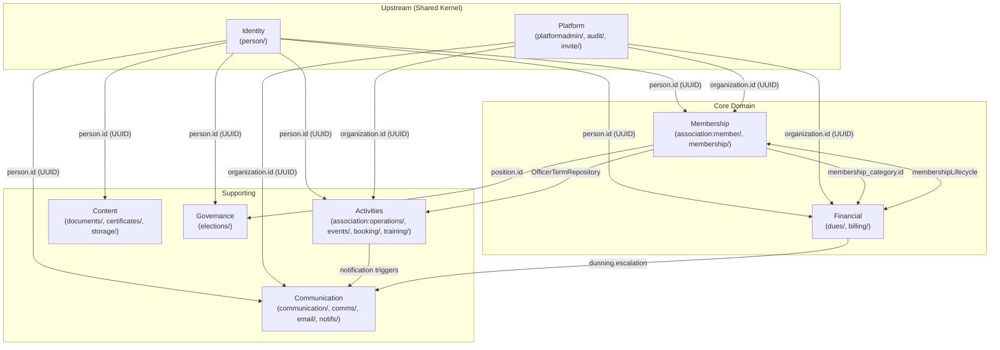

# Domain Model
Generated from 33 Drizzle ORM schema files. Source of truth for data architecture.

## Summary Statistics

| Metric | Count |
|--------|-------|
| **Tables** | 68 |
| **Enums (pgEnum)** | 55 |
| **Foreign Keys** | 38 |
| **Unique Constraints** | 18 |
| **Check Constraints** | 9 |
| **Schema Files** | 33 |
| **Bounded Contexts** | 8 |

All tables inherit 6 base entity fields from `core/database.schema.ts`:
`id` (uuid PK), `createdAt`, `updatedAt`, `version` (optimistic locking), `createdBy`, `updatedBy`.

---

## 1. Identity & Auth

### Tables

| Table | Description | Columns (excl. base) | Schema File |
|-------|-------------|---------------------|-------------|
| `person` | Core identity record for every user | 11 | `person/repos/person.schema.ts` |
| `notification_preference` | Per-person, per-category push/email toggles | 5 | `person/repos/notification-preferences.schema.ts` |
| `person_privacy_setting` | Directory visibility controls per person per org | 6 | `person/repos/privacy-settings.schema.ts` |

### Enums

| Enum | Values |
|------|--------|
| `gender` | `male`, `female`, `non-binary`, `other`, `prefer-not-to-say` |

### Table Details

**`person`**
- `firstName` varchar(50) NOT NULL
- `lastName` varchar(50)
- `middleName` varchar(50)
- `dateOfBirth` date
- `gender` gender enum
- `primaryAddress` jsonb (Address)
- `contactInfo` jsonb (ContactInfo — email, phone)
- `avatar` jsonb (MaybeStoredFile)
- `languagesSpoken` jsonb (string[])
- `timezone` varchar(50)
- `deletionRequestedAt` timestamp
- `deletionScheduledAt` timestamp
- Indexes: `persons_first_name_idx`, `persons_last_name_idx`

**`notification_preference`**
- `personId` uuid NOT NULL
- `organizationId` uuid NOT NULL
- `category` varchar(50) NOT NULL — values: dues, events, trainings, announcements, credits
- `pushEnabled` boolean (default: true)
- `emailEnabled` boolean (default: false)
- Unique: `(personId, category, organizationId)`

**`person_privacy_setting`**
- `personId` uuid NOT NULL
- `organizationId` uuid NOT NULL
- `emailVisible` boolean (default: false)
- `phoneVisible` boolean (default: false)
- `photoVisible` boolean (default: true)
- `addressVisible` boolean (default: false)
- Unique: `(personId, organizationId)`

### Foreign Keys
_None — person is the root identity aggregate._

### Module Mapping
- `person` → M02 (Member Profile)
- `notification_preference` → M02
- `person_privacy_setting` → M02

---

## 2. Membership

### Tables

| Table | Description | Columns (excl. base) | Schema File |
|-------|-------------|---------------------|-------------|
| `membership_tier` | Fee structure and benefits definition | 9 | `association:member/repos/membership.schema.ts` |
| `membership_category` | Tier grouping for reporting/eligibility | 4 | `association:member/repos/membership.schema.ts` |
| `membership` | Individual membership linking person→org→tier | 14 | `association:member/repos/membership.schema.ts` |
| `membership_application` | Prospective member application | 7 | `association:member/repos/membership.schema.ts` |
| `membership_status_history` | Every status transition for audit | 7 | `association:member/repos/status-history.schema.ts` |
| `chapter_affiliation` | Person↔chapter affiliation | 7 | `association:member/repos/chapters.schema.ts` |
| `affiliation_transfer` | Chapter transfer request workflow | 10 | `association:member/repos/chapters.schema.ts` |
| `royalty_split` | Dues revenue split between national org and chapter | 7+ | `association:member/repos/chapters.schema.ts` |
| `professional_license` | PRC/professional license tracking | 8+ | `association:member/repos/credentials.schema.ts` |
| `license_renewal_alert` | Upcoming license expiry alerts | 5+ | `association:member/repos/credentials.schema.ts` |
| `credential_template` | Template for digital credential design | 6 | `association:member/repos/credentials.schema.ts` |
| `digital_credential` | Issued digital credential with QR/HMAC | 12 | `association:member/repos/credentials.schema.ts` |
| `credit_entry` | CPD/CE credit tracking per person | 12 | `association:member/repos/credits.schema.ts` |
| `directory_profile` | Public-facing member directory profile | 14 | `association:member/repos/directory.schema.ts` |
| `position` | Governance position definition | 7 | `association:member/repos/governance.schema.ts` |
| `officer_term` | Officer term assignment to position | 6 | `association:member/repos/governance.schema.ts` |

### Enums

| Enum | Values |
|------|--------|
| `tier_status` | `active`, `retired` |
| `membership_status` | `pendingPayment`, `active`, `gracePeriod`, `lapsed`, `expired`, `suspended`, `removed`, `resigned`, `deceased`, `expelled` |
| `application_status` | `submitted`, `underReview`, `approved`, `denied`, `waitlisted` |
| `affiliation_status` | `active`, `transferred`, `withdrawn` |
| `transfer_status` | `requested`, `pendingSourceApproval`, `pendingTargetApproval`, `approved`, `denied`, `completed`, `cancelled` |
| `credential_type` | _(defined in credentials schema)_ |
| `credential_template_status` | _(defined in credentials schema)_ |
| `credential_dc_status` | _(defined in credentials schema — digital credential status)_ |
| `credit_entry_type` | `auto`, `manual` |
| `credit_cpd_category` | `General`, `Major`, `Self-Directed` |
| `credit_verification_status` | `pending`, `verified`, `rejected` |
| `directory_visibility` | `public`, `memberOnly`, `hidden` |
| `position_level` | `national`, `regional`, `chapter` |
| `term_status` | `upcoming`, `active`, `completed`, `resigned`, `removed` |

### Key Relationships

| Source Table | FK Column | Target Table | On Delete |
|-------------|-----------|-------------|-----------|
| `membership` | `tierId` | `membership_tier` | — |
| `membership` | `categoryId` | `membership_category` | — |
| `membership_application` | `tierId` | `membership_tier` | — |
| `membership_application` | `reviewedBy` | `person` | — |
| `membership_status_history` | `membershipId` | `membership` | restrict |
| `membership_status_history` | `personId` | `person` | restrict |
| `membership_status_history` | `changedBy` | `person` | restrict |
| `credential_template` | `organizationId` | `organization` | — |
| `digital_credential` | `organizationId` | `organization` | — |
| `officer_term` | `positionId` | `position` | — |

### Unique Constraints
- `membership`: `(organizationId, personId)` — one membership per person per org
- `membership_status_history`: Check constraint on `officer_term` — `endDate > startDate`

### Module Mapping
- `membership_tier`, `membership_category`, `membership`, `membership_application` → M05 (Membership)
- `membership_status_history` → M05
- `chapter_affiliation`, `affiliation_transfer`, `royalty_split` → M04 (Org Admin)
- `professional_license`, `license_renewal_alert`, `credential_template`, `digital_credential` → M11 (Documents & Credentials)
- `credit_entry` → M10 (Credit Tracking)
- `directory_profile` → M04 (Org Admin — member directory)
- `position`, `officer_term` → M04 (Org Admin — governance positions)

---

## 3. Financial

### 3a. Billing

| Table | Description | Columns (excl. base) | Schema File |
|-------|-------------|---------------------|-------------|
| `invoice` | Core billing invoice (Stripe-aligned) | 19 | `billing/repos/billing.schema.ts` |
| `invoice_line_item` | Line items on an invoice | 6 | `billing/repos/billing.schema.ts` |
| `merchant_account` | Person's payment processing account | 4 | `billing/repos/billing.schema.ts` |

#### Enums

| Enum | Values |
|------|--------|
| `invoice_status` | `draft`, `open`, `paid`, `void`, `uncollectible` |
| `payment_status` | `pending`, `requires_capture`, `processing`, `succeeded`, `failed`, `canceled` |
| `capture_method` | `automatic`, `manual` |

#### Key Relationships

| Source Table | FK Column | Target Table | On Delete |
|-------------|-----------|-------------|-----------|
| `invoice` | `customer` | `person` | restrict |
| `invoice` | `merchant` | `person` | restrict |
| `invoice` | `merchantAccount` | `merchant_account` | set null |
| `invoice_line_item` | `invoice` | `invoice` | cascade |
| `merchant_account` | `person` | `person` | restrict |

#### Unique Constraints
- `invoice`: `invoiceNumber` unique, `context` unique
- `merchant_account`: `person` unique (one account per person)

### 3b. Dues (Legacy Config)

| Table | Description | Columns (excl. base) | Schema File |
|-------|-------------|---------------------|-------------|
| `dues_config` | Legacy dues configuration | 8 | `association:member/repos/dues.schema.ts` |
| `dues_invoice` | Dues invoice for renewal period | 10 | `association:member/repos/dues.schema.ts` |
| `aging_bucket` | AR aging snapshot per org | 7 | `association:member/repos/dues.schema.ts` |
| `dues_reminder_log` | Sent reminder tracking for idempotency | 8 | `association:member/repos/dues.schema.ts` |

#### Enums

| Enum | Values |
|------|--------|
| `dues_config_status` | _(defined in dues schema)_ |
| `dues_invoice_status` | _(defined in dues schema)_ |

#### Unique Constraints
- `dues_reminder_log`: `(personId, scheduleId, periodKey, daysOffset)` — idempotency guard

### 3c. Dues (Payment System)

| Table | Description | Columns (excl. base) | Schema File |
|-------|-------------|---------------------|-------------|
| `dues_org_config` | Org-level dues configuration | 7 | `dues/repos/dues-payments.schema.ts` |
| `dues_category_override` | Per-category amount overrides | 4 | `dues/repos/dues-payments.schema.ts` |
| `dues_fund` | Named fund with allocation percentage | 5 | `dues/repos/dues-payments.schema.ts` |
| `dues_payment` | Individual dues payment record | 16 | `dues/repos/dues-payments.schema.ts` |
| `dues_fund_allocation` | Payment→fund allocation record | 5 | `dues/repos/dues-payments.schema.ts` |
| `dues_reminder_schedule` | Configurable reminder schedule | 7 | `dues/repos/dues-payments.schema.ts` |
| `dues_gateway_config` | Payment gateway credentials (PayMongo/Stripe) | 6 | `dues/repos/dues-payments.schema.ts` |
| `dues_payment_status_history` | Payment status audit trail | 6 | `dues/repos/dues-status-history.schema.ts` |

#### Enums

| Enum | Values |
|------|--------|
| `billing_frequency` | `annual`, `semi-annual`, `quarterly` |
| `dues_payment_method` | `online`, `cash`, `check`, `bankTransfer`, `gcash`, `other` |
| `dues_payment_status` | `pending`, `completed`, `failed`, `refunded`, `partiallyRefunded`, `expired`, `submitted`, `underReview`, `confirmed`, `rejected` |
| `gateway_provider` | `paymongo`, `stripe` |

#### Key Relationships

| Source Table | FK Column | Target Table | On Delete |
|-------------|-----------|-------------|-----------|
| `dues_org_config` | `organizationId` | `organization` | — |
| `dues_category_override` | `organizationId` | `organization` | — |
| `dues_category_override` | `duesConfigId` | `dues_org_config` | cascade |
| `dues_category_override` | `categoryId` | `membership_category` | — |
| `dues_fund` | `organizationId` | `organization` | — |
| `dues_payment` | `organizationId` | `organization` | — |
| `dues_payment` | `personId` | `person` | restrict |
| `dues_fund_allocation` | `paymentId` | `dues_payment` | cascade |
| `dues_fund_allocation` | `fundId` | `dues_fund` | — |
| `dues_reminder_schedule` | `duesConfigId` | `dues_org_config` | cascade |
| `dues_gateway_config` | `organizationId` | `organization` | — |
| `dues_payment_status_history` | `paymentId` | `dues_payment` | restrict |
| `dues_payment_status_history` | `personId` | `person` | restrict |
| `dues_payment_status_history` | `changedBy` | `person` | restrict |

#### Unique Constraints
- `dues_org_config`: `organizationId` unique (one config per org)
- `dues_category_override`: `(duesConfigId, categoryId)` unique
- `dues_payment`: `receiptNumber` unique
- `dues_gateway_config`: `organizationId` unique

### 3d. Dunning

| Table | Description | Columns (excl. base) | Schema File |
|-------|-------------|---------------------|-------------|
| `dunning_template` | Escalation stage content and channel | 7 | `association:member/repos/dunning.schema.ts` |
| `dunning_event` | Reminder sent log per member | 7 | `association:member/repos/dunning.schema.ts` |

#### Enums

| Enum | Values |
|------|--------|
| `dunning_channel` | `email`, `sms`, `letter` |
| `dunning_template_status` | `active`, `inactive` |
| `dunning_delivery_status` | `pending`, `sent`, `delivered`, `failed` |

### Module Mapping
- `invoice`, `invoice_line_item`, `merchant_account` → M06 (Dues & Payments — Billing subsystem)
- `dues_config`, `dues_invoice`, `aging_bucket`, `dues_reminder_log` → M06 (Dues & Payments — legacy config)
- `dues_org_config`, `dues_category_override`, `dues_fund`, `dues_payment`, `dues_fund_allocation`, `dues_reminder_schedule`, `dues_gateway_config`, `dues_payment_status_history` → M06 (Dues & Payments — v2)
- `dunning_template`, `dunning_event` → M06 (Dues & Payments — dunning subsystem)

---

## 4. Activities

### 4a. Events

| Table | Description | Columns (excl. base) | Schema File |
|-------|-------------|---------------------|-------------|
| `event` | Association event (GA, ceremony, fellowship, etc.) | 13 | `association:operations/repos/events.schema.ts` |
| `event_registration` | Event attendance registration | 6 | `association:operations/repos/events.schema.ts` |
| `check_in` | QR/manual check-in record | 5 | `association:operations/repos/events.schema.ts` |
| `waitlist_entry` | Overflow waitlist for full events | 4+ | `association:operations/repos/events.schema.ts` |

#### Enums

| Enum | Values |
|------|--------|
| `event_status` | `draft`, `published`, `cancelled`, `completed` |
| `registration_status` | `confirmed`, `waitlisted`, `cancelled`, `refunded`, `noShow` |
| `check_in_method` | `qr`, `manual` |
| `event_visibility` | `internal`, `network` |
| `event_type` | `generalAssembly`, `inductionCeremony`, `fellowship`, `medicalMission`, `boardMeeting`, `committeeMeeting`, `fundraiser`, `other` |

### 4b. Training & CPD

| Table | Description | Columns (excl. base) | Schema File |
|-------|-------------|---------------------|-------------|
| `training` | Instructor-led training session | 13 | `association:operations/repos/training.schema.ts` |
| `training_enrollment` | Training attendance enrollment | 5 | `association:operations/repos/training.schema.ts` |
| `course` | Self-paced online course | 5 | `association:operations/repos/training.schema.ts` |
| `course_enrollment` | Course enrollment with progress | 5+ | `association:operations/repos/training.schema.ts` |
| `quiz_attempt` | Course quiz submission | 7 | `association:operations/repos/training.schema.ts` |
| `accredited_provider` | PRC-accredited training provider | 5 | `training/repos/accredited-provider.schema.ts` |

#### Enums

| Enum | Values |
|------|--------|
| `training_status` | `draft`, `published`, `cancelled`, `completed` |
| `enrollment_status` | `enrolled`, `completed`, `cancelled`, `noShow` |
| `course_status` | `draft`, `published`, `archived` |
| `accredited_provider_status` | `active`, `suspended`, `expired` |

### 4c. Booking

| Table | Description | Columns (excl. base) | Schema File |
|-------|-------------|---------------------|-------------|
| `booking_event` | Flexible event scheduling configuration | 20+ | `booking/repos/booking.schema.ts` |
| `time_slot` | Individual bookable time slot | 10 | `booking/repos/booking.schema.ts` |
| `booking` | Confirmed booking between client and host | 14 | `booking/repos/booking.schema.ts` |
| `schedule_exception` | Blocked/modified times for events | 7+ | `booking/repos/booking.schema.ts` |

#### Enums

| Enum | Values |
|------|--------|
| `booking_status` | `pending`, `confirmed`, `rejected`, `cancelled`, `completed`, `no_show_client`, `no_show_host` |
| `slot_status` | `available`, `booked`, `blocked` |
| `booking_event_status` | `draft`, `active`, `paused`, `archived` |
| `location_type` | `video`, `phone`, `in-person` |
| `recurrence_type` | `daily`, `weekly`, `monthly`, `yearly` |

#### Key Relationships

| Source Table | FK Column | Target Table | On Delete |
|-------------|-----------|-------------|-----------|
| `booking_event` | `owner` | `person` | restrict |
| `time_slot` | `owner` | `person` | restrict |
| `time_slot` | `event` | `booking_event` | cascade |
| `time_slot` | `booking` | `booking` | set null |
| `booking` | `client` | `person` | restrict |
| `booking` | `host` | `person` | restrict |
| `booking` | `slot` | `time_slot` | cascade |

#### Unique Constraints
- `time_slot`: `(event, startTime)` — no overlap within same event

#### Check Constraints
- `booking_event`: maxBookingDays 0-365, minBookingMinutes 0-4320, effectiveTo > effectiveFrom
- `time_slot`: endTime > startTime
- `booking`: reason length <= 500, durationMinutes 15-480
- `schedule_exception`: endDatetime > startDatetime, reason length <= 500

### Module Mapping
- `event`, `event_registration`, `check_in`, `waitlist_entry` → M08 (Events)
- `training`, `training_enrollment`, `course`, `course_enrollment`, `quiz_attempt` → M09 (Training)
- `accredited_provider` → M09
- `booking_event`, `time_slot`, `booking`, `schedule_exception` → M08 (Events — Booking subsystem)

---

## 5. Communication

### 5a. Templated Messaging (communication/)

| Table | Description | Columns (excl. base) | Schema File |
|-------|-------------|---------------------|-------------|
| `message_template` | Reusable message template | 9 | `communication/repos/communication.schema.ts` |
| `message` | Sent/scheduled message instance | 9 | `communication/repos/communication.schema.ts` |
| `subscription_topic` | Opt-in/opt-out topic definition | 5 | `communication/repos/communication.schema.ts` |
| `person_subscription` | Person's subscription state per topic | 3 | `communication/repos/communication.schema.ts` |
| `announcement` | Officer-authored broadcast | 11 | `communication/repos/communication.schema.ts` |
| `announcement_stats` | Delivery metrics per announcement | 6 | `communication/repos/communication.schema.ts` |

#### Enums

| Enum | Values |
|------|--------|
| `comm_channel` | `email`, `push`, `inApp`, `sms` |
| `template_status` (comm) | `draft`, `active`, `archived` |
| `message_status` | `draft`, `scheduled`, `sending`, `sent`, `cancelled`, `failed` |
| `delivery_status` | `pending`, `sent`, `delivered`, `failed`, `bounced` |
| `announcement_status` | `draft`, `scheduled`, `sent`, `scheduledFailed`, `archived` |
| `announcement_visibility` | `internal`, `network` |

#### Key Relationships

| Source Table | FK Column | Target Table | On Delete |
|-------------|-----------|-------------|-----------|
| `announcement` | `authorId` | `person` | — |
| `announcement_stats` | `announcementId` | `announcement` | cascade |

### 5b. Real-Time Comms (comms/)

| Table | Description | Columns (excl. base) | Schema File |
|-------|-------------|---------------------|-------------|
| `chat_room` | Flexible chat room with participant arrays | 8 | `comms/repos/comms.schema.ts` |
| `chat_message` | Immutable chat message with optional video call data | 5 | `comms/repos/comms.schema.ts` |

#### Enums

| Enum | Values |
|------|--------|
| `chat_room_status` | `active`, `archived` |
| `message_type` | `text`, `system`, `video_call` |
| `video_call_status` | `starting`, `active`, `ended`, `cancelled` |
| `participant_type` | `client`, `host` |

### 5c. Email

| Table | Description | Columns (excl. base) | Schema File |
|-------|-------------|---------------------|-------------|
| `email_template` | Runtime-configurable email template (Handlebars) | 13 | `email/repos/email.schema.ts` |
| `email_queue` | Async email processing queue | 16 | `email/repos/email.schema.ts` |
| `email_suppression` | Bounce/unsubscribe/complaint suppression list | 5 | `email/repos/suppression.schema.ts` |

#### Enums

| Enum | Values |
|------|--------|
| `variable_type` | `string`, `number`, `boolean`, `date`, `datetime`, `url`, `email`, `array` |
| `template_status` (email) | `draft`, `active`, `archived` |
| `email_queue_status` | `pending`, `processing`, `sent`, `failed`, `cancelled` |
| `email_category` | `bulk`, `transactional` |
| `email_provider` | `smtp`, `postmark`, `onesignal` |
| `suppression_reason` | `hard_bounce`, `unsubscribe`, `complaint`, `manual` |

#### Key Relationships

| Source Table | FK Column | Target Table | On Delete |
|-------------|-----------|-------------|-----------|
| `email_queue` | `template` | `email_template` | set null |

#### Unique Constraints
- `email_suppression`: `(organizationId, email)` — one suppression per email per org

### 5d. Notifications

| Table | Description | Columns (excl. base) | Schema File |
|-------|-------------|---------------------|-------------|
| `notification` | Multi-channel notification delivery record | 11 | `notifs/repos/notification.schema.ts` |

#### Enums

| Enum | Values |
|------|--------|
| `notification_type` | `billing`, `security`, `system`, `booking.created`, `booking.confirmed`, `booking.rejected`, `booking.cancelled`, `booking.no-show-client`, `booking.no-show-host`, `comms.video-call-started`, `comms.video-call-joined`, `comms.video-call-left`, `comms.video-call-ended`, `comms.chat-message` |
| `notification_channel` | `email`, `push`, `in-app` |
| `notification_status` | `queued`, `sent`, `delivered`, `read`, `failed`, `expired` |

### Module Mapping
- `message_template`, `message`, `subscription_topic`, `person_subscription`, `announcement`, `announcement_stats` → M07 (Communications)
- `chat_room`, `chat_message` → M07 (Communications — real-time comms subsystem)
- `email_template`, `email_queue`, `email_suppression` → M07 (Communications — email subsystem)
- `notification` → M07 (Communications — notifications subsystem)

---

## 6. Content

| Table | Description | Columns (excl. base) | Schema File |
|-------|-------------|---------------------|-------------|
| `document` | Uploaded document with access control | 11 | `documents/repos/documents.schema.ts` |
| `document_version` | Version history for documents | 6 | `documents/repos/documents.schema.ts` |
| `document_tag` | Tagging taxonomy for documents | 3 | `documents/repos/documents.schema.ts` |
| `document_access_log` | Audit trail for document views/downloads | 5 | `documents/repos/documents.schema.ts` |
| `certificate` | Training completion certificate | 4 | `certificates/repos/certificates.schema.ts` |
| `stored_file` | Generic file storage record | 5 | `storage/repos/file.schema.ts` |

### Enums

| Enum | Values |
|------|--------|
| `document_status` | `draft`, `published`, `archived` |
| `file_status` | `uploading`, `processing`, `available`, `failed` |

### Key Relationships

| Source Table | FK Column | Target Table | On Delete |
|-------------|-----------|-------------|-----------|
| `certificate` | `personId` | `person` | restrict |

### Unique Constraints
- `certificate`: `certificateNumber` unique; `(trainingId, personId)` unique — one cert per person per training

### Module Mapping
- `document`, `document_version`, `document_tag`, `document_access_log` → M11 (Documents & Credentials)
- `certificate` → M11 (Documents & Credentials — certificate issuance)
- `stored_file` → M11 (Documents & Credentials — Storage subsystem)

---

## 7. Governance

| Table | Description | Columns (excl. base) | Schema File |
|-------|-------------|---------------------|-------------|
| `election` | Election event (officer or bylaw) | 12 | `elections/repos/elections.schema.ts` |
| `election_nominee` | Nominated candidate for a position | 5 | `elections/repos/elections.schema.ts` |
| `election_vote` | Individual vote cast (one per voter per position per election) | 5 | `elections/repos/elections.schema.ts` |

### Enums

| Enum | Values |
|------|--------|
| `election_type` | `officer`, `bylaw` |
| `election_status` | `draft`, `nominationsOpen`, `votingOpen`, `awaitingConfirmation`, `published`, `cancelled` |
| `voting_mode` | `online`, `inPerson`, `hybrid` |
| `nominee_status` | `nominated`, `accepted`, `declined`, `elected` |

### Key Relationships

| Source Table | FK Column | Target Table | On Delete |
|-------------|-----------|-------------|-----------|
| `election_nominee` | `electionId` | `election` | cascade |
| `election_nominee` | `positionId` | `position` | — |
| `election_nominee` | `personId` | `person` | — |
| `election_nominee` | `nominatedBy` | `person` | — |
| `election_vote` | `electionId` | `election` | cascade |
| `election_vote` | `positionId` | `position` | — |
| `election_vote` | `nomineeId` | `election_nominee` | — |
| `election_vote` | `voterId` | `person` | — |

### Unique Constraints
- `election_vote`: `(electionId, positionId, voterId)` — one vote per voter per position

### Check Constraints
- `election`: nominationsCloseAt > nominationsOpenAt, votingCloseAt > votingOpenAt, votingOpenAt >= nominationsCloseAt

### Module Mapping
- `election`, `election_nominee`, `election_vote` → M12 (Elections & Governance)

---

## 8. Platform Admin

| Table | Description | Columns (excl. base) | Schema File |
|-------|-------------|---------------------|-------------|
| `association` | Top-level association (country, currency, CPD config) | 9 | `platformadmin/repos/platform-admin.schema.ts` |
| `organization` | Org within an association (chapter, society, etc.) | 9 | `platformadmin/repos/platform-admin.schema.ts` |
| `feature_flag` | Module-level feature toggle | 5 | `platformadmin/repos/platform-admin.schema.ts` |
| `platform_admin` | Super/support/analyst admin user | 3 | `platformadmin/repos/platform-admin.schema.ts` |
| `impersonation_session` | Admin impersonation audit trail | 6 | `platformadmin/repos/platform-admin.schema.ts` |
| `audit_log_entry` | HIPAA-compliant audit trail | 16 | `audit/repos/audit.schema.ts` |
| `review` | Context-bound NPS review | 6 | `reviews/repos/review.schema.ts` |
| `invitation_token` | Officer invite / bulk import claim token | 10 | `invite/repos/invite.schema.ts` |

### Enums

| Enum | Values |
|------|--------|
| `org_lifecycle_status` | `trial`, `active`, `suspended`, `cancelled` |
| `org_type` | `chapter`, `society`, `national`, `clinic` |
| `admin_role` | `super`, `support`, `analyst` |
| `audit_event_type` | `authentication`, `data-access`, `data-modification`, `data-deletion`, `system-config`, `security`, `compliance` |
| `audit_category` | `hipaa`, `security`, `privacy`, `administrative`, `clinical`, `financial`, `association` |
| `audit_action` | `create`, `read`, `update`, `delete`, `login`, `logout`, `approve`, `deny`, `renew`, `terminate`, `reinstate`, `mark-paid`, `complete`, `transfer`, `delete-request`, `delete-cancel`, `anonymize`, `export`, `resign`, `deceased` |
| `audit_outcome` | `success`, `failure`, `partial`, `denied` |
| `audit_retention_status` | `active`, `archived`, `pending-purge` |
| `invite_type` | `claim`, `invite` |
| `invite_status` | `pending`, `claimed`, `expired`, `revoked` |

### Key Relationships

| Source Table | FK Column | Target Table | On Delete |
|-------------|-----------|-------------|-----------|
| `invitation_token` | `organizationId` | `organization` | cascade |
| `review` | `reviewer` | `person` | restrict |
| `review` | `reviewedEntity` | `person` | restrict |
| `audit_log_entry` | `archivedBy` | `user` (better-auth) | — |

### Unique Constraints
- `association`: `name` unique
- `organization`: `(name, associationId)` unique; `slug` unique
- `feature_flag`: `(targetType, targetId, moduleName)` unique
- `platform_admin`: `userId` unique
- `invitation_token`: `tokenHash` unique
- `review`: `(context, reviewer, reviewType)` unique — one review per context per reviewer per type

### Check Constraints
- `review`: npsScore 0-10, comment length <= 1000, reviewType length <= 50

### Module Mapping
- `association`, `organization`, `feature_flag`, `platform_admin`, `impersonation_session` → M03 (Platform Admin)
- `audit_log_entry` → M03 (Platform Admin — audit subsystem, cross-cutting)
- `review` → M03 (Platform Admin — NPS reviews)
- `invitation_token` → M04 (Org Admin — member invite/import)

---

## Cross-Context Relationship Map

```
┌─────────────┐     ┌──────────────┐     ┌─────────────┐
│   PERSON    │────►│  MEMBERSHIP  │────►│    DUES     │
│   (M02)     │     │    (M05)     │     │   (M06)     │
└──────┬──────┘     └──────┬───────┘     └──────┬──────┘
       │                   │                     │
       │            ┌──────┴───────┐      ┌──────┴──────┐
       │            │   ORG ADMIN  │      │  DUNNING    │
       │            │    (M04)     │      │   (M06)     │
       │            └──────────────┘      └─────────────┘
       │
       ├──────────►┌──────────────┐     ┌─────────────┐
       │           │   BILLING    │     │   BOOKING   │
       │           │    (M06)     │◄────│   (M08)     │
       │           └──────────────┘     └─────────────┘
       │
       ├──────────►┌──────────────┐     ┌─────────────┐
       │           │  CREDENTIALS │     │   CREDITS   │
       │           │    (M11)     │     │   (M10)     │
       │           └──────────────┘     └─────────────┘
       │
       ├──────────►┌──────────────┐
       │           │  ELECTIONS   │
       │           │    (M12)     │
       │           └──────────────┘
       │
       ├──────────►┌──────────────┐     ┌─────────────┐
       │           │    COMMS     │     │    EMAIL    │
       │           │    (M07)     │     │   (M07)     │
       │           └──────────────┘     └─────────────┘
       │
       └──────────►┌──────────────┐
                   │   REVIEWS    │
                   │    (M03)     │
                   └──────────────┘

┌──────────────────────────────────────────────────────┐
│              PLATFORM ADMIN (M03)                     │
│  association → organization → feature_flag            │
│  platform_admin, impersonation_session                │
│  invitation_token (M04), audit_log_entry              │
└──────────────────────────────────────────────────────┘
```

## Complete Table Index (alphabetical)

| # | Table | Context | Module | Schema File |
|---|-------|---------|--------|-------------|
| 1 | `accredited_provider` | Activities | M09 | `training/repos/accredited-provider.schema.ts` |
| 2 | `affiliation_transfer` | Membership | M04 | `association:member/repos/chapters.schema.ts` |
| 3 | `aging_bucket` | Financial | M06 | `association:member/repos/dues.schema.ts` |
| 4 | `announcement` | Communication | M07 | `communication/repos/communication.schema.ts` |
| 5 | `announcement_stats` | Communication | M07 | `communication/repos/communication.schema.ts` |
| 6 | `association` | Platform | M03 | `platformadmin/repos/platform-admin.schema.ts` |
| 7 | `audit_log_entry` | Platform | M03 | `audit/repos/audit.schema.ts` |
| 8 | `booking` | Activities | M08 | `booking/repos/booking.schema.ts` |
| 9 | `booking_event` | Activities | M08 | `booking/repos/booking.schema.ts` |
| 10 | `certificate` | Content | M11 | `certificates/repos/certificates.schema.ts` |
| 11 | `chapter_affiliation` | Membership | M04 | `association:member/repos/chapters.schema.ts` |
| 12 | `chat_message` | Communication | M07 | `comms/repos/comms.schema.ts` |
| 13 | `chat_room` | Communication | M07 | `comms/repos/comms.schema.ts` |
| 14 | `check_in` | Activities | M08 | `association:operations/repos/events.schema.ts` |
| 15 | `course` | Activities | M09 | `association:operations/repos/training.schema.ts` |
| 16 | `course_enrollment` | Activities | M09 | `association:operations/repos/training.schema.ts` |
| 17 | `credential_template` | Membership | M11 | `association:member/repos/credentials.schema.ts` |
| 18 | `credit_entry` | Membership | M10 | `association:member/repos/credits.schema.ts` |
| 19 | `digital_credential` | Membership | M11 | `association:member/repos/credentials.schema.ts` |
| 20 | `directory_profile` | Membership | M04 | `association:member/repos/directory.schema.ts` |
| 21 | `document` | Content | M11 | `documents/repos/documents.schema.ts` |
| 22 | `document_access_log` | Content | M11 | `documents/repos/documents.schema.ts` |
| 23 | `document_tag` | Content | M11 | `documents/repos/documents.schema.ts` |
| 24 | `document_version` | Content | M11 | `documents/repos/documents.schema.ts` |
| 25 | `dues_category_override` | Financial | M06 | `dues/repos/dues-payments.schema.ts` |
| 26 | `dues_config` | Financial | M06 | `association:member/repos/dues.schema.ts` |
| 27 | `dues_fund` | Financial | M06 | `dues/repos/dues-payments.schema.ts` |
| 28 | `dues_fund_allocation` | Financial | M06 | `dues/repos/dues-payments.schema.ts` |
| 29 | `dues_gateway_config` | Financial | M06 | `dues/repos/dues-payments.schema.ts` |
| 30 | `dues_invoice` | Financial | M06 | `association:member/repos/dues.schema.ts` |
| 31 | `dues_org_config` | Financial | M06 | `dues/repos/dues-payments.schema.ts` |
| 32 | `dues_payment` | Financial | M06 | `dues/repos/dues-payments.schema.ts` |
| 33 | `dues_payment_status_history` | Financial | M06 | `dues/repos/dues-status-history.schema.ts` |
| 34 | `dues_reminder_log` | Financial | M06 | `association:member/repos/dues.schema.ts` |
| 35 | `dues_reminder_schedule` | Financial | M06 | `dues/repos/dues-payments.schema.ts` |
| 36 | `dunning_event` | Financial | M06 | `association:member/repos/dunning.schema.ts` |
| 37 | `dunning_template` | Financial | M06 | `association:member/repos/dunning.schema.ts` |
| 38 | `election` | Governance | M12 | `elections/repos/elections.schema.ts` |
| 39 | `election_nominee` | Governance | M12 | `elections/repos/elections.schema.ts` |
| 40 | `election_vote` | Governance | M12 | `elections/repos/elections.schema.ts` |
| 41 | `email_queue` | Communication | M07 | `email/repos/email.schema.ts` |
| 42 | `email_suppression` | Communication | M07 | `email/repos/suppression.schema.ts` |
| 43 | `email_template` | Communication | M07 | `email/repos/email.schema.ts` |
| 44 | `event` | Activities | M08 | `association:operations/repos/events.schema.ts` |
| 45 | `event_registration` | Activities | M08 | `association:operations/repos/events.schema.ts` |
| 46 | `feature_flag` | Platform | M03 | `platformadmin/repos/platform-admin.schema.ts` |
| 47 | `impersonation_session` | Platform | M03 | `platformadmin/repos/platform-admin.schema.ts` |
| 48 | `invitation_token` | Platform | M04 | `invite/repos/invite.schema.ts` |
| 49 | `invoice` | Financial | M06 | `billing/repos/billing.schema.ts` |
| 50 | `invoice_line_item` | Financial | M06 | `billing/repos/billing.schema.ts` |
| 51 | `license_renewal_alert` | Membership | M11 | `association:member/repos/credentials.schema.ts` |
| 52 | `membership` | Membership | M05 | `association:member/repos/membership.schema.ts` |
| 53 | `membership_application` | Membership | M05 | `association:member/repos/membership.schema.ts` |
| 54 | `membership_category` | Membership | M05 | `association:member/repos/membership.schema.ts` |
| 55 | `membership_status_history` | Membership | M05 | `association:member/repos/status-history.schema.ts` |
| 56 | `membership_tier` | Membership | M05 | `association:member/repos/membership.schema.ts` |
| 57 | `merchant_account` | Financial | M06 | `billing/repos/billing.schema.ts` |
| 58 | `message` | Communication | M07 | `communication/repos/communication.schema.ts` |
| 59 | `message_template` | Communication | M07 | `communication/repos/communication.schema.ts` |
| 60 | `notification` | Communication | M07 | `notifs/repos/notification.schema.ts` |
| 61 | `notification_preference` | Identity | M02 | `person/repos/notification-preferences.schema.ts` |
| 62 | `officer_term` | Membership | M04 | `association:member/repos/governance.schema.ts` |
| 63 | `organization` | Platform | M03 | `platformadmin/repos/platform-admin.schema.ts` |
| 64 | `person` | Identity | M02 | `person/repos/person.schema.ts` |
| 65 | `person_privacy_setting` | Identity | M02 | `person/repos/privacy-settings.schema.ts` |
| 66 | `person_subscription` | Communication | M07 | `communication/repos/communication.schema.ts` |
| 67 | `platform_admin` | Platform | M03 | `platformadmin/repos/platform-admin.schema.ts` |
| 68 | `position` | Membership | M04 | `association:member/repos/governance.schema.ts` |
| 69 | `professional_license` | Membership | M11 | `association:member/repos/credentials.schema.ts` |
| 70 | `quiz_attempt` | Activities | M09 | `association:operations/repos/training.schema.ts` |
| 71 | `review` | Platform | M03 | `reviews/repos/review.schema.ts` |
| 72 | `royalty_split` | Membership | M04 | `association:member/repos/chapters.schema.ts` |
| 73 | `schedule_exception` | Activities | M08 | `booking/repos/booking.schema.ts` |
| 74 | `stored_file` | Content | M11 | `storage/repos/file.schema.ts` |
| 75 | `subscription_topic` | Communication | M07 | `communication/repos/communication.schema.ts` |
| 76 | `training` | Activities | M09 | `association:operations/repos/training.schema.ts` |
| 77 | `training_enrollment` | Activities | M09 | `association:operations/repos/training.schema.ts` |
| 78 | `waitlist_entry` | Activities | M08 | `association:operations/repos/events.schema.ts` |

## Complete Enum Index (alphabetical)

| # | Enum | Values | Schema File |
|---|------|--------|-------------|
| 1 | `accredited_provider_status` | active, suspended, expired | `training/repos/accredited-provider.schema.ts` |
| 2 | `admin_role` | super, support, analyst | `platformadmin/repos/platform-admin.schema.ts` |
| 3 | `affiliation_status` | active, transferred, withdrawn | `association:member/repos/chapters.schema.ts` |
| 4 | `announcement_status` | draft, scheduled, sent, scheduledFailed, archived | `communication/repos/communication.schema.ts` |
| 5 | `announcement_visibility` | internal, network | `communication/repos/communication.schema.ts` |
| 6 | `application_status` | submitted, underReview, approved, denied, waitlisted | `association:member/repos/membership.schema.ts` |
| 7 | `audit_action` | create, read, update, delete, login, logout, approve, deny, renew, terminate, reinstate, mark-paid, complete, transfer, delete-request, delete-cancel, anonymize, export, resign, deceased | `audit/repos/audit.schema.ts` |
| 8 | `audit_category` | hipaa, security, privacy, administrative, clinical, financial, association | `audit/repos/audit.schema.ts` |
| 9 | `audit_event_type` | authentication, data-access, data-modification, data-deletion, system-config, security, compliance | `audit/repos/audit.schema.ts` |
| 10 | `audit_outcome` | success, failure, partial, denied | `audit/repos/audit.schema.ts` |
| 11 | `audit_retention_status` | active, archived, pending-purge | `audit/repos/audit.schema.ts` |
| 12 | `billing_frequency` | annual, semi-annual, quarterly | `dues/repos/dues-payments.schema.ts` |
| 13 | `booking_event_status` | draft, active, paused, archived | `booking/repos/booking.schema.ts` |
| 14 | `booking_status` | pending, confirmed, rejected, cancelled, completed, no_show_client, no_show_host | `booking/repos/booking.schema.ts` |
| 15 | `capture_method` | automatic, manual | `billing/repos/billing.schema.ts` |
| 16 | `chat_room_status` | active, archived | `comms/repos/comms.schema.ts` |
| 17 | `check_in_method` | qr, manual | `association:operations/repos/events.schema.ts` |
| 18 | `comm_channel` | email, push, inApp, sms | `communication/repos/communication.schema.ts` |
| 19 | `course_status` | draft, published, archived | `association:operations/repos/training.schema.ts` |
| 20 | `credit_cpd_category` | General, Major, Self-Directed | `association:member/repos/credits.schema.ts` |
| 21 | `credit_entry_type` | auto, manual | `association:member/repos/credits.schema.ts` |
| 22 | `credit_verification_status` | pending, verified, rejected | `association:member/repos/credits.schema.ts` |
| 23 | `delivery_status` | pending, sent, delivered, failed, bounced | `communication/repos/communication.schema.ts` |
| 24 | `directory_visibility` | public, memberOnly, hidden | `association:member/repos/directory.schema.ts` |
| 25 | `document_status` | draft, published, archived | `documents/repos/documents.schema.ts` |
| 26 | `dues_config_status` | _(in dues.schema.ts)_ | `association:member/repos/dues.schema.ts` |
| 27 | `dues_invoice_status` | _(in dues.schema.ts)_ | `association:member/repos/dues.schema.ts` |
| 28 | `dues_payment_method` | online, cash, check, bankTransfer, gcash, other | `dues/repos/dues-payments.schema.ts` |
| 29 | `dues_payment_status` | pending, completed, failed, refunded, partiallyRefunded, expired, submitted, underReview, confirmed, rejected | `dues/repos/dues-payments.schema.ts` |
| 30 | `dunning_channel` | email, sms, letter | `association:member/repos/dunning.schema.ts` |
| 31 | `dunning_delivery_status` | pending, sent, delivered, failed | `association:member/repos/dunning.schema.ts` |
| 32 | `dunning_template_status` | active, inactive | `association:member/repos/dunning.schema.ts` |
| 33 | `election_status` | draft, nominationsOpen, votingOpen, awaitingConfirmation, published, cancelled | `elections/repos/elections.schema.ts` |
| 34 | `election_type` | officer, bylaw | `elections/repos/elections.schema.ts` |
| 35 | `email_category` | bulk, transactional | `email/repos/email.schema.ts` |
| 36 | `email_provider` | smtp, postmark, onesignal | `email/repos/email.schema.ts` |
| 37 | `email_queue_status` | pending, processing, sent, failed, cancelled | `email/repos/email.schema.ts` |
| 38 | `enrollment_status` | enrolled, completed, cancelled, noShow | `association:operations/repos/training.schema.ts` |
| 39 | `event_status` | draft, published, cancelled, completed | `association:operations/repos/events.schema.ts` |
| 40 | `event_type` | generalAssembly, inductionCeremony, fellowship, medicalMission, boardMeeting, committeeMeeting, fundraiser, other | `association:operations/repos/events.schema.ts` |
| 41 | `event_visibility` | internal, network | `association:operations/repos/events.schema.ts` |
| 42 | `file_status` | uploading, processing, available, failed | `storage/repos/file.schema.ts` |
| 43 | `gateway_provider` | paymongo, stripe | `dues/repos/dues-payments.schema.ts` |
| 44 | `gender` | male, female, non-binary, other, prefer-not-to-say | `person/repos/person.schema.ts` |
| 45 | `invite_status` | pending, claimed, expired, revoked | `invite/repos/invite.schema.ts` |
| 46 | `invite_type` | claim, invite | `invite/repos/invite.schema.ts` |
| 47 | `invoice_status` | draft, open, paid, void, uncollectible | `billing/repos/billing.schema.ts` |
| 48 | `location_type` | video, phone, in-person | `booking/repos/booking.schema.ts` |
| 49 | `membership_status` | pendingPayment, active, gracePeriod, lapsed, expired, suspended, removed, resigned, deceased, expelled | `association:member/repos/membership.schema.ts` |
| 50 | `message_status` | draft, scheduled, sending, sent, cancelled, failed | `communication/repos/communication.schema.ts` |
| 51 | `message_type` | text, system, video_call | `comms/repos/comms.schema.ts` |
| 52 | `nominee_status` | nominated, accepted, declined, elected | `elections/repos/elections.schema.ts` |
| 53 | `notification_channel` | email, push, in-app | `notifs/repos/notification.schema.ts` |
| 54 | `notification_status` | queued, sent, delivered, read, failed, expired | `notifs/repos/notification.schema.ts` |
| 55 | `notification_type` | billing, security, system, booking.created, booking.confirmed, booking.rejected, booking.cancelled, booking.no-show-client, booking.no-show-host, comms.video-call-started, comms.video-call-joined, comms.video-call-left, comms.video-call-ended, comms.chat-message | `notifs/repos/notification.schema.ts` |
| 56 | `org_lifecycle_status` | trial, active, suspended, cancelled | `platformadmin/repos/platform-admin.schema.ts` |
| 57 | `org_type` | chapter, society, national, clinic | `platformadmin/repos/platform-admin.schema.ts` |
| 58 | `participant_type` | client, host | `comms/repos/comms.schema.ts` |
| 59 | `payment_status` | pending, requires_capture, processing, succeeded, failed, canceled | `billing/repos/billing.schema.ts` |
| 60 | `position_level` | national, regional, chapter | `association:member/repos/governance.schema.ts` |
| 61 | `recurrence_type` | daily, weekly, monthly, yearly | `booking/repos/booking.schema.ts` |
| 62 | `registration_status` | confirmed, waitlisted, cancelled, refunded, noShow | `association:operations/repos/events.schema.ts` |
| 63 | `slot_status` | available, booked, blocked | `booking/repos/booking.schema.ts` |
| 64 | `suppression_reason` | hard_bounce, unsubscribe, complaint, manual | `email/repos/suppression.schema.ts` |
| 65 | `template_status` (comm) | draft, active, archived | `communication/repos/communication.schema.ts` |
| 66 | `template_status` (email) | draft, active, archived | `email/repos/email.schema.ts` |
| 67 | `term_status` | upcoming, active, completed, resigned, removed | `association:member/repos/governance.schema.ts` |
| 68 | `tier_status` | active, retired | `association:member/repos/membership.schema.ts` |
| 69 | `training_status` | draft, published, cancelled, completed | `association:operations/repos/training.schema.ts` |
| 70 | `transfer_status` | requested, pendingSourceApproval, pendingTargetApproval, approved, denied, completed, cancelled | `association:member/repos/chapters.schema.ts` |
| 71 | `variable_type` | string, number, boolean, date, datetime, url, email, array | `email/repos/email.schema.ts` |
| 72 | `video_call_status` | starting, active, ended, cancelled | `comms/repos/comms.schema.ts` |
| 73 | `voting_mode` | online, inPerson, hybrid | `elections/repos/elections.schema.ts` |

> **Note:** `template_status` is defined in two separate schema files (communication and email) with the same values. Two pgEnum definitions sharing the same name may cause migration conflicts — verify they use distinct DB enum names.

---

## DDD Analysis

_Added 2026-05-20. Derived from handler directory structure, cross-module imports, schema foreign keys, and VALID_TRANSITIONS maps in code._

---

## 9. Bounded Contexts

Eight bounded contexts aligned with handler directory clusters. Each context owns its schema files and exposes repositories as its public API.

### Context Inventory

| # | Context | Handler Dirs | Aggregate Root | Tables Owned |
|---|---------|-------------|----------------|-------------|
| 1 | **Identity** | `person/` | `person` | 3 |
| 2 | **Membership** | `association:member/`, `membership/` | `membership` | 16 |
| 3 | **Financial** | `dues/`, `billing/`, `association:member/repos/dues.schema.ts`, `association:member/repos/dunning.schema.ts` | `dues_payment` | 14 |
| 4 | **Activities** | `association:operations/`, `events/`, `booking/`, `training/` | `event`, `booking_event`, `training` | 14 |
| 5 | **Communication** | `communication/`, `comms/`, `email/`, `notifs/` | `announcement`, `chat_room`, `email_queue`, `notification` | 12 |
| 6 | **Content** | `documents/`, `certificates/`, `storage/` | `document` | 6 |
| 7 | **Governance** | `elections/` | `election` | 3 |
| 8 | **Platform** | `platformadmin/`, `audit/`, `reviews/`, `invite/` | `organization` | 8 |

### Context Definitions

**1. Identity Context**
- **Owning module:** `person/`
- **Core entities:** `person`, `notification_preference`, `person_privacy_setting`
- **External dependencies:** None (root context)
- **Downstream consumers:** Every other context references `person.id` via UUID

**2. Membership Context**
- **Owning modules:** `association:member/`, `membership/`
- **Core entities:** `membership`, `membership_tier`, `membership_category`, `membership_application`, `membership_status_history`, `chapter_affiliation`, `affiliation_transfer`, `royalty_split`, `professional_license`, `license_renewal_alert`, `credential_template`, `digital_credential`, `credit_entry`, `directory_profile`, `position`, `officer_term`
- **External dependencies:** Identity (person), Platform (organization)
- **Notes:** This is the mega-module (157+ handlers). Split plan exists at `.planning/phases/14-mega-module-split/SPLIT-PLAN.md`

**3. Financial Context**
- **Owning modules:** `dues/`, `billing/`
- **Core entities:** `dues_payment`, `dues_org_config`, `dues_fund`, `dues_fund_allocation`, `dues_gateway_config`, `dues_reminder_schedule`, `dues_category_override`, `dues_payment_status_history`, `invoice`, `invoice_line_item`, `merchant_account`, `dues_config` (legacy), `dues_invoice` (legacy), `aging_bucket`, `dunning_template`, `dunning_event`, `dues_reminder_log`
- **External dependencies:** Identity (person), Platform (organization), Membership (membership_category for dues_category_override)
- **Notes:** Two subsystems coexist — legacy `dues_config`/`dues_invoice` in `association:member/repos/dues.schema.ts` and v2 payment system in `dues/repos/dues-payments.schema.ts`

**4. Activities Context**
- **Owning modules:** `association:operations/`, `events/`, `booking/`, `training/`
- **Core entities:** `event`, `event_registration`, `check_in`, `waitlist_entry`, `training`, `training_enrollment`, `course`, `course_enrollment`, `quiz_attempt`, `accredited_provider`, `booking_event`, `time_slot`, `booking`, `schedule_exception`
- **External dependencies:** Identity (person), Membership (for officer role checks via `OfficerTermRepository`)

**5. Communication Context**
- **Owning modules:** `communication/`, `comms/`, `email/`, `notifs/`
- **Core entities:** `message_template`, `message`, `subscription_topic`, `person_subscription`, `announcement`, `announcement_stats`, `chat_room`, `chat_message`, `email_template`, `email_queue`, `email_suppression`, `notification`
- **External dependencies:** Identity (person for announcements and recipients)

**6. Content Context**
- **Owning modules:** `documents/`, `certificates/`, `storage/`
- **Core entities:** `document`, `document_version`, `document_tag`, `document_access_log`, `certificate`, `stored_file`
- **External dependencies:** Identity (person for certificates), Activities (training for certificate issuance)

**7. Governance Context**
- **Owning module:** `elections/`
- **Core entities:** `election`, `election_nominee`, `election_vote`
- **External dependencies:** Identity (person), Membership (position)

**8. Platform Context**
- **Owning modules:** `platformadmin/`, `audit/`, `reviews/`, `invite/`
- **Core entities:** `association`, `organization`, `feature_flag`, `platform_admin`, `impersonation_session`, `audit_log_entry`, `review`, `invitation_token`
- **External dependencies:** Better-Auth `user` table (for audit_log_entry.archivedBy)

### Context Map



---

## 10. Aggregate Roots

Each bounded context has one or more aggregate roots — the entity that other entities within the aggregate reference via foreign key, and that external contexts reference by UUID.

### Per-Context Aggregates

**Identity Context:**
- **`person`** — Root aggregate. No FK dependencies. All other contexts reference `person.id` as a UUID. File: `person/repos/person.schema.ts`

**Membership Context:**
- **`membership`** — Links person→org→tier. Referenced by `membership_status_history.membershipId`. One per person per org (unique constraint). File: `association:member/repos/membership.schema.ts`
- **`position`** — Governance position definition. Referenced by `officer_term.positionId` and cross-context by `election_nominee.positionId`. File: `association:member/repos/governance.schema.ts`
- **`membership_tier`** — Referenced by `membership.tierId` and `membership_application.tierId`. File: `association:member/repos/membership.schema.ts`

**Financial Context:**
- **`dues_payment`** — Central payment record. Referenced by `dues_fund_allocation.paymentId`, `dues_payment_status_history.paymentId`. File: `dues/repos/dues-payments.schema.ts`
- **`dues_org_config`** — Org-level config root. Referenced by `dues_category_override.duesConfigId`, `dues_reminder_schedule.duesConfigId`. File: `dues/repos/dues-payments.schema.ts`
- **`invoice`** — Billing aggregate root. Referenced by `invoice_line_item.invoice`. File: `billing/repos/billing.schema.ts`

**Activities Context:**
- **`event`** — Referenced by `event_registration`, `check_in`, `waitlist_entry` (all via organizationId/eventId pattern). File: `association:operations/repos/events.schema.ts`
- **`booking_event`** — Referenced by `time_slot.event`, `schedule_exception`. File: `booking/repos/booking.schema.ts`
- **`training`** — Referenced by `training_enrollment`, `certificate` (cross-context). File: `association:operations/repos/training.schema.ts`

**Communication Context:**
- **`announcement`** — Referenced by `announcement_stats.announcementId`. File: `communication/repos/communication.schema.ts`
- **`chat_room`** — Referenced by `chat_message.roomId`. File: `comms/repos/comms.schema.ts`
- **`email_template`** — Referenced by `email_queue.template`. File: `email/repos/email.schema.ts`
- **`notification`** — Standalone aggregate (no child entities). File: `notifs/repos/notification.schema.ts`

**Content Context:**
- **`document`** — Referenced by `document_version`, `document_tag`, `document_access_log`. File: `documents/repos/documents.schema.ts`

**Governance Context:**
- **`election`** — Referenced by `election_nominee.electionId`, `election_vote.electionId` (both cascade on delete). File: `elections/repos/elections.schema.ts`

**Platform Context:**
- **`organization`** — Referenced by 10+ tables across Financial, Membership, and Communication contexts. The `association` table is its parent. File: `platformadmin/repos/platform-admin.schema.ts`

---

## 11. Domain Events

Domain events are implemented as notification types in the `notification` table. The `notificationTypeEnum` in `notifs/repos/notification.schema.ts` defines the event catalog. Additional trigger functions in `notifs/notification-triggers.ts` wire cross-cutting events.

### Event Catalog

| Event Name | Producer Context | Consumer Context | Channel | Payload Shape | Source |
|------------|-----------------|------------------|---------|---------------|--------|
| `billing` | Financial | Communication | email/push/in-app | Generic billing notification | `notifs/repos/notification.schema.ts` enum |
| `security` | Platform | Communication | email/push/in-app | Security alert | `notifs/repos/notification.schema.ts` enum |
| `system` | Platform | Communication | email/push/in-app | System notification | `notifs/repos/notification.schema.ts` enum |
| `booking.created` | Activities (Booking) | Communication | configurable | `{ recipient, relatedEntity: bookingId }` | `notifs/repos/notification.schema.ts` enum |
| `booking.confirmed` | Activities (Booking) | Communication | configurable | `{ recipient, relatedEntity: bookingId }` | `notifs/repos/notification.schema.ts` enum |
| `booking.rejected` | Activities (Booking) | Communication | configurable | `{ recipient, relatedEntity: bookingId }` | `notifs/repos/notification.schema.ts` enum |
| `booking.cancelled` | Activities (Booking) | Communication | configurable | `{ recipient, relatedEntity: bookingId }` | `notifs/repos/notification.schema.ts` enum |
| `booking.no-show-client` | Activities (Booking) | Communication | configurable | `{ recipient, relatedEntity: bookingId }` | `notifs/repos/notification.schema.ts` enum |
| `booking.no-show-host` | Activities (Booking) | Communication | configurable | `{ recipient, relatedEntity: bookingId }` | `notifs/repos/notification.schema.ts` enum |
| `comms.video-call-started` | Communication (Comms) | Communication (Notifs) | configurable | `{ recipient, relatedEntity: roomId }` | `notifs/repos/notification.schema.ts` enum |
| `comms.video-call-joined` | Communication (Comms) | Communication (Notifs) | configurable | `{ recipient, relatedEntity: roomId }` | `notifs/repos/notification.schema.ts` enum |
| `comms.video-call-left` | Communication (Comms) | Communication (Notifs) | configurable | `{ recipient, relatedEntity: roomId }` | `notifs/repos/notification.schema.ts` enum |
| `comms.video-call-ended` | Communication (Comms) | Communication (Notifs) | configurable | `{ recipient, relatedEntity: roomId }` | `notifs/repos/notification.schema.ts` enum |
| `comms.chat-message` | Communication (Comms) | Communication (Notifs) | configurable | `{ recipient, relatedEntity: roomId }` | `notifs/repos/notification.schema.ts` enum |
| `waitlist.promoted` | Activities (Events) | Communication (Notifs) | in-app | `WaitlistPromotionContext { organizationId, personId, eventId, eventName, position }` | `notifs/notification-triggers.ts` GAP-003 |
| `event.late-cancellation` | Activities (Events) | Communication (Notifs) | in-app | `LateCancellationContext { organizationId, cancellerId, organizerIds[], eventId, eventName, cancelledAt, eventStartsAt }` | `notifs/notification-triggers.ts` GAP-006 |
| `dunning.escalation` | Financial (Dunning) | Communication (Notifs) | in-app | `DunningEscalationContext { organizationId, personId, membershipId, stage, daysOverdue, templateName }` | `notifs/notification-triggers.ts` GAP-012 |
| `task.overdue` | Membership (Committees) | Communication (Notifs) | in-app | `TaskOverdueContext { organizationId, assigneeId, taskId, taskTitle, committeeName, daysOverdue }` | `notifs/notification-triggers.ts` GAP-017 |

### Event Delivery Pattern

All notification triggers follow a fire-and-forget pattern:

```typescript
// From notifs/notification-triggers.ts
// Non-blocking: errors swallowed to avoid breaking the producer flow
try {
  await notifService.createNotification({
    organizationId, recipient, type, channel: 'in-app',
    title, message, relatedEntityType, relatedEntity,
    consentValidated: true,
  });
} catch {
  // Non-blocking
}
```

### CreateNotificationRequest Interface

Defined in `notifs/repos/notification.schema.ts`:

```typescript
interface CreateNotificationRequest {
  organizationId: string;
  recipient: string;          // person UUID
  type: NotificationType;     // one of the 18 enum values above
  channel: 'email' | 'push' | 'in-app';
  title: string;
  message: string;
  scheduledAt?: Date;
  relatedEntityType?: string; // e.g., 'event', 'booking', 'membership', 'task'
  relatedEntity?: string;     // UUID of related entity
  consentValidated?: boolean;
  targetApp?: string;         // optional app tag for push filtering
}
```

---

## 12. Anti-Corruption Layers

Cross-context dependencies analyzed from actual `import` statements in handler files (excluding tests and generated code).

### Direct Cross-Context Imports (Coupling)

| Consumer | Imports From | Import Type | Risk Level |
|----------|-------------|-------------|------------|
| `dues/refundPayment.ts` | `association:member/utils/membership-lifecycle` | Function call | **High** — Financial directly mutates Membership state |
| `dues/utils/settle-payment.ts` | `association:member/utils/membership-lifecycle` | Function call | **High** — Same: payment settlement extends membership |
| `dues/getDuesDashboard.ts` | `association:operations/repos/events.schema` | Schema import | Medium — reads Events schema for dashboard data |
| `dues/repos/dues-payments.schema.ts` | `platformadmin/repos/platform-admin.schema` | FK reference | Low — standard org FK |
| `person/getMyCreditSummary.ts` | `association:member/repos/credits.repo` | Repository call | Medium — Identity reads from Membership |
| `person/createMyCreditEntry.ts` | `association:member/repos/credits.repo`, `utils/credit-cycle` | Repository + util | Medium — Identity writes to Membership |
| `person/exportMyData.ts` | `association:member/repos/membership.repo`, `credits.repo` | Repository reads | Medium — GDPR export crosses contexts |
| `person/getMyMemberships.ts` | `association:member/repos/membership.schema`, `platformadmin/repos/platform-admin.schema` | Schema reads | Low — read-only joins |
| `membership/listOrgMembers.ts` | `association:member/repos/membership.schema`, `person/repos/person.schema`, `platformadmin/repos/platform-admin.schema` | Schema reads | Medium — 3-context join |
| `membership/listOrgApplications.ts` | `association:member/repos/membership.schema`, `platformadmin/repos/platform-admin.schema` | Schema reads | Low |
| `events/getEvent.ts`, `updateEvent.ts`, `cancelEvent.ts` | `membership/repos/membership.repo` | Repository call | Medium — Events checks membership for authorization |
| `association:member/listDuesPayments.ts` | `dues/repos/dues.repo` | Repository call | Medium — Membership reads Financial |
| `association:member/confirmPaymentProof.ts` | `dues/repos/dues.repo`, `dues/utils/settle-payment` | Repository + util | **High** — Membership triggers Financial settlement |
| `association:member/getDuesConfig.ts` | `dues/repos/dues.repo` | Repository read | Low |
| `association:member/getRosterMember.ts` | `membership/repos/membership.repo` | Repository call | Low — same context boundary ambiguity |
| `documents/slice-023-*.test.ts` | `association:operations/utils/qr-checkin`, `association:member/utils/credential-token`, `certificates/repos/certificates.repo` | Test utility | Low — test-only |

### Proper Boundaries (ID-Based References)

These cross-context references use **UUID-only coupling** (correct DDD pattern):

- All tables reference `person.id` via UUID FK — no direct schema imports needed at runtime
- `organization.id` referenced via UUID FK in Financial, Membership, Communication schemas
- `position.id` referenced via UUID FK in `election_nominee.positionId` (Governance → Membership)
- `training.id` referenced via UUID in `certificate.trainingId` (Content → Activities)

### High-Risk Coupling Assessment

The **Financial ↔ Membership bidirectional coupling** is the most significant anti-corruption concern:

1. **Financial → Membership:** `dues/utils/settle-payment.ts` and `dues/refundPayment.ts` import `membershipLifecycle` from `association:member/utils/membership-lifecycle.ts` to extend/reset membership expiry on payment/refund
2. **Membership → Financial:** `association:member/confirmPaymentProof.ts` imports `settlePayment` from `dues/utils/settle-payment.ts`

This creates a circular dependency chain: `dues → membership-lifecycle → dues (repos)`. Currently resolved via the `membershipLifecycle` service object in `association:member/utils/membership-lifecycle.ts` which acts as a **Shared Kernel** between the two contexts, but is owned by Membership.

---

## 13. State Machines

Three explicit `VALID_TRANSITIONS` maps exist in handler code. One additional state machine is computed at query time (membership status).

### 13a. Organization Lifecycle

**Entity:** `organization`
**Enum:** `org_lifecycle_status`
**Source:** `platformadmin/transitionOrgStatus.ts`

```
trial ──────► active
              │
              ├──► suspended ──► active
              │        │
              │        └──► cancelled ──► active
              │
              └──► cancelled ──► active
```

| From | Allowed Targets | Guard |
|------|----------------|-------|
| `trial` | `active` | None |
| `active` | `suspended`, `cancelled` | None |
| `suspended` | `active`, `cancelled` | None |
| `cancelled` | `active` | None |

Error: `BusinessLogicError('INVALID_TRANSITION')` on disallowed transition.

### 13b. Membership Status (Officer-Initiated)

**Entity:** `membership`
**Enum:** `membership_status` (subset used in transitions)
**Source:** `membership/updateMember.ts`

| From | Allowed Targets | Guard |
|------|----------------|-------|
| `active` | `suspended`, `removed` | Officer role required |
| `grace` | `suspended` | Officer role required |
| `lapsed` | `suspended`, `active` | Officer role required |
| `suspended` | `active` | Officer role required |

**Important caveats (from code comments):**
- `pendingPayment → active/removed` handled by `reviewApplication`, not `updateMember`
- `active → gracePeriod` and `gracePeriod → lapsed` are **automatic** (computed from `dues_expiry_date`)
- `lapsed → active` also happens via payment recording (BR-07)
- No-op transitions (`from === to`) are always valid

### 13c. Membership Status (Computed — BR-01)

**Entity:** `membership` (virtual — never stored as mutable field)
**Source:** `association:member/utils/compute-membership-status.ts`

This is **not** a traditional state machine. Status is computed at query time from `duesExpiryDate`, `suspendedAt`, `removedAt`, and `isPendingPayment` flags.

**Priority order (highest wins):**

| Priority | Status | Condition |
|----------|--------|-----------|
| 1 | `removed` | `removedAt` is set (irreversible officer action) |
| 2 | `suspended` | `suspendedAt` is set (reversible officer action) |
| 3 | `pendingPayment` | `isPendingPayment` flag true (initial state) |
| 4 | `active` | `duesExpiryDate` is null (life/honorary) OR expiry >= today |
| 5 | `gracePeriod` | Today is within `gracePeriodDays` after expiry |
| 6 | `lapsed` | Grace period also expired |

**Reactivatable statuses** (from `membership-lifecycle.ts`): `pendingPayment`, `active`, `gracePeriod`, `lapsed`

### 13d. Election Status

**Entity:** `election`
**Enum:** `election_status`
**Source:** `elections/updateElectionStatus.ts`

```
draft ──► nominationsOpen ──► votingOpen ──► awaitingConfirmation ──► published (terminal)
  │              │                 │                   │
  └──► cancelled └──► cancelled    └──► cancelled      └──► cancelled (terminal)
```

| From | Allowed Targets | Guard |
|------|----------------|-------|
| `draft` | `nominationsOpen`, `cancelled` | None |
| `nominationsOpen` | `votingOpen`, `cancelled` | None |
| `votingOpen` | `awaitingConfirmation`, `cancelled` | **BR-33:** Minimum 2 candidates per position |
| `awaitingConfirmation` | `published`, `cancelled` | None |
| `published` | _(none — terminal)_ | — |
| `cancelled` | _(none — terminal)_ | — |

Error: `BusinessLogicError('INVALID_ELECTION_TRANSITION')` on disallowed transition. `BusinessLogicError('INSUFFICIENT_CANDIDATES')` when BR-33 fails.

### Enum-Only Status Fields (No Explicit Transition Map)

These entities have status enums but no `VALID_TRANSITIONS` map in code — transitions are implicit in handler logic:

| Entity | Enum | Values | Schema File |
|--------|------|--------|-------------|
| `booking` | `booking_status` | pending, confirmed, rejected, cancelled, completed, no_show_client, no_show_host | `booking/repos/booking.schema.ts` |
| `event` | `event_status` | draft, published, cancelled, completed | `association:operations/repos/events.schema.ts` |
| `training` | `training_status` | draft, published, cancelled, completed | `association:operations/repos/training.schema.ts` |
| `dues_payment` | `dues_payment_status` | pending, completed, failed, refunded, partiallyRefunded, expired, submitted, underReview, confirmed, rejected | `dues/repos/dues-payments.schema.ts` |
| `notification` | `notification_status` | queued, sent, delivered, read, failed, expired | `notifs/repos/notification.schema.ts` |
| `email_queue` | `email_queue_status` | pending, processing, sent, failed, cancelled | `email/repos/email.schema.ts` |
| `invitation_token` | `invite_status` | pending, claimed, expired, revoked | `invite/repos/invite.schema.ts` |
| `affiliation_transfer` | `transfer_status` | requested, pendingSourceApproval, pendingTargetApproval, approved, denied, completed, cancelled | `association:member/repos/chapters.schema.ts` |
