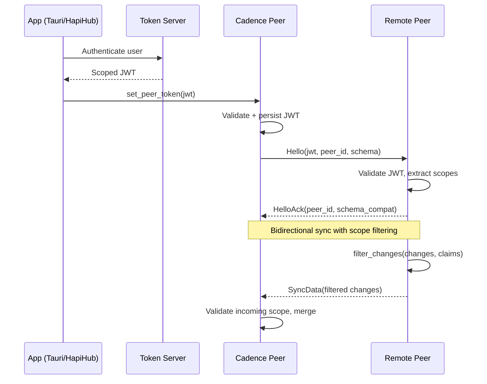
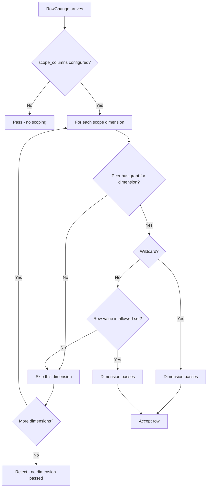
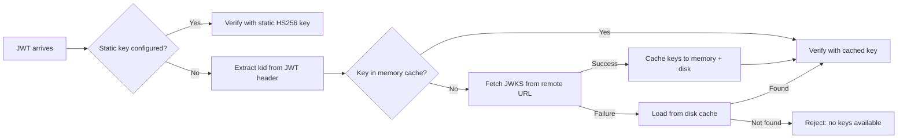
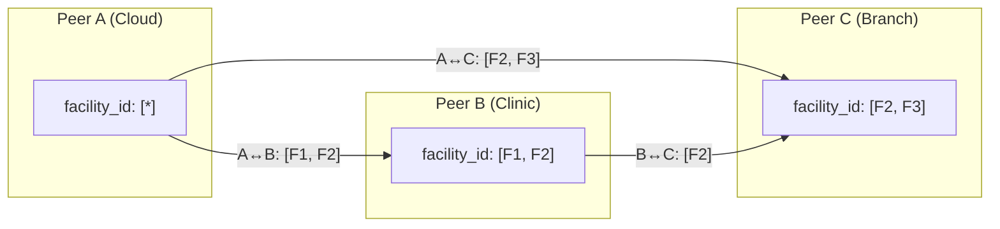
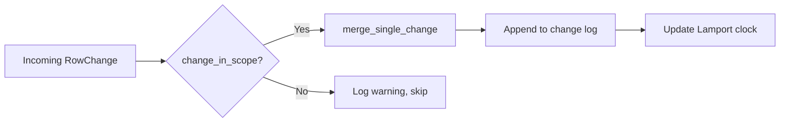

# Cadence v2 — P2P Sync Engine

## Architecture

```
┌────────────────────────────────────────────────────┐
│  HapiHub (reads/writes primary DB)                 │
├────────────────────────────────────────────────────┤
│  Primary DB (PostgreSQL or SQLite)                 │
├────────────────────────────────────────────────────┤
│  Cadence v2 (CLI peer or embedded in Tauri app)    │
│  ├── ChangeWatcher   (polls/listens DB)            │
│  ├── SyncState       (Lamport + LWW)               │
│  ├── Iroh Transport  (P2P, mDNS, QUIC)            │
│  ├── Auth            (JWT generic scopes)          │
│  ├── TokenStore      (runtime token management)    │
│  └── MetadataBackend (pluggable storage trait)     │
└────────────────────────────────────────────────────┘
```

## Storage Layer

### MetadataBackend Trait

All metadata storage (change log, peer watermarks, peer tokens, JWKS cache) goes through the async `MetadataBackend` trait. This enables pluggable backends:

| Backend | Status | Use case |
|---------|--------|----------|
| **SQLite** (`SqliteBackend`) | Implemented | Local/embedded (desktop, mobile, CLI) |
| **Valkey** (future) | Planned | Distributed/cloud deployments |

```rust
#[async_trait]
pub trait MetadataBackend: Send + Sync + 'static {
    async fn append_change(&self, change: &RowChange) -> Result<u64>;
    async fn query_since(&self, since_seq: u64) -> Result<Vec<RowChange>>;
    async fn query_by_doc(&self, collection: &str, doc_id: &str) -> Result<Vec<RowChange>>;
    async fn compact(&self) -> Result<u64>;
    async fn max_seq(&self) -> Result<u64>;
    async fn get_watermark(&self, peer_id: &str) -> Result<u64>;
    async fn set_watermark(&self, peer_id: &str, seq: u64) -> Result<()>;
    async fn get_peer_token(&self, key: &str) -> Result<Option<String>>;
    async fn set_peer_token(&self, key: &str, jwt: &str) -> Result<()>;
    async fn get_cached_jwks(&self, url: &str) -> Result<Option<String>>;
    async fn set_cached_jwks(&self, url: &str, keys_json: &str) -> Result<()>;
}
```

### Hash-Scoped Metadata DB

Each `primary_db_url` gets its own metadata DB file, derived via SHA256 hash:

```
primary_db_url = "postgresql://localhost/clinic_a"
  → SHA256 → cadence-meta-a1b2c3d4e5f6g7h8.db

primary_db_url = "postgresql://localhost/clinic_b"
  → SHA256 → cadence-meta-x9y8z7w6v5u4t3s2.db
```

Switching `primary_db_url` automatically uses a different metadata DB. Switching back picks up the old file with its tokens, JWKS cache, watermarks, and change log intact.

`primary_db_url` is **required** — Cadence refuses to start without it.

### Platform-Aware Default Directories

```
macOS:    ~/Library/Application Support/cadence/
Linux:    $XDG_DATA_HOME/cadence/ (or ~/.local/share/cadence/)
Windows:  %LOCALAPPDATA%\cadence\
iOS/Tauri: $CADENCE_DATA_DIR (injected by host)
```

Override priority: `CADENCE_DATA_DIR` env > `data_dir` config > platform default.

## Generic Token/Scope System

### Overview

Cadence uses a **generic, dimension-based scope system** for row-level access control during P2P sync. Instead of hardcoding "facility" scoping, the system supports arbitrary scope dimensions (organization, workspace, user, facility, etc.) with wildcard support.

**Key design decisions:**
- **Any dimension** — scope names are arbitrary strings (e.g., `workspace_id`, `org_id`, `user_id`)
- **Literal values + wildcard** — exact match or `["*"]` for all values
- **Multi-dimensional OR** — if a row matches ANY scope dimension, it passes
- **Runtime token management** — tokens can be set/updated/persisted dynamically
- **Config file support** — initial tokens for standalone binary mode

### Token Flow



### SyncClaims Structure

```rust
pub struct SyncClaims {
    pub sub: String,
    pub iss: String,
    pub aud: Option<String>,
    pub exp: Option<u64>,
    pub nbf: Option<u64>,
    pub iat: Option<u64>,
    pub peer_id: Option<String>,
    pub read_only: bool,
    pub scopes: HashMap<String, Vec<String>>,
}
```

**JWT Examples:**
```json
// Specific workspace
{"scopes": {"workspace_id": ["clinic-a"]}}

// All workspaces (cloud peer)
{"scopes": {"workspace_id": ["*"]}}

// Multi-dimension: org + user
{"scopes": {"org_id": ["org-1"], "user_id": ["u-5"]}}

// Healthcare: multiple facilities
{"scopes": {"facility_id": ["F1", "F2"]}}
```

### Scope Configuration

```yaml
primary_db_url: "postgresql://localhost/clinic_db"

collections:
  patients:
    strategy: lww
    scope_columns:
      facility_id: facility      # scope dimension → DB column name

  tasks:
    scope_columns:
      workspace_id: workspace_id # 1:1 mapping

  user_settings:
    scope_columns:
      user_id: owner_id          # dimension name ≠ column name
      organization_id: org_id    # multiple dimensions = OR logic

# This peer's token (obtained from the token server)
peer_token: "eyJ..."

# JWKS endpoint for JWT validation (required)
jwks_url: "https://hapihub.example.com/.well-known/jwks.json"

# Optional: override data directory for metadata DB files
# data_dir: "/custom/path"
```

### Wildcard Auto-Discovery

Instead of manually listing every table, use `"*"` to auto-discover all tables from the primary database. Callers must invoke `.resolve_wildcards().await?` on the builder **before** `.build()` — this is the only step in the chain that opens a connection to the primary DB, so short-lived metadata-only invocations (peer-token / peers / local-identity CRUD) can simply omit it and run without a reachable primary DB. See `CadenceBuilder::resolve_wildcards` rustdoc for the rationale.

```yaml
collections:
  # Explicit overrides (highest priority — never overwritten by wildcard)
  clinical-notes:
    strategy: crdt
    scope_columns:
      facility_id: facility

  # Wildcard: auto-discover all other tables from the DB
  "*":
    strategy: lww
    scope_rules:
      facility_id: facility          # if table has facility_id column → scope to facility
      organization_id: organization  # if table has organization_id column → scope to organization

# Tables to exclude from wildcard auto-discovery (optional)
collections_blacklist:
  - some-internal-table
```

**How it works:**

```rust
// Full sync path: explicit wildcard resolution, then build, then start_sync.
let mut cadence = Cadence::builder()
    .primary_db("postgres://...")
    .metadata_db("/path/to/metadata.db")
    // ...collections, scope rules, etc...
    .resolve_wildcards()   // ← connects to the primary DB here (and ONLY here)
    .await?
    .build()
    .await?;
cadence.start_sync().await?;

// Metadata-only path: no primary DB connection ever.
let cadence = Cadence::builder()
    .primary_db("postgres://...")
    .metadata_db("/path/to/metadata.db")
    // ...
    .build()               // ← no resolve_wildcards → pure metadata construction
    .await?;
cadence.sync_engine().set_peer_token(jwt).await?;  // works with primary DB unreachable
```

1. When the caller invokes `.resolve_wildcards()`, if `collections` contains a `"*"` key, cadence queries the primary DB for all tables
   - PostgreSQL: `SELECT table_name FROM information_schema.tables WHERE table_schema = 'public'`
   - SQLite: `SELECT name FROM sqlite_master WHERE type = 'table'`
2. For each discovered table (converted from `snake_case` to `kebab-case`):
   - Skip if in `collections_blacklist`
   - Skip if already has an explicit entry in `collections`
   - Auto-detect scope columns: for each `scope_rules` entry, check if the table has that DB column
   - Create a collection entry with the wildcard's `strategy` and detected scope columns
3. The `"*"` key is removed after resolution — subsequent `.build()` sees a flat collection map
4. If the caller never invokes `.resolve_wildcards()`, the `"*"` entry is preserved but ignored by the runtime components that don't need table-level discovery (token store, peer list, local identity) — allowing short-lived CLI tools to function without the primary DB.

**Key difference: `scope_rules` vs `scope_columns`:**
- `scope_columns` — the resolved per-table mapping used at runtime (e.g., "this table's `facility_id` column maps to the `facility` scope dimension")
- `scope_rules` — only used on the `"*"` wildcard entry as an auto-detection template ("for each discovered table, check if it has this column — if yes, add it to scope_columns")

### Row-Level Filtering (OR Logic)



**Logic:** If ANY scope dimension passes, the row is in scope (OR). This allows:
- A user with `org_id=org-1` to see all org-1 data even if they don't have a `user_id` grant
- A user with `user_id=u-5` to see their personal settings even in a different org

### TokenStore

```
TokenStore
  - token: RwLock<Option<String>>
  - claims: RwLock<Option<SyncClaims>>
  - storage: Arc<dyn MetadataBackend>
  - validator: Arc<JwtValidator>
  + set_token(jwt) -> Result<SyncClaims>
  + token() -> Option<String>
  + claims() -> Option<SyncClaims>
  + clear()
  + load_from_storage() -> Result<bool>
  + load_from_config(config) -> Result<bool>

SyncEngine
  - token_store: Arc<TokenStore>
  - storage: Arc<dyn MetadataBackend>
  + set_peer_token(jwt) -> Result<SyncClaims>
  + peer_token() -> Option<String>
  + peer_claims() -> Option<SyncClaims>
  + clear_peer_token()

SyncEngine --> TokenStore (uses)
TokenStore --> MetadataBackend (persists to)
TokenStore --> JwtValidator (validates with)
```

**Token loading priority (startup):**
1. `peer_token` from config file (JWT obtained from token server)
2. Persisted token from metadata DB (from previous `set_peer_token()` call)
3. None — requires `set_peer_token()` at runtime

### JWT Verification

All tokens are verified against the remote JWKS endpoint configured via `jwks_url`.
Cadence never mints its own tokens — the token server (e.g., HapiHub) is the sole issuer.



**JWKS offline caching:** On every successful JWKS fetch, keys are persisted to the
`jwks_cache` table in the metadata DB. When the JWKS endpoint is unreachable (offline/LAN-only),
cadence falls back to the disk-cached keys. This enables offline P2P sync after initial setup.

**What is verified:**
- Cryptographic signature (ES256 via JWKS, or HS256 for embedded consumers)
- `exp` — token not expired
- `nbf` — token not used before valid time
- `aud` — must be `"cadence-sync"`

**What is NOT verified:**
- Scope values are not validated against any external authority — the JWT issuer decides what scopes to grant
- No token revocation — expiration is the revocation mechanism

### Scope Intersection Between Peers

When two peers connect, the effective sync scope is the intersection of their grants:



**Intersection rules per dimension:**
- Wildcard x Wildcard = Wildcard
- Wildcard x Specific = Specific
- Specific x Specific = Set intersection

### Use Cases

#### 1. Healthcare Facility Scoping
```yaml
# Config
collections:
  medical_patients:
    scope_columns:
      facility_id: facility
  medical_encounters:
    scope_columns:
      facility_id: facility

# Clinic peer JWT
{"scopes": {"facility_id": ["F1", "F2"]}}

# Cloud peer JWT (all facilities)
{"scopes": {"facility_id": ["*"]}}
```

#### 2. Workspace-Scoped Task Management (Cadence Demo)
```yaml
collections:
  projects:
    scope_columns:
      workspace_id: workspace_id
  tasks:
    scope_columns:
      workspace_id: workspace_id

# Peer JWT
{"scopes": {"workspace_id": ["clinic-a"]}}
```

#### 3. User-Scoped Personal Settings
```yaml
collections:
  user_settings:
    scope_columns:
      user_id: owner_id

# Peer JWT
{"scopes": {"user_id": ["u-5"]}}
```

#### 4. Multi-Dimension: Org Data + Personal Overrides (OR Logic)
```yaml
collections:
  config_overrides:
    scope_columns:
      organization_id: org_id
      user_id: owner_id

# Peer JWT — sees all org-1 data AND their own overrides
{"scopes": {"organization_id": ["org-1"], "user_id": ["u-5"]}}
```
With OR logic, this peer syncs:
- All `config_overrides` rows where `org_id = "org-1"` (org match)
- All `config_overrides` rows where `owner_id = "u-5"` (user match)
- Rejects rows where neither matches

### Incoming Change Validation

Remote peers can only push changes that fall within their JWT scope. The `receive_and_merge_streaming` loop validates each incoming change:



### Watcher: Scope Column Emission

The SQLite watcher always emits scope column fields in change payloads (even if unchanged), so `filter_changes` can inspect them for scope matching. Without this, an update to a non-scope field (e.g., `name`) would lack the `workspace_id` field needed for filtering.

## Configuration

### Required Fields

| Field | Description |
|-------|-------------|
| `primary_db_url` | Primary database connection string. Cadence refuses to start without it. |

### Optional Fields

| Field | Default | Description |
|-------|---------|-------------|
| `collections_blacklist` | `[]` | Tables to exclude from wildcard auto-discovery |
| `metadata_db_path` | Hash-based | Override metadata DB path (skips hash-based naming) |
| `data_dir` | Platform default | Override data directory for metadata files |
| `metadata_backend` | `"sqlite"` | Storage backend (`"sqlite"`, future: `"valkey"`) |
| `valkey_url` | None | Valkey URL (for future distributed backend) |
| `jwks_url` | None | JWKS endpoint for JWT validation |
| `peer_token` | None | Initial JWT for peer authentication |
| `poll_interval_ms` | `1000` | Change polling interval |
| `compaction_interval_secs` | `3600` | Change log compaction interval |
| `keepalive_interval_secs` | `10` | Keepalive probe interval |
| `liveness_timeout_secs` | `30` | Disconnect if no message within this window |
| `reconnect_base_delay_ms` | `1000` | Base delay for reconnect backoff |
| `reconnect_max_delay_ms` | `60000` | Max delay for reconnect backoff |

### Environment Variable Overrides

| Variable | Config field |
|----------|-------------|
| `CADENCE_PRIMARY_DB_URL` | `primary_db_url` |
| `CADENCE_DATA_DIR` | `data_dir` |
| `CADENCE_METADATA_BACKEND` | `metadata_backend` |
| `CADENCE_PEER_TOKEN` | `peer_token` |
| `CADENCE_BOOTSTRAP_PEERS` | `bootstrap_peers` (comma-separated) |
| `CADENCE_JWKS_URL` | `jwks_url` |

## File Structure

```
src/
├── auth.rs             # SyncClaims, JwtValidator, JWKS caching
├── config.rs           # CadenceConfig, CollectionConfig (scope_columns)
├── token.rs            # TokenStore (runtime JWT management + persistence)
├── sync.rs             # SyncEngine (filter_changes, merge, token API)
├── storage/
│   ├── mod.rs          # Re-exports, Storage type alias
│   ├── backend.rs      # MetadataBackend async trait definition
│   ├── sqlite.rs       # SqliteBackend implementation
│   └── path.rs         # Platform-aware path resolution + hash naming
├── watcher/
│   └── sqlite.rs       # SqliteWatcher (scope column emission)
├── lib.rs              # Module declarations
└── main.rs             # CLI binary (wire TokenStore, bootstrap peers)
```

## Running Tests

### Prerequisites

Start the test infrastructure (PostgreSQL + Valkey):

```bash
cd services/cadence
docker compose -f docker-compose.deps.yml up -d
```

### Test Suites

| Suite | Tests | Description |
|-------|-------|-------------|
| **lib** | 46 | Core library unit tests |
| **unit** | 168 | Comprehensive unit tests |
| **property** | 15 | Property-based tests (LWW, CRDT, sync) |
| **integration** | 66 | Integration tests (transport, auth, API) |
| **e2e** | 48+ | End-to-end sync tests (SQLite↔PG, WebSocket) |
| **chaos** | 5 | Chaos/resilience tests |
| **stress** | 4 | Performance stress tests |

### Run All Tests (~350 tests)

```bash
# Full test suite (requires docker deps running)
cargo test --features integration-tests -- --test-threads=1
```

The `--test-threads=1` flag ensures sequential execution for tests that share infrastructure.

### Run Specific Suites

```bash
# Fast unit tests (no infra required)
cargo test --test unit

# Property tests
cargo test --test property

# Integration tests (requires docker)
cargo test --features integration-tests --test integration -- --test-threads=1

# E2E tests (requires docker)
cargo test --features integration-tests --test e2e -- --test-threads=1

# Stress tests
cargo test --features integration-tests --test stress -- --test-threads=1
```

### Cleanup

```bash
docker compose -f docker-compose.deps.yml down
```

## Verification

```bash
cd services/cadence

# 1. Compile check
cargo check

# 2. Quick tests (no infra required)
cargo test --test unit --test property

# 3. Full test suite (with infra)
docker compose -f docker-compose.deps.yml up -d
cargo test --features integration-tests -- --test-threads=1
docker compose -f docker-compose.deps.yml down

# 4. Verify metadata DB path resolution (check logs)
RUST_LOG=info cargo run -- --config cadence.yml
# Should log: "Metadata DB: ~/Library/Application Support/cadence/cadence-meta-{hash}.db"

# 5. Demo app compiles
cd ../../apps/cadence-demo/src-tauri && cargo check
```

## Future Work

- **Valkey backend** — `src/storage/valkey.rs` behind `valkey-backend` feature, using `fred` 10.x crate
- **CLI `--data-dir` flag** — override via clap arg in addition to env var
